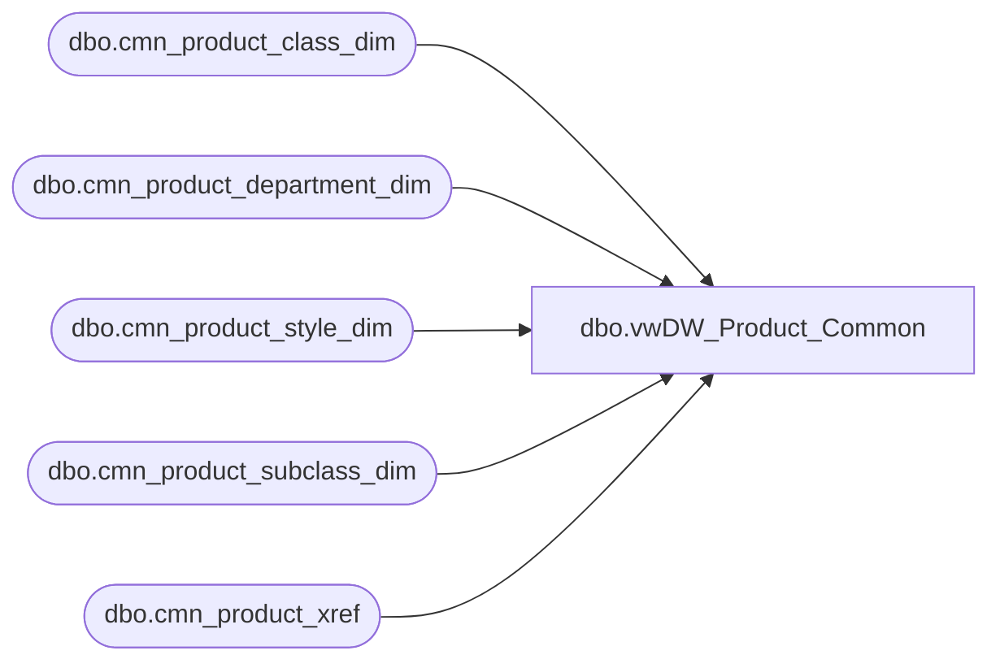

# dbo.vwDW_Product_Common

**Database:** dw  
**Server:** papamart  

## Architecture Diagram



## Table Dependencies

| Referenced Table |
|---|
| dbo.cmn_product_class_dim |
| dbo.cmn_product_department_dim |
| dbo.cmn_product_style_dim |
| dbo.cmn_product_subclass_dim |
| dbo.cmn_product_xref |

## View Code

```sql
CREATE VIEW [dbo].[vwDW_Product_Common]
AS SELECT
		  dept.cmn_department_code
		, dept.cmn_department_code + ' ' + dept.cmn_department AS cmn_department
		, cls.cmn_class_code
		, cls.cmn_class_code + ' ' + cls.cmn_class AS cmn_class
		, subcls.cmn_subclass_code
		, subcls.cmn_subclass_code + ' ' + subcls.cmn_subclass AS cmn_subclass
		, sty.cmn_style_code
		, sty.cmn_style_code + ' ' + sty.description AS cmn_Style
		, xref.product_key
	 FROM
		  dbo.cmn_product_department_dim AS dept WITH (nolock)
		  INNER JOIN dbo.cmn_product_class_dim AS cls WITH (nolock)
			  ON dept.cmn_department_code = cls.cmn_department_code
		  INNER JOIN dbo.cmn_product_subclass_dim AS subcls WITH (nolock)
			  ON cls.cmn_class_code = subcls.cmn_class_code
		  INNER JOIN dbo.cmn_product_style_dim AS sty WITH (nolock)
			  ON subcls.cmn_subclass_code = sty.cmn_subclass_code
		  INNER JOIN dbo.cmn_product_xref AS xref WITH (nolock)
			  ON sty.cmn_style_code = xref.cmn_style_code;
```

