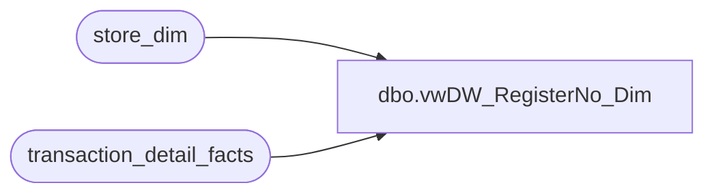

# dbo.vwDW_RegisterNo_Dim

**Database:** dw  
**Server:** papamart  

## Architecture Diagram



## Table Dependencies

| Referenced Table |
|---|
| store_dim |
| transaction_detail_facts |

## View Code

```sql
CREATE view [dbo].[vwDW_RegisterNo_Dim] 
as
SELECT  t.Register_Num, t.store_key, s.store_id, s.store_name, 
'Store ' + cast(s.store_id as varchar(20)) + '_RegisterNo ' + Cast(Register_Num as varchar(50)) as RegisterNoSID
from transaction_detail_facts t with (nolock)
join store_dim s on 
t.store_key = s.store_key
group by  t.Register_Num, t.store_key, s.store_id, s.store_name
```

