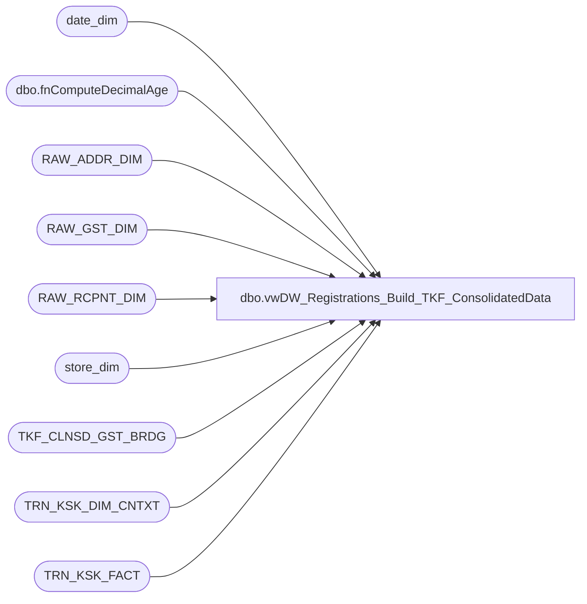

# dbo.vwDW_Registrations_Build_TKF_ConsolidatedData

**Database:** dw  
**Server:** papamart  

## Architecture Diagram



## Table Dependencies

| Referenced Table |
|---|
| date_dim |
| dbo.fnComputeDecimalAge |
| RAW_ADDR_DIM |
| RAW_GST_DIM |
| RAW_RCPNT_DIM |
| store_dim |
| TKF_CLNSD_GST_BRDG |
| TRN_KSK_DIM_CNTXT |
| TRN_KSK_FACT |

## View Code

```sql
CREATE VIEW [dbo].[vwDW_Registrations_Build_TKF_ConsolidatedData]
AS
-- =============================================================================================================
-- Name: [dbo].[vwDW_Registrations_Build_TKF_ConsolidatedData]
--
-- Description: View used to create a summary table of the TRN_KSK_FACT information
--				used to analyze the Guest information.
--				This will be stored in dw.dbo.TKF_ConsolidatedData
--
--
-- Dependencies: 
--
-- Revision History
--		Name:				Date:			Comments:
--		Kevin Shyr			6/2/2014		Added 1/1/2000 to the null date based on data quality
--		Kevin Shyr			9/1/2014		Modified for new age bracket
--		Gary Murrish		5/20/2014		Changed to support SOTF default values.....
--		Gary Murrish		8/31/2012		Initial deployment
-- =============================================================================================================
SELECT
	TKF_ID,
	CLNSD_GST_ID,
	CLNSD_ADDR_ID,
	date_key,
	GST_VST_RECUR_CD,
	ADDR_VST_RECUR_CD,
	GIFT_IND,
	Recepient_GNDR_CD AS Recipient_GNDR_CD,
	ReceipientAge AS Recipient_Age,
	wrk.daysFromRecipientBirthDay AS Recipient_DaysFromBirthDay,
	hasRecipientAge AS Recipient_hasAge,
	Purchaser_GNDR_CD,
	PurchaserAge AS Purchaser_Age,
	wrk.daysFromPurchaserBirthDay AS Purchaser_DaysFromBirthDay,
	hasPurchaserAge AS Purchaser_hasAge,
	DistanceToStore,
	hasDistanceToStore,
	isForeign,
	TourismBand,
	[5to25_MileBand],
	CASE
		WHEN wrk.daysFromPurchaserBirthDay < 0 AND
		wrk.daysFromRecipientBirthDay < 0 THEN -1
		WHEN wrk.daysFromPurchaserBirthDay BETWEEN 0 AND 15 OR
		wrk.daysFromPurchaserBirthDay >= 300 OR
		wrk.daysFromRecipientBirthDay BETWEEN 0 AND 15 OR
		wrk.daysFromRecipientBirthDay >= 300 THEN 1
		ELSE 0
	END AS isNearBirthday,
	isTourist,
	TOURIST_GST_ID,
	TOURIST_ADDR_ID
FROM
	(SELECT
			TKF.TKF_ID,
			b.CLNSD_GST_ID,
			RAD.CLNSD_ADDR_ID,
			TKF.DT_ID AS date_key,
			TKDC.GST_VST_RECUR_CD,
			TKDC.ADDR_VST_RECUR_CD,
			TKDC.GIFT_IND,
			ISNULL(RRD.DRVD_GNDR_CD, 'U') AS Recepient_GNDR_CD,
			ISNULL(RGD.DRVD_GNDR_CD, 'U') AS Purchaser_GNDR_CD,
			CASE
				WHEN RRD.DRVD_GNDR_CD = 'U' AND RRD.BRTH_DT IN ('1/1/1900', '1/1/2000', '1/1/2001')
					THEN 0.0 /* SOTF Default */
				WHEN RRD.BRTH_DT IS NULL OR RRD.BRTH_DT IN ('1/1/1900', '1/1/2000', '1/1/2001')
					THEN 0.0
				ELSE --ISNULL(CAST((DATEDIFF(dy, RRD.BRTH_DT, dd.actual_date) / 365.25) AS int), 0)
					dbo.fnComputeDecimalAge(RRD.BRTH_DT, dd.actual_date)
			END AS ReceipientAge,
			CASE
				WHEN RRD.DRVD_GNDR_CD = 'U' AND RRD.BRTH_DT IN ('1/1/1900', '1/1/2000', '1/1/2001')
					THEN 0 /* SOTF Default */
				WHEN RRD.BRTH_DT IS NULL OR RRD.BRTH_DT IN ('1/1/1900', '1/1/2000', '1/1/2001')
					THEN 0
				WHEN RRD.BRTH_DT > dd.actual_date
					THEN 0
				ELSE 1
			END AS hasRecipientAge,
			--ISNULL(CAST((DATEDIFF(dy, RGD.BRTH_DT, dd.actual_date) / 365.25) AS int), 0) AS PurchaserAge,
			dbo.fnComputeDecimalAge(RGD.BRTH_DT, dd.actual_date) AS PurchaserAge,
			CASE
				WHEN RGD.BRTH_DT IS NULL THEN 0
				WHEN RGD.BRTH_DT > dd.actual_date THEN 0
				ELSE 1
			END AS hasPurchaserAge,
			ISNULL(TKF.TOR_DSTNC_TO_STR_QTY, 0) AS DistanceToStore,
			CASE
				WHEN ISNULL(TKF.TOR_DSTNC_TO_STR_QTY, 0) = 0 THEN 0
				ELSE 1
			END AS hasDistanceToStore,
			CASE
				WHEN TKF.TOR_DSTNC_TO_STR_QTY IS NULL AND
				RAD.DRVD_CNTRY_ABBRV <> sd.country THEN 1
				ELSE 0
			END AS isForeign,
			CASE
				WHEN TKF.TOR_DSTNC_TO_STR_QTY BETWEEN 0 AND 29.99 THEN 1 --'1) 00.00 - 29.99 Miles'
				WHEN TKF.TOR_DSTNC_TO_STR_QTY BETWEEN 30 AND 49.99 THEN 2 --'2) 30.00 - 49.99 Miles'
				WHEN TKF.TOR_DSTNC_TO_STR_QTY BETWEEN 50 AND 99.99 THEN 3 --'3) 50.00 - 99.99 Miles'
				WHEN TKF.TOR_DSTNC_TO_STR_QTY > 99.99 THEN 4 --'4) 100+ Miles'
				WHEN ((TKF.TOR_DSTNC_TO_STR_QTY IS NULL AND
				RAD.DRVD_CNTRY_ABBRV IS NOT NULL) AND
				(RAD.DRVD_CNTRY_ABBRV <> sd.country)) THEN 5 --'5) Foreign' 
				ELSE -1 --'6) Unspecified' 
			END AS TourismBand,
			CASE
				WHEN TKF.TOR_DSTNC_TO_STR_QTY BETWEEN 0 AND 4.99 THEN 1 --'1) 00.00 - 4.99 Miles'
				WHEN TKF.TOR_DSTNC_TO_STR_QTY BETWEEN 5 AND 9.99 THEN 2 --'2) 5.00 - 9.99 Miles'
				WHEN TKF.TOR_DSTNC_TO_STR_QTY BETWEEN 10 AND 14.99 THEN 3 --'3) 10.00 - 14.99 Miles'
				WHEN TKF.TOR_DSTNC_TO_STR_QTY BETWEEN 15 AND 19.99 THEN 4 --'4) 15.00 - 19.99 Miles'
				WHEN TKF.TOR_DSTNC_TO_STR_QTY BETWEEN 20 AND 24.99 THEN 5 --'5) 20.00 - 24.99 Miles'
				WHEN TKF.TOR_DSTNC_TO_STR_QTY BETWEEN 25 AND 49.99 THEN 6 --'6) 25.00 - 49.99 Miles'
				WHEN TKF.TOR_DSTNC_TO_STR_QTY BETWEEN 50 AND 74.99 THEN 7 --'7) 50.00 - 74.99 Miles'
				WHEN TKF.TOR_DSTNC_TO_STR_QTY BETWEEN 75 AND 99.99 THEN 8 --'8) 75.00 - 99.99 Miles'
				WHEN TKF.TOR_DSTNC_TO_STR_QTY > 99.99 THEN 9 --'9) 100+ Miles' 
				WHEN ((TKF.TOR_DSTNC_TO_STR_QTY IS NULL AND
				RAD.DRVD_CNTRY_ABBRV IS NOT NULL) AND
				(RAD.DRVD_CNTRY_ABBRV <> sd.country)) THEN 900 --'10) Foreign' 
				ELSE -1 --'11) Unspecified' 
			END AS [5to25_MileBand],
			CASE
				WHEN RGD.BRTH_DT IS NULL THEN -90000
				WHEN RGD.BRTH_DT <= '1/1/1900' THEN -90000
				WHEN DAY(RGD.BRTH_DT) = 29 AND
				MONTH(RGD.BRTH_DT) = 2 THEN ABS(DATEDIFF(D, dd.actual_date, CAST(CAST(YEAR(dd.actual_date) AS varchar) + '-' + CAST(MONTH(RGD.BRTH_DT) AS varchar) + '-' + CAST(28 AS varchar) AS datetime)))
				ELSE ABS(DATEDIFF(D, dd.actual_date, CAST(CAST(YEAR(dd.actual_date) AS varchar) + '-' + CAST(MONTH(RGD.BRTH_DT) AS varchar) + '-' + CAST(DAY(RGD.BRTH_DT) AS varchar) AS datetime)))
			END AS daysFromPurchaserBirthDay,
			CASE
				WHEN RRD.BRTH_DT IS NULL THEN -90000
				WHEN RRD.BRTH_DT <= '1/1/1900' THEN -90000
				WHEN RRD.DRVD_GNDR_CD = 'U' AND
				RRD.BRTH_DT IN ('1/1/1900', '1/1/2000', '1/1/2001') THEN /* SOTF Default */
				-90000
				WHEN DAY(RRD.BRTH_DT) = 29 AND
				MONTH(RRD.BRTH_DT) = 2 THEN ABS(DATEDIFF(D, dd.actual_date, CAST(CAST(YEAR(dd.actual_date) AS varchar) + '-' + CAST(MONTH(RRD.BRTH_DT) AS varchar) + '-' + CAST(28 AS varchar) AS datetime)))
				ELSE ABS(DATEDIFF(D, dd.actual_date, CAST(CAST(YEAR(dd.actual_date) AS varchar) + '-' + CAST(MONTH(RRD.BRTH_DT) AS varchar) + '-' + CAST(DAY(RRD.BRTH_DT) AS varchar) AS datetime)))
			END AS daysFromRecipientBirthDay,
			CASE
				WHEN (TKF.TOR_DSTNC_TO_STR_QTY > 49.99) THEN 1
				WHEN (b.CLNSD_GST_ID = -1 AND
				RAD.DRVD_CNTRY_ABBRV IS NOT NULL) AND
				(RAD.DRVD_CNTRY_ABBRV <> sd.country) THEN 1
				ELSE 0
			END AS isTourist,
			CASE
				WHEN b.CLNSD_GST_ID > 0 THEN b.CLNSD_GST_ID
				WHEN (b.CLNSD_GST_ID = -1 AND
				RAD.DRVD_CNTRY_ABBRV IS NOT NULL) AND
				(RAD.DRVD_CNTRY_ABBRV <> sd.country) THEN TKF.RAW_GST_ID
				ELSE b.CLNSD_GST_ID
			END AS TOURIST_GST_ID,
			CASE
				WHEN TKF.TOR_CLNSD_ADDR_ID > 0 THEN TKF.TOR_CLNSD_ADDR_ID
				WHEN (TKF.TOR_CLNSD_ADDR_ID = -1 AND
				RAD.DRVD_CNTRY_ABBRV IS NOT NULL) AND
				(RAD.DRVD_CNTRY_ABBRV <> sd.country) THEN RAD.RAW_ADDR_ID
				ELSE TKF.TOR_CLNSD_ADDR_ID
			END AS TOURIST_ADDR_ID

		FROM
			TRN_KSK_FACT TKF WITH (NOLOCK)
			INNER JOIN TRN_KSK_DIM_CNTXT TKDC WITH (NOLOCK)
				ON TKDC.TRN_KSK_CNTXT_ID = TKF.TRN_KSK_CNTXT_ID
			INNER JOIN date_dim dd WITH (NOLOCK)
				ON dd.date_key = TKF.DT_ID
			INNER JOIN TKF_CLNSD_GST_BRDG b WITH (NOLOCK)
				ON TKF.TKF_ID = b.TKF_ID
			INNER JOIN RAW_RCPNT_DIM RRD WITH (NOLOCK)
				ON RRD.RAW_RCPNT_ID = TKF.RAW_RCPNT_ID
			INNER JOIN RAW_GST_DIM RGD WITH (NOLOCK)
				ON RGD.RAW_GST_ID = TKF.RAW_GST_ID
			INNER JOIN (SELECT
							r.RAW_ADDR_ID,
							r.CLNSD_ADDR_ID,
							REPLACE(r.DRVD_CNTRY_ABBRV, 'GB', 'UK') AS DRVD_CNTRY_ABBRV
						FROM
							RAW_ADDR_DIM r WITH(NOLOCK)
			) RAD
				ON RAD.RAW_ADDR_ID = RGD.RAW_ADDR_ID
			INNER JOIN store_dim sd WITH(NOLOCK)
				ON sd.store_key = TKF.STR_ID) wrk
```

