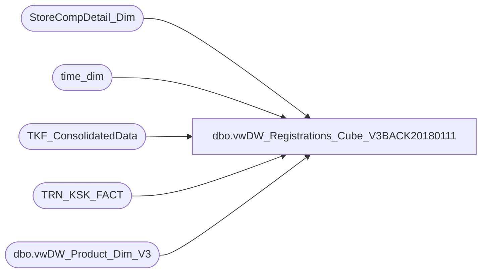

# dbo.vwDW_Registrations_Cube_V3BACK20180111

**Database:** dw  
**Server:** papamart  

## Architecture Diagram



## Table Dependencies

| Referenced Table |
|---|
| StoreCompDetail_Dim |
| time_dim |
| TKF_ConsolidatedData |
| TRN_KSK_FACT |
| dbo.vwDW_Product_Dim_V3 |

## View Code

```sql
CREATE VIEW [dbo].[vwDW_Registrations_Cube_V3BACK20180111] AS

-- =============================================================================================================
-- Name: [dbo].[vwDW_Registrations_Cube]
--
-- Description: View underlying the SSAS Registrations Cube used on the dashboard.   
-- Aggregates Kiosk registrations and product group metrics by store and date
--
--
-- Dependencies: 
--
-- Revision History
--		Name:				Date:			Comments:
--		Gary Murrish		8/1/2012		Added Tourist Information
--		Gary Murrish		5/10/2012		Changed Store Comp Storage
--		Gary Murrish		5/2/2012		Added indicator whether or not this was within 15 days of Birthday
--		Gary Murrish		4/13/2012		Initial deployment
-- =============================================================================================================


SELECT CASE
		   WHEN wrk.hasRecipientAge = 0 OR wrk.ReceipientAge < 0 THEN
			   CAST(-1 AS DECIMAL(4, 1)) -- Unspecified
		   WHEN wrk.ReceipientAge > 101 THEN
			   CAST(101 AS DECIMAL(4, 1))
		   ELSE
			   wrk.ReceipientAge
	   END AS RecepientAgeID
	 , wrk.RecepientID
	 , wrk.AddressID
	 , wrk.store_key
	 , wrk.date_key
	 , wrk.time_key
	 , ISNULL(pd.product_key, -1) AS product_key
	 , wrk.GST_VST_RECUR_CD
	 , wrk.ADDR_VST_RECUR_CD
	 , wrk.GIFT_IND
	 , wrk.GNDR_CD
	 , wrk.ReceipientAge
	 , wrk.hasRecipientAge
	 , wrk.PurchaserAge
	 , wrk.hasPurchaserAge
	 , wrk.DistanceToStore
	 , wrk.hasDistanceToStore
	 , wrk.isForeign
	 , wrk.TourismBand
	 , wrk.[5to25_MileBand]
	 , wrk.isComp
	 , wrk.isCompNextYear
	 , wrk.calc
	 , CASE
		   WHEN wrk.daysFromGstBirthDay < 0 AND wrk.daysFromReceipBirthDay < 0 THEN
			   -1
		   WHEN wrk.daysFromGstBirthDay BETWEEN 0 AND 15 OR wrk.daysFromGstBirthDay >= 300 OR wrk.daysFromReceipBirthDay BETWEEN 0 AND 15 OR wrk.daysFromReceipBirthDay >= 300 THEN
			   1
		   ELSE
			   0
	   END AS isNearBirthday
	 , wrk.isTourist
	 , wrk.GuestID
	 , wrk.isSOTF
	 , wrk.isShopperTrak
	 , wrk.isShopperTrakCompTY
	 , wrk.isShopperTrakCompNY
	 , wrk.TKF_ID
FROM
	(SELECT tkf.TKF_ID
		  , TKF.RAW_RCPNT_ID AS RecepientID
		  , TKF.TOR_CLNSD_ADDR_ID AS AddressID
		  , tkf.STR_ID AS store_key
		  , TKF.DT_ID AS date_key
		  , CASE
				WHEN TKF.PRDCT_ID <= 0 THEN
					-1
				ELSE
					TKF.PRDCT_ID
			END AS product_key
		  , TKF.tm_ID AS time_key
		  , xd.GST_VST_RECUR_CD
		  , xd.ADDR_VST_RECUR_CD
		  , xd.GIFT_IND
		  , xd.Recipient_GNDR_CD AS GNDR_CD
		  , xd.Recipient_Age AS ReceipientAge
		  , xd.Recipient_hasAge AS hasRecipientAge
		  , xd.Purchaser_Age AS PurchaserAge
		  , xd.Purchaser_hasAge AS hasPurchaserAge
		  , isnull(TKF.TOR_DSTNC_TO_STR_QTY, 0) AS DistanceToStore
		  , xd.hasDistanceToStore AS hasDistanceToStore
		  , xd.isForeign AS isForeign
		  , xd.TourismBand AS TourismBand
		  , xd.[5to25_MileBand] AS [5to25_MileBand]
		  , cast(isnull(cmp.isCompTY, 0) AS INTEGER) AS isComp
		  , cast(isnull(cmp.isCompNY, 0) AS INTEGER) AS isCompNextYear
		  , 1 AS calc
		  , xd.Purchaser_DaysFromBirthDay AS daysFromGstBirthDay
		  , xd.Recipient_DaysFromBirthDay AS daysFromReceipBirthDay
		  , xd.isTourist AS isTourist
		  , xd.TOURIST_GST_ID AS GuestID
		  , xd.TOURIST_ADDR_ID AS Tourist_Addr_ID
		  , cast(isnull(cmp.isSOTF, 0) AS INTEGER) AS isSOTF
		  , cast(CASE
				WHEN cmp.isShopperTrak IS NULL THEN
					0
				WHEN cmp.isShopperTrak = 1 AND td.hour BETWEEN cmp.ShopperTrakStartHour AND cmp.ShopperTrakEndHour THEN
					1
				ELSE
					0
			END AS INTEGER) AS isShopperTrak
		  , cast(CASE
				WHEN cmp.isShopperTrakCompTY IS NULL THEN
					0
				WHEN cmp.isShopperTrakCompTY = 1 AND td.hour BETWEEN cmp.ShopperTrakStartHour AND cmp.ShopperTrakEndHour THEN
					1
				ELSE
					0
			END AS INTEGER) AS isShopperTrakCompTY
		  , cast(CASE
				WHEN cmp.isShopperTrakCompNY IS NULL THEN
					0
				WHEN cmp.isShopperTrakCompNY = 1 AND td.hour BETWEEN cmp.ShopperTrakStartHour AND cmp.ShopperTrakEndHour THEN
					1
				ELSE
					0
			END AS INTEGER) AS isShopperTrakCompNY
	 FROM
		 TRN_KSK_FACT TKF WITH(NOLOCK)
		 LEFT JOIN StoreCompDetail_Dim cmp WITH(NOLOCK)
			 ON cmp.store_key = TKF.STR_ID 
				AND cmp.date_key = tkf.DT_ID
		 INNER JOIN time_dim td WITH(NOLOCK)
			 ON TKF.TM_ID = td.time_key
		 INNER JOIN TKF_ConsolidatedData xd WITH(NOLOCK)
			 ON TKF.TKF_ID = xd.tkf_id
	) wrk
	LEFT OUTER JOIN dbo.vwDW_Product_Dim_V3 pd WITH(NOLOCK)
		ON pd.product_key = wrk.product_key
```

