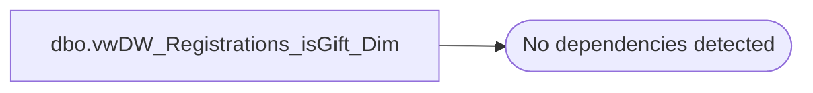

# dbo.vwDW_Registrations_isGift_Dim

**Database:** dw  
**Server:** papamart  

## Architecture Diagram



## Table Dependencies

_No table dependencies detected._

## View Code

```sql
CREATE VIEW [dbo].[vwDW_Registrations_isGift_Dim]
AS
-- =============================================================================================================
-- Name: [dbo].[vwDW_Registrations_isGift_Dim]
--
-- Description: View underlying the SSAS Registrations Cube used on the dashboard.   
-- Used to indicate whether or not the registration was a gift.
--
--
-- Dependencies: 
--
-- Revision History
--		Name:				Date:			Comments:
--		Gary Murrish		4/13/2012		Initial deployment
-- =============================================================================================================
SELECT 'Y' AS Gift_Ind
	 , 'Gift' AS descr
	 , 10 AS seq
UNION ALL
SELECT 'N' AS Gift_Ind
	 , 'Self' AS descr
	 , 20 AS seq
```

