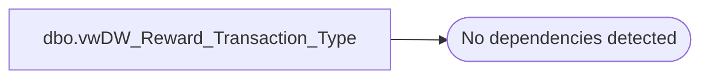

# dbo.vwDW_Reward_Transaction_Type

**Database:** dw  
**Server:** papamart  

## Architecture Diagram



## Table Dependencies

_No table dependencies detected._

## View Code

```sql
CREATE VIEW [dbo].[vwDW_Reward_Transaction_Type]
AS
SELECT
		cast(0 as smallint) AS sfs_transaction_type_key
		,'Non-Reward Transaction' AS description

UNION ALL

SELECT
		cast(1 as smallint) AS sfs_transaction_type_key
		,'New-Reward Transaction' AS description

UNION ALL

SELECT
		cast(2 as smallint) AS sfs_transaction_type_key
		,'Repeat-Reward Transaction' AS description
```

