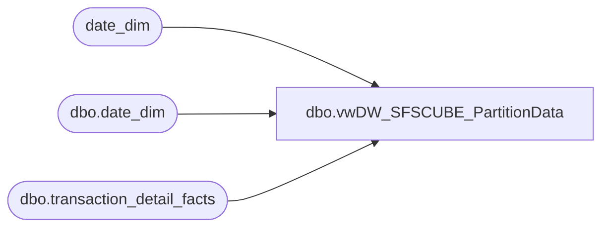

# dbo.vwDW_SFSCUBE_PartitionData

**Database:** dw  
**Server:** papamart  

## Architecture Diagram



## Table Dependencies

| Referenced Table |
|---|
| date_dim |
| dbo.date_dim |
| dbo.transaction_detail_facts |

## View Code

```sql
--ALTER VIEW [dbo].[vwDW_PartitionData3_dev_4_RZ]
CREATE VIEW [dbo].[vwDW_SFSCUBE_PartitionData]
AS


		
	-- Transactions Partition
	SELECT 'BAB DW' AS DataSourceID, 'SFSCube' AS CubeName, 'Papamart' AS CubeID, 
			'Transactions' AS MeasureGroup, 'Vw DW SFS Cube Transactions' AS MeasureGroupID, 
			'TR_' + CAST(dsum.fiscal_year AS varchar) + '_' + RIGHT('0' + CAST(dsum.fiscal_period AS varchar), 2) AS Partition,
			'SELECT *'
			+
			 ' FROM [dbo].[vwDW_SFSCube_Transactions] with (nolock) WHERE date_key &gt;= ' 
				+ CAST(min_date_key AS varchar) + ' AND date_key &lt;= ' + CAST(max_date_key AS varchar) AS SQL,
			CONVERT(VARCHAR(10), DSUM.min_date_key) AS min_date_key,
			CONVERT(VARCHAR(10), DSUM.max_date_key) AS max_date_key,
			CASE
				WHEN DSUM.period_id > (SELECT period_id FROM date_dim WHERE actual_date = convert(datetime, convert(char(10), getdate(), 101))) - 2 THEN 1
				ELSE 0
			END AS ProcessFlag,
			'1000000' AS EstimatedRows,
			'AggregationPercent' AS AggregationDesignID,
			'[Date].[Fiscal].[Fiscal Period].&amp;[' 
				+ CAST(DSUM.fiscal_year AS varchar) + ' ' 
				+ RIGHT('0' + CAST(DSUM.fiscal_period AS varchar), 2) + ']' AS PartitionSlice
	FROM
		(SELECT fiscal_year, fiscal_period, MAX(period_id) AS Period_ID,MIN(date_key) AS min_date_key, MAX(date_key) AS max_date_key
			FROM dw.dbo.date_dim WITH (NOLOCK)
			WHERE date_key >= 4019
			GROUP BY fiscal_year, fiscal_period
			
		) AS DSUM
			WHERE EXISTS (SELECT TOP 1 *
					FROM dw.dbo.transaction_detail_facts WITH (NOLOCK)
					WHERE date_key BETWEEN DSUM.min_date_key AND DSUM.max_date_key	
				)
UNION ALL 			
	-- Transaction Guests Partition
	SELECT 'BAB DW' AS DataSourceID, 'SFSCube' AS CubeName, 'Papamart' AS CubeID, 
			'Transactions Guest Count' AS MeasureGroup, 'Transactions 1' AS MeasureGroupID, 
			'TRG_' + CAST(dsum.fiscal_year AS varchar) + '_' + RIGHT('0' + CAST(dsum.fiscal_period AS varchar), 2) AS Partition,
			'SELECT *'
			+
			 ' FROM [dbo].[vwDW_SFSCube_Transactions] with (nolock) WHERE date_key &gt;= ' 
				+ CAST(min_date_key AS varchar) + ' AND date_key &lt;= ' + CAST(max_date_key AS varchar) AS SQL,
			CONVERT(VARCHAR(10), DSUM.min_date_key) AS min_date_key,
			CONVERT(VARCHAR(10), DSUM.max_date_key) AS max_date_key,
			CASE
				WHEN DSUM.period_id > (SELECT period_id FROM date_dim WHERE actual_date = convert(datetime, convert(char(10), getdate(), 101))) - 2 THEN 1
				ELSE 0
			END AS ProcessFlag,
			'1000000' AS EstimatedRows,
			'AggregationPercent' AS AggregationDesignID,
			'[Date].[Fiscal].[Fiscal Period].&amp;[' 
				+ CAST(DSUM.fiscal_year AS varchar) + ' ' 
				+ RIGHT('0' + CAST(DSUM.fiscal_period AS varchar), 2) + ']' AS PartitionSlice
	FROM
		(SELECT fiscal_year, fiscal_period, MAX(period_id) AS Period_ID,MIN(date_key) AS min_date_key, MAX(date_key) AS max_date_key
			FROM dw.dbo.date_dim WITH (NOLOCK)
			WHERE date_key >= 4019
			GROUP BY fiscal_year, fiscal_period
			
		) AS DSUM
			WHERE EXISTS (SELECT TOP 1 *
					FROM dw.dbo.transaction_detail_facts WITH (NOLOCK)
					WHERE date_key BETWEEN DSUM.min_date_key AND DSUM.max_date_key	
				)

UNION ALL 			
	-- Kiosk Partition
	SELECT 'BAB DW' AS DataSourceID, 'SFSCube' AS CubeName, 'Papamart' AS CubeID, 
			'Registrations' AS MeasureGroup, 'Vw DW SFS Cube KIOSK' AS MeasureGroupID, 
			'KSK_' + CAST(dsum.fiscal_year AS varchar) + '_' + RIGHT('0' + CAST(dsum.fiscal_period AS varchar), 2) AS Partition,
			'SELECT *'
			+
			 ' FROM [dbo].[vwDW_SFSCube_KIOSK] with (nolock) WHERE date_key &gt;= ' 
				+ CAST(min_date_key AS varchar) + ' AND date_key &lt;= ' + CAST(max_date_key AS varchar) AS SQL,
			CONVERT(VARCHAR(10), DSUM.min_date_key) AS min_date_key,
			CONVERT(VARCHAR(10), DSUM.max_date_key) AS max_date_key,
			CASE
				WHEN DSUM.period_id > (SELECT period_id FROM date_dim WHERE actual_date = convert(datetime, convert(char(10), getdate(), 101))) - 2 THEN 1
				ELSE 0
			END AS ProcessFlag,
			'1000000' AS EstimatedRows,
			'AggregationPercent' AS AggregationDesignID,
			'[Date].[Fiscal].[Fiscal Period].&amp;[' 
				+ CAST(DSUM.fiscal_year AS varchar) + ' ' 
				+ RIGHT('0' + CAST(DSUM.fiscal_period AS varchar), 2) + ']' AS PartitionSlice
	FROM
		(SELECT fiscal_year, fiscal_period, MAX(period_id) AS Period_ID,MIN(date_key) AS min_date_key, MAX(date_key) AS max_date_key
			FROM dw.dbo.date_dim WITH (NOLOCK)
			WHERE date_key >= 4019
			GROUP BY fiscal_year, fiscal_period
			
		) AS DSUM
			WHERE EXISTS (SELECT TOP 1 *
					FROM dw.dbo.transaction_detail_facts WITH (NOLOCK)
					WHERE date_key BETWEEN DSUM.min_date_key AND DSUM.max_date_key	
				)		
UNION ALL 			
	-- Kiosk Guest Partition
	SELECT 'BAB DW' AS DataSourceID, 'SFSCube' AS CubeName, 'Papamart' AS CubeID, 
			'Registrations Guest Count' AS MeasureGroup, 'Registrations' AS MeasureGroupID, 
			'KSKG_' + CAST(dsum.fiscal_year AS varchar) + '_' + RIGHT('0' + CAST(dsum.fiscal_period AS varchar), 2) AS Partition,
			'SELECT *'
			+
			 ' FROM [dbo].[vwDW_SFSCube_KIOSK] with (nolock) WHERE date_key &gt;= ' 
				+ CAST(min_date_key AS varchar) + ' AND date_key &lt;= ' + CAST(max_date_key AS varchar) AS SQL,
			CONVERT(VARCHAR(10), DSUM.min_date_key) AS min_date_key,
			CONVERT(VARCHAR(10), DSUM.max_date_key) AS max_date_key,
			CASE
				WHEN DSUM.period_id > (SELECT period_id FROM date_dim WHERE actual_date = convert(datetime, convert(char(10), getdate(), 101))) - 2 THEN 1
				ELSE 0
			END AS ProcessFlag,
			'1000000' AS EstimatedRows,
			'AggregationPercent' AS AggregationDesignID,
			'[Date].[Fiscal].[Fiscal Period].&amp;[' 
				+ CAST(DSUM.fiscal_year AS varchar) + ' ' 
				+ RIGHT('0' + CAST(DSUM.fiscal_period AS varchar), 2) + ']' AS PartitionSlice
	FROM
		(SELECT fiscal_year, fiscal_period, MAX(period_id) AS Period_ID,MIN(date_key) AS min_date_key, MAX(date_key) AS max_date_key
			FROM dw.dbo.date_dim WITH (NOLOCK)
			WHERE date_key >= 4019
			GROUP BY fiscal_year, fiscal_period
			
		) AS DSUM
			WHERE EXISTS (SELECT TOP 1 *
					FROM dw.dbo.transaction_detail_facts WITH (NOLOCK)
					WHERE date_key BETWEEN DSUM.min_date_key AND DSUM.max_date_key	
				)
```

