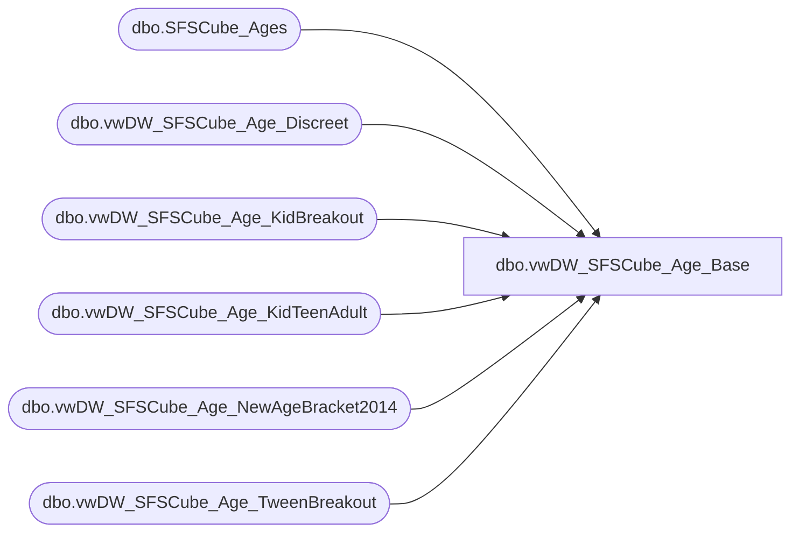

# dbo.vwDW_SFSCube_Age_Base

**Database:** dw  
**Server:** papamart  

## Architecture Diagram



## Table Dependencies

| Referenced Table |
|---|
| dbo.SFSCube_Ages |
| dbo.vwDW_SFSCube_Age_Discreet |
| dbo.vwDW_SFSCube_Age_KidBreakout |
| dbo.vwDW_SFSCube_Age_KidTeenAdult |
| dbo.vwDW_SFSCube_Age_NewAgeBracket2014 |
| dbo.vwDW_SFSCube_Age_TweenBreakout |

## View Code

```sql
CREATE VIEW [dbo].[vwDW_SFSCube_Age_Base]
AS
SELECT AG.Age
	, ISNULL(DIS.ageKey, - 1) AS DISKey
	, ISNULL(KID.ageKey, - 1) AS KIDKey
	, ISNULL(KTA.ageKey, - 1) AS KTAKey
	, ISNULL(TWE.ageKey, - 1) AS TWEKey
	, ISNULL(NAB.ageKey, - 1) AS NABKey
	, DIS.relSeq AS DISRelSeq
	, DIS.Descr AS DISDescr
	, KID.relSeq AS KIDRelSeq
	, KID.Descr AS KIDDescr
	, KTA.relSeq AS KTARelSeq
	, KTA.Descr AS KTADescr
	, TWE.relSeq AS TWERelSeq
	, TWE.Descr AS TWEDescr
	, NAB.relSeq AS NABRelSeq
	, NAB.Descr AS NABDescr
	, CASE 
		WHEN ag.age = - 1 
			THEN 'No' 
		ELSE 'Yes' 
	END AS hasBirthDate
FROM queries.dbo.SFSCube_Ages AS AG WITH(NOLOCK) 
	LEFT OUTER JOIN dbo.vwDW_SFSCube_Age_Discreet AS DIS WITH(NOLOCK)
		ON AG.Age BETWEEN DIS.minAge AND DIS.maxAge
	LEFT OUTER JOIN dbo.vwDW_SFSCube_Age_KidBreakout AS KID WITH(NOLOCK)
		ON AG.Age BETWEEN KID.minAge AND KID.maxAge 
	LEFT OUTER JOIN dbo.vwDW_SFSCube_Age_KidTeenAdult AS KTA WITH(NOLOCK)
		ON AG.Age BETWEEN KTA.minAge AND KTA.maxAge
	LEFT OUTER JOIN dbo.vwDW_SFSCube_Age_TweenBreakout AS TWE WITH(NOLOCK)
		ON AG.Age BETWEEN TWE.minAge AND TWE.maxAge
	LEFT OUTER JOIN dbo.vwDW_SFSCube_Age_NewAgeBracket2014 AS NAB WITH(NOLOCK)
		ON AG.Age BETWEEN NAB.minAge AND NAB.maxAge
```

