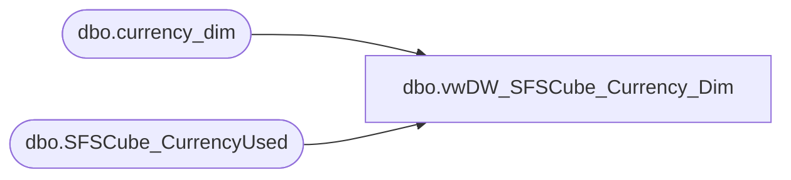

# dbo.vwDW_SFSCube_Currency_Dim

**Database:** dw  
**Server:** papamart  

## Architecture Diagram



## Table Dependencies

| Referenced Table |
|---|
| dbo.currency_dim |
| dbo.SFSCube_CurrencyUsed |

## View Code

```sql
CREATE VIEW dbo.vwDW_SFSCube_Currency_Dim
AS
SELECT     D.currency_key, D.currency_code, D.currency_desc
FROM         dbo.currency_dim AS D WITH (nolock) INNER JOIN
                      queries.dbo.SFSCube_CurrencyUsed AS U WITH (nolock) ON D.currency_key = U.currency_key
```

