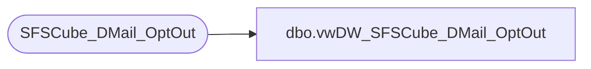

# dbo.vwDW_SFSCube_DMail_OptOut

**Database:** dw  
**Server:** papamart  

## Architecture Diagram



## Table Dependencies

| Referenced Table |
|---|
| SFSCube_DMail_OptOut |

## View Code

```sql
CREATE VIEW [dbo].[vwDW_SFSCube_DMail_OptOut]
AS SELECT
		  date_key
		, ORIG_SRC_SYS_CD
		, daysSinceID
		, isSFSMember
		, CNTRY_ABBRV
		, numDmailsOptOut
		, numDaysSinceAcquisition
	 FROM queries..SFSCube_DMail_OptOut A WITH (NOLOCK);
```

