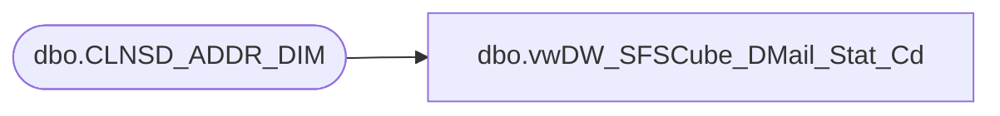

# dbo.vwDW_SFSCube_DMail_Stat_Cd

**Database:** dw  
**Server:** papamart  

## Architecture Diagram



## Table Dependencies

| Referenced Table |
|---|
| dbo.CLNSD_ADDR_DIM |

## View Code

```sql
CREATE VIEW [dbo].[vwDW_SFSCube_DMail_Stat_Cd]
as

SELECT DISTINCT ISNULL(ADDR.MAIL_STAT_CD,'No Address') AS MAIL_STAT_CD
FROM dw.dbo.CLNSD_ADDR_DIM ADDR WITH (NOLOCK)
```

