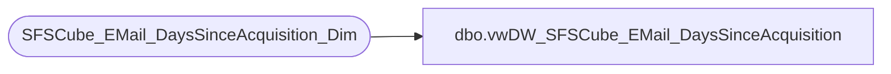

# dbo.vwDW_SFSCube_EMail_DaysSinceAcquisition

**Database:** dw  
**Server:** papamart  

## Architecture Diagram



## Table Dependencies

| Referenced Table |
|---|
| SFSCube_EMail_DaysSinceAcquisition_Dim |

## View Code

```sql
CREATE VIEW dbo.vwDW_SFSCube_EMail_DaysSinceAcquisition
AS SELECT
		  daysSinceID
		, Description
		, relSeq
	 FROM queries..SFSCube_EMail_DaysSinceAcquisition_Dim X WITH (NOLOCK);
```

