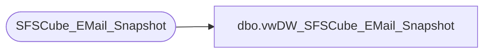

# dbo.vwDW_SFSCube_EMail_Snapshot

**Database:** dw  
**Server:** papamart  

## Architecture Diagram



## Table Dependencies

| Referenced Table |
|---|
| SFSCube_EMail_Snapshot |

## View Code

```sql
CREATE VIEW [dbo].[vwDW_SFSCube_EMail_Snapshot]
AS
	SELECT date_key,
		   CNTRY_ABBRV,
		   isSFSMember,
		   email_stat_cd,
		   promo_pref,
		   numAddresses 
	FROM queries..SFSCube_EMail_Snapshot SNAP WITH (NOLOCK)
```

