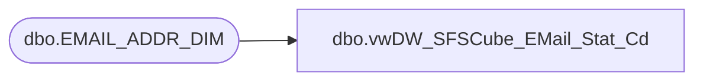

# dbo.vwDW_SFSCube_EMail_Stat_Cd

**Database:** dw  
**Server:** papamart  

## Architecture Diagram



## Table Dependencies

| Referenced Table |
|---|
| dbo.EMAIL_ADDR_DIM |

## View Code

```sql
CREATE VIEW dbo.vwDW_SFSCube_EMail_Stat_Cd
AS
SELECT DISTINCT EMAIL_STAT_CD
FROM dbo.EMAIL_ADDR_DIM WITH (NOLOCK)
UNION ALL 
SELECT 'No Address'
```

