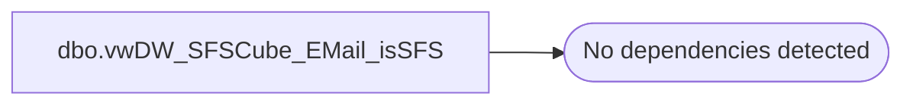

# dbo.vwDW_SFSCube_EMail_isSFS

**Database:** dw  
**Server:** papamart  

## Architecture Diagram



## Table Dependencies

_No table dependencies detected._

## View Code

```sql
CREATE VIEW [dbo].[vwDW_SFSCube_EMail_isSFS]
AS
	SELECT CAST(1 AS SMALLINT) AS isSFSMember, 'SFS Member' AS Description, 10 AS relSeq
UNION 
	SELECT CAST(0 AS SMALLINT) AS isSFSMember, 'Not SFS Member' AS Description, 20 AS relSeq
```

