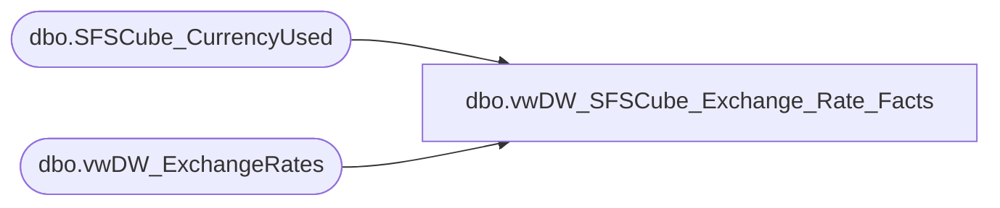

# dbo.vwDW_SFSCube_Exchange_Rate_Facts

**Database:** dw  
**Server:** papamart  

## Architecture Diagram



## Table Dependencies

| Referenced Table |
|---|
| dbo.SFSCube_CurrencyUsed |
| dbo.vwDW_ExchangeRates |

## View Code

```sql
CREATE VIEW dbo.vwDW_SFSCube_Exchange_Rate_Facts
AS
SELECT     F.date_key, F.from_currency_key, F.to_currency_key, F.bbw_rate
FROM         dbo.vwDW_ExchangeRates AS F WITH (nolock) INNER JOIN
                      queries.dbo.SFSCube_CurrencyUsed AS FR WITH (nolock) ON F.from_currency_key = FR.currency_key INNER JOIN
                      queries.dbo.SFSCube_CurrencyUsed AS T WITH (nolock) ON F.to_currency_key = T.currency_key
```

