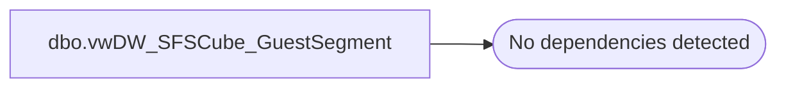

# dbo.vwDW_SFSCube_GuestSegment

**Database:** dw  
**Server:** papamart  

## Architecture Diagram



## Table Dependencies

_No table dependencies detected._

## View Code

```sql
CREATE VIEW [dbo].[vwDW_SFSCube_GuestSegment]
AS SELECT
       CAST(10 AS smallint) AS GS_ID
      ,CAST(1 AS smallint) AS minVisits
      ,CAST(1 AS smallint) AS maxVisits
      ,CAST(10 AS smallint) AS relSeq
      ,CAST('1x' AS varchar(10)) AS Descr
   UNION ALL
   SELECT
       20 AS GS_ID
      ,2 AS minVisits
      ,2 AS maxVisits
      ,20 AS relSeq
      ,'Casual (2x)' AS Descr
   UNION ALL
   SELECT
       30 AS GS_ID
      ,3 AS minVisits
      ,999999 AS maxVisits
      ,22 AS relSeq
      ,'Best (3+)' AS Descr
   UNION ALL
   SELECT
       -1 AS GS_ID
      ,-32767 AS minVisits
      ,0 AS maxVisits
      ,80 AS relSeq
      ,'Never' AS Descr
```

