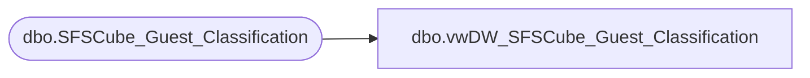

# dbo.vwDW_SFSCube_Guest_Classification

**Database:** dw  
**Server:** papamart  

## Architecture Diagram



## Table Dependencies

| Referenced Table |
|---|
| dbo.SFSCube_Guest_Classification |

## View Code

```sql
CREATE VIEW [dbo].[vwDW_SFSCube_Guest_Classification]
AS SELECT
       guest_class_key
      ,CASE
            WHEN GNDR_CD = 'M' THEN 'Boy'
            WHEN GNDR_CD = 'F' THEN 'Girl'
            ELSE 'Unknown'
       END AS Gender
      ,hasBirthDate
      ,isSFSMember
      ,hasDMailAddress
      ,hasEMailAddress
      ,EMailStatus
      ,SFS_Country
      ,CNTRY_ABBRV AS MailedCountry
      ,DMailStatus
      ,CheckSumValue
      ,hasHispanicSurname
      ,CASE
            WHEN hasHispanicSurname = 1 THEN 'Hispanic Surname'
            ELSE 'NOT Hispanic Surname'
       END AS hasHispanicSurnameText
      ,CASE
            WHEN isSFSMember = 1 THEN 'SFS Member'
            ELSE 'NOT SFS Member'
       END AS isSFSMemberText
      ,CASE
            WHEN hasDMailAddress = 1 THEN 'Has Address'
            ELSE 'NO Address'
       END AS hasDMailAddressText
      ,CASE
            WHEN hasEMailAddress = 1 THEN 'Has EMail'
            ELSE 'NO EMail'
       END AS hasEMailAddressText
      ,CASE
            WHEN hasBirthDate = 1 THEN 'Has Birth Date'
            ELSE 'NO Birth Date'
       END AS hasBirthDateText
      ,isSFSHousehold
      ,CASE
            WHEN isSFSHousehold = 1 THEN 'SFS Household'
            ELSE 'NOT SFS Household'
       END AS isSFSHouseholdText
   FROM
       queries.dbo.SFSCube_Guest_Classification WITH (NOLOCK)
```

