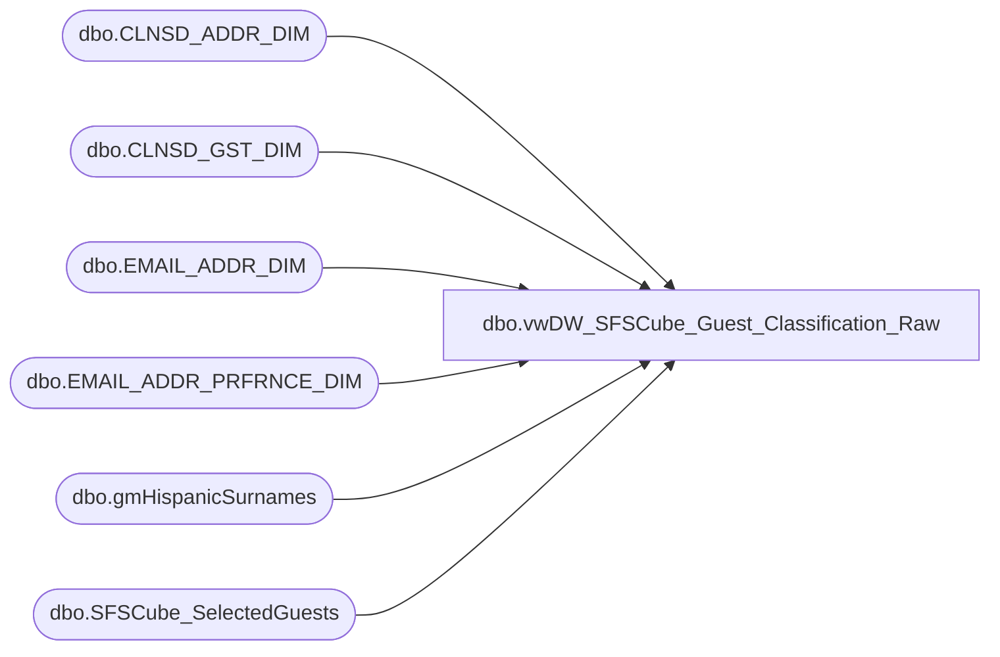

# dbo.vwDW_SFSCube_Guest_Classification_Raw

**Database:** dw  
**Server:** papamart  

## Architecture Diagram



## Table Dependencies

| Referenced Table |
|---|
| dbo.CLNSD_ADDR_DIM |
| dbo.CLNSD_GST_DIM |
| dbo.EMAIL_ADDR_DIM |
| dbo.EMAIL_ADDR_PRFRNCE_DIM |
| dbo.gmHispanicSurnames |
| dbo.SFSCube_SelectedGuests |

## View Code

```sql
CREATE VIEW [dbo].[vwDW_SFSCube_Guest_Classification_Raw]
AS SELECT 
    GST.CLNSD_GST_ID
   ,CASE
         WHEN GST.GNDR_CD IN ('M', 'F', 'U') THEN gst.gndr_cd
         ELSE 'U'
    END AS GNDR_CD
   ,CAST(CASE
              WHEN GST.BRTH_DT IS NULL
              OR GST.BRTH_DT = '1900-01-01' THEN 0
              ELSE 1
         END AS bit) AS hasBirthDate
   ,CAST(CASE
              WHEN LEN(ISNULL(GST.LYLTY_GST_NBR, '')) > 0 THEN 1
              ELSE 0
         END AS bit) AS isSFSMember
   ,CAST(CASE
              WHEN gst.CLNSD_ADDR_ID > 0 THEN 1
              ELSE 0
         END AS bit) AS hasDMailAddress
   ,CAST(CASE
              WHEN gst.email_addr_ID > 0 THEN 1
              ELSE 0
         END AS bit) AS hasEMailAddress
   ,CASE
         WHEN GST.email_addr_id <= 0 THEN 'No Address'
         ELSE ISNULL(CASE
                          WHEN EMAIL.EMAIL_STAT_CD = 'VALID'
                          AND EPref.PROMO_PREF = 'Y' THEN 'OPT-IN'
                          WHEN EMAIL.EMAIL_STAT_CD = 'VALID' THEN 'OPT-OUT'
                          ELSE ISNULL(EMAIL.EMAIL_STAT_CD, 'No Address')
                     END, 'No Address')
    END AS EMailStatus
   ,CASE LEFT(ISNULL(GST.LYLTY_GST_NBR, ''), 1)
      WHEN '3' THEN 'UK'
      WHEN '7' THEN 'US'
      WHEN '8' THEN 'CAN'
      ELSE 'N/A'
    END AS SFS_Country
   ,ISNULL(ADDR.CNTRY_ABBRV, 'N/A') AS CNTRY_ABBRV
   ,ISNULL(ADDR.MAIL_STAT_CD, 'No Address') AS DMailStatus
   ,CAST(CASE
              WHEN HSN.Surname IS NULL THEN 0
              ELSE 1
         END AS bit) AS hasHispanicSurname
   ,CAST(CASE
              WHEN LEN(ISNULL(GST.HOH_LYLTY_GST_NBR, '')) > 0 THEN 1
              ELSE 0
         END AS bit) AS isSFSHousehold
FROM
    dbo.CLNSD_GST_DIM AS GST WITH (NOLOCK)
LEFT OUTER JOIN dbo.EMAIL_ADDR_DIM AS EMAIL WITH (NOLOCK)
    ON EMAIL.EMAIL_ADDR_ID = GST.EMAIL_ADDR_ID
LEFT OUTER JOIN dbo.CLNSD_ADDR_DIM AS ADDR WITH (nolock)
    ON GST.CLNSD_ADDR_ID = ADDR.CLNSD_ADDR_ID
INNER JOIN queries.dbo.SFSCube_SelectedGuests AS SEL WITH (nolock)
    ON SEL.clnsd_gst_id = GST.CLNSD_GST_ID
LEFT JOIN queries.dbo.gmHispanicSurnames HSN WITH (NOLOCK)
    ON HSN.Surname = GST.LAST_NM
LEFT JOIN dw.dbo.EMAIL_ADDR_PRFRNCE_DIM EPref WITH (NOLOCK)
    ON EPref.EMAIL_ADDR_ID = GST.EMAIL_ADDR_ID
```

