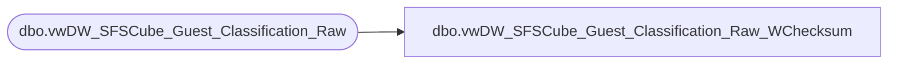

# dbo.vwDW_SFSCube_Guest_Classification_Raw_WChecksum

**Database:** dw  
**Server:** papamart  

## Architecture Diagram



## Table Dependencies

| Referenced Table |
|---|
| dbo.vwDW_SFSCube_Guest_Classification_Raw |

## View Code

```sql
CREATE VIEW [dbo].[vwDW_SFSCube_Guest_Classification_Raw_WChecksum]
AS SELECT
       CLNSD_GST_ID
      ,CHECKSUM([GNDR_CD] 
						,[hasBirthDate] * 27
						,[isSFSMember] * 13
						,[hasDMailAddress]
						,[hasEMailAddress]
						,[EMailStatus]
						,[SFS_Country]
						,[CNTRY_ABBRV]
						,[DMailStatus]
						,[hasHispanicSurname] * 17
						,[isSFSHousehold] * 47) AS CheckSumValue
   FROM
       dbo.vwDW_SFSCube_Guest_Classification_Raw WITH (nolock)
```

