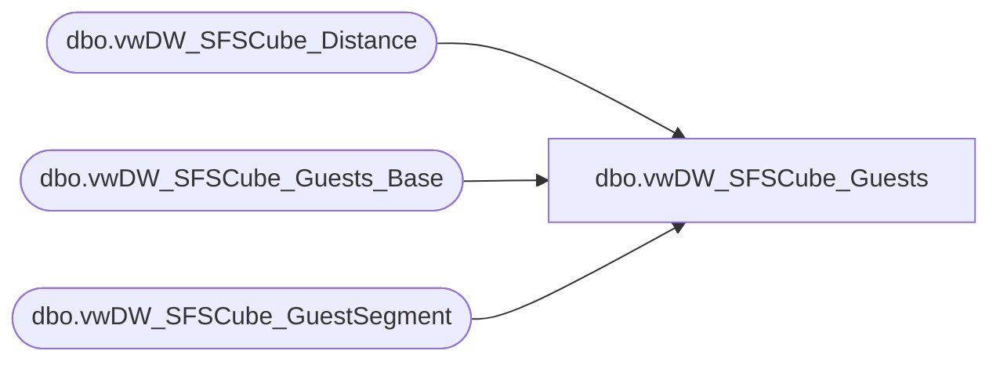

# dbo.vwDW_SFSCube_Guests

**Database:** dw  
**Server:** papamart  

## Architecture Diagram



## Table Dependencies

| Referenced Table |
|---|
| dbo.vwDW_SFSCube_Distance |
| dbo.vwDW_SFSCube_Guests_Base |
| dbo.vwDW_SFSCube_GuestSegment |

## View Code

```sql
CREATE VIEW [dbo].[vwDW_SFSCube_Guests]
AS SELECT
       BASE.CLNSD_GST_ID
      ,CAST(CASE
                 WHEN Gndr_cd = 'M' THEN 'Boy'
                 WHEN gndr_cd = 'F' THEN 'Girl'
                 ELSE 'Unknown'
            END AS varchar(7)) AS GNDR_CD
      ,BASE.CurrentAge
      ,BASE.hasBirthDate
      ,BASE.isSFSMember
      ,BASE.hasDMailAddress
      ,BASE.hasEMailAddress
      ,BASE.EMailStatus
      ,BASE.Joined_Date_Key
      ,BASE.CLNSD_ADDR_ID
      ,BASE.sfs_rfm_key
      ,BASE.LYLTY_GST_NBR
      ,BASE.GST_Name
      ,BASE.SFS_Country
      ,BASE.CRM_REGIS_STR_ID
      ,BASE.lifetimeVisitNumber
      ,BASE.daysSinceLastTransaction
      ,BASE.[12MoVisit]
      ,BASE.[24MoVisit]
      ,Y2GS.GS_ID AS y2_GS_ID
      ,Y1GS.GS_ID AS Y1_GS_ID
      ,Y1GS.Descr AS Y1_Descr
      ,Y1GS.relSeq AS Y1_relSeq
      ,Y2GS.relSeq AS Y2_relSeq
      ,Y2GS.Descr AS Y2_Descr
      ,LTGS.GS_ID AS LT_GSID
      ,LTGS.relSeq AS LT_relSeq
      ,LTGS.Descr AS LT_Descr
      ,CASE
            WHEN base.[12MoVisit] > 0 THEN 1
            ELSE 0
       END AS GSTS12Mo
      ,CASE
            WHEN base.[24MoVisit] > 0 THEN 1
            ELSE 0
       END AS GSTS24Mo
      ,CASE
            WHEN base.lifetimevisitnumber > 0 THEN 1
            ELSE 0
       END AS GSTSLTVisits
      ,BASE.CNTRY_ABBRV
      ,BASE.CNTRY_NM
      ,BASE.DMailStatus
      ,BASE.SFS_Mbr_Mos
      ,BASE.guest_class_key
      ,BASE.psyte_clus_id
	  ,CASE WHEN BASE.distance_to_nearest_store >= 0 THEN BASE.distance_to_nearest_store ELSE 0 END AS distance_to_nearest_store
	  ,CAST(CASE
				WHEN BASE.distance_to_nearest_store > 0 THEN 1
				ELSE 0
			END AS TINYINT) AS num_with_distance_to_nearest_store
	  ,ISNULL(DISTN.distance_key, -1) AS distance_to_nearest_store_key   
	  ,BASE.nearest_store_key   
	  ,BASE.dma_code
	  ,BASE.dateJoinedSFS
	  ,BASE.isSFSHousehold
   FROM
       dbo.vwDW_SFSCube_Guests_Base AS BASE
   INNER JOIN dbo.vwDW_SFSCube_GuestSegment AS Y1GS WITH (nolock)
   ON  BASE.[12MoVisit] BETWEEN Y1GS.minVisits
       AND Y1GS.maxVisits
   INNER JOIN dbo.vwDW_SFSCube_GuestSegment AS Y2GS WITH (nolock)
   ON  BASE.[24MoVisit] BETWEEN Y2GS.minVisits
       AND Y2GS.maxVisits
   INNER JOIN dbo.vwDW_SFSCube_GuestSegment AS LTGS WITH (nolock)
   ON  BASE.lifetimeVisitNumber BETWEEN LTGS.minVisits
       AND LTGS.maxVisits
	LEFT JOIN dbo.vwDW_SFSCube_Distance DISTN WITH (NOLOCK)
		ON BASE.distance_to_nearest_store >= DISTN.minDistance 
			AND BASE.distance_to_nearest_store < DISTN.maxDistance
```

