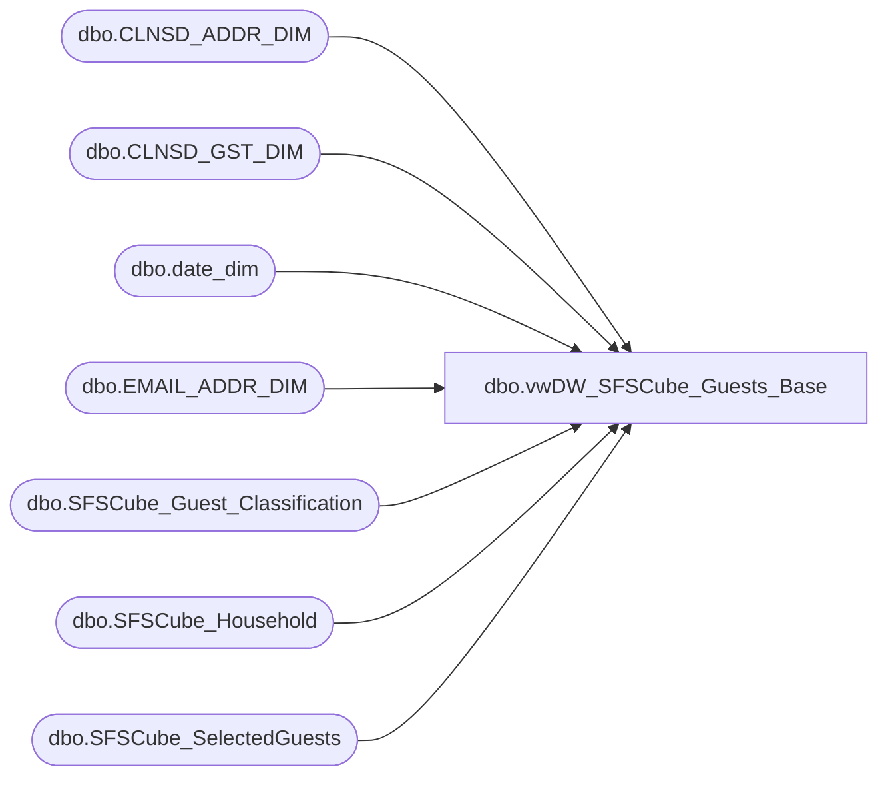

# dbo.vwDW_SFSCube_Guests_Base

**Database:** dw  
**Server:** papamart  

## Architecture Diagram



## Table Dependencies

| Referenced Table |
|---|
| dbo.CLNSD_ADDR_DIM |
| dbo.CLNSD_GST_DIM |
| dbo.date_dim |
| dbo.EMAIL_ADDR_DIM |
| dbo.SFSCube_Guest_Classification |
| dbo.SFSCube_Household |
| dbo.SFSCube_SelectedGuests |

## View Code

```sql
CREATE VIEW [dbo].[vwDW_SFSCube_Guests_Base]
AS SELECT
       GST.CLNSD_GST_ID
      ,CASE
            WHEN GST.GNDR_CD IN ('M', 'F', 'U') THEN gst.gndr_cd
            ELSE 'U'
       END AS GNDR_CD
      ,CAST(CASE
                 WHEN GST.BRTH_DT IS NULL
                 OR GST.BRTH_DT = '1900-01-01' THEN 0
                 ELSE 1
            END AS bit) AS hasBirthDate
      ,CAST(CASE
                 WHEN LEFT(ISNULL(LYLTY_GST_NBR, ''), 1) IN ('3', '7', '8') THEN 1
                 ELSE 0
            END AS bit) AS isSFSMember
      ,CAST(CASE
                 WHEN gst.CLNSD_ADDR_ID > 0 THEN 1
                 ELSE 0
            END AS bit) AS hasDMailAddress
      ,CAST(CASE
                 WHEN gst.email_addr_ID > 0 THEN 1
                 ELSE 0
            END AS bit) AS hasEMailAddress
      ,ISNULL(EMAIL.EMAIL_STAT_CD, 'No Address') AS EMailStatus
      ,JDTE.date_key AS Joined_Date_Key
      ,ISNULL(HSH.CLNSD_ADDR_ID, -1) AS CLNSD_ADDR_ID
      ,GST.LYLTY_GST_NBR
      ,GST.FRST_NM + ' ' + GST.LAST_NM AS GST_Name
      ,CASE LEFT(ISNULL(LYLTY_GST_NBR, ''), 1)
         WHEN '3' THEN 'UK'
         WHEN '7' THEN 'US'
         WHEN '8' THEN 'CAN'
         ELSE 'N/A'
       END AS SFS_Country
      ,GST.CRM_REGIS_STR_ID
      ,SEL.lifetimeVisitNumber
      ,SEL.daysSinceLastTransaction
      ,SEL.[12MoVisit]
      ,SEL.[24MoVisit]
      ,ISNULL(ADDR.CNTRY_ABBRV, '?') AS CNTRY_ABBRV
      ,ISNULL(ADDR.CNTRY_NM, 'Unknown') AS CNTRY_NM
      ,ISNULL(ADDR.MAIL_STAT_CD, 'No Address') AS DMailStatus
      ,CAST(CASE
                 WHEN GST.CRM_MBRSHP_DT IS NULL
                 OR GST.CRM_MBRSHP_DT = '1900-01-01' THEN-1
                 ELSE datediff(m, GST.CRM_MBRSHP_DT, GETDATE())
            END AS smallint) AS SFS_Mbr_Mos
      ,SEL.CurrentAge
      ,SEL.sfs_rfm_key
      ,SEL.guest_class_key
      ,HSH.psyte_clus_id
      ,ISNULL(HSH.dstnc_to_str_qty,-1) AS distance_to_nearest_Store
	  ,ISNULL(HSH.NRST_STR_Key,-4) AS nearest_store_key
	  ,ISNULL(HSH.dma_code,-1) AS dma_code
	  ,ISNULL(SEL.dateJoinedSFS,1) AS dateJoinedSFS
	  ,ISNULL(CLS.isSFSHousehold,0) AS isSFSHousehold
   FROM
       dbo.CLNSD_GST_DIM AS GST WITH (NOLOCK)
   LEFT OUTER JOIN dbo.EMAIL_ADDR_DIM AS EMAIL WITH (NOLOCK)
   ON  EMAIL.EMAIL_ADDR_ID = GST.EMAIL_ADDR_ID
   LEFT OUTER JOIN dbo.date_dim AS JDTE WITH (NOLOCK)
   ON  JDTE.actual_date = GST.CRM_MBRSHP_DT
   INNER JOIN queries.dbo.SFSCube_SelectedGuests AS SEL WITH (nolock)
   ON  GST.CLNSD_GST_ID = SEL.clnsd_gst_id
   INNER JOIN queries.dbo.SFSCube_Household AS HSH WITH (NOLOCK)
	ON SEL.clnsd_addr_id = HSH.clnsd_addr_id
   LEFT OUTER JOIN dbo.CLNSD_ADDR_DIM AS ADDR WITH (nolock)
   ON  GST.CLNSD_ADDR_ID = ADDR.CLNSD_ADDR_ID
   LEFT JOIN queries.dbo.SFSCube_Guest_Classification CLS WITH (NOLOCK)
	ON SEL.guest_class_key = CLS.guest_class_key
```

