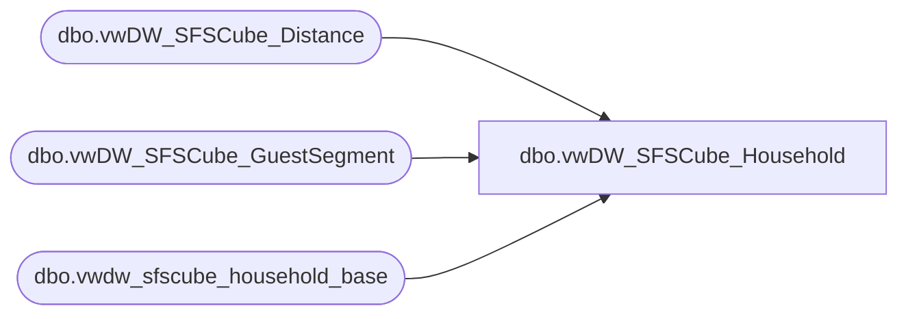

# dbo.vwDW_SFSCube_Household

**Database:** dw  
**Server:** papamart  

## Architecture Diagram



## Table Dependencies

| Referenced Table |
|---|
| dbo.vwDW_SFSCube_Distance |
| dbo.vwDW_SFSCube_GuestSegment |
| dbo.vwdw_sfscube_household_base |

## View Code

```sql
CREATE VIEW [dbo].[vwDW_SFSCube_Household]
AS


SELECT 
    BASE.clnsd_addr_id
   ,BASE.lifetimeVisitNumber
   ,BASE.daysSinceLastTransaction
   ,BASE.[12MoVisit]
   ,BASE.[24MoVisit]
   ,BASE.[12MoKiosk]
   ,BASE.[24MoKiosk]
   ,BASE.lifetimeKiosk
   ,BASE.daysSinceLastKiosk
   ,BASE.psyte_clus_id
   ,BASE.NRST_str_key
   ,BASE.DSTNC_TO_STR_QTY
   ,BASE.dma_code
   ,BASE.dateJoinedSFS
   ,BASE.isSFSHousehold
   ,BASE.CNTRY_ABBRV
   ,BASE.DMailStatus
   ,BASE.hasDMailAddress
   ,CASE
         WHEN base.[12MoVisit] > 0 THEN 1
         ELSE 0
    END AS HS12Mo
   ,CASE
         WHEN base.[24MoVisit] > 0 THEN 1
         ELSE 0
    END AS HS24Mo
   ,CASE
         WHEN base.lifetimevisitnumber > 0 THEN 1
         ELSE 0
    END AS HSLTVisits
   ,CAST(CASE
              WHEN BASE.DSTNC_TO_STR_QTY > 0 THEN 1
              ELSE 0
         END AS tinyint) AS num_with_distance_to_nearest_store
   ,ISNULL(DISTN.distance_key, -1) AS distance_to_nearest_store_key
   ,Y2HS.GS_ID AS y2_GS_ID
   ,Y1HS.GS_ID AS Y1_GS_ID
   ,LTHS.GS_ID AS LT_GS_ID
FROM
    dw.dbo.vwdw_sfscube_household_base BASE WITH (NOLOCK)
INNER JOIN dbo.vwDW_SFSCube_GuestSegment AS Y1HS WITH (nolock)
    ON BASE.[12MoVisit] BETWEEN Y1HS.minVisits
       AND Y1HS.maxVisits
INNER JOIN dbo.vwDW_SFSCube_GuestSegment AS Y2HS WITH (nolock)
    ON BASE.[24MoVisit] BETWEEN Y2HS.minVisits
       AND Y2HS.maxVisits
INNER JOIN dbo.vwDW_SFSCube_GuestSegment AS LTHS WITH (nolock)
    ON BASE.lifetimeVisitNumber BETWEEN LTHS.minVisits
       AND LTHS.maxVisits
LEFT JOIN dbo.vwDW_SFSCube_Distance DISTN WITH (NOLOCK)
    ON BASE.DSTNC_TO_STR_QTY >= DISTN.minDistance
       AND BASE.DSTNC_TO_STR_QTY < DISTN.maxDistance
```

