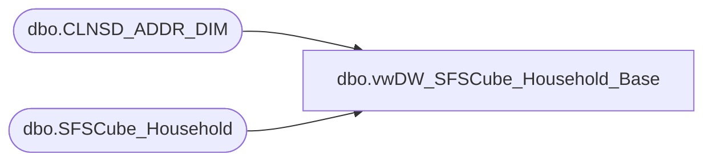

# dbo.vwDW_SFSCube_Household_Base

**Database:** dw  
**Server:** papamart  

## Architecture Diagram



## Table Dependencies

| Referenced Table |
|---|
| dbo.CLNSD_ADDR_DIM |
| dbo.SFSCube_Household |

## View Code

```sql
CREATE VIEW [dbo].[vwDW_SFSCube_Household_Base]
AS SELECT
       HSH.clnsd_addr_id
      ,HSH.lifetimeVisitNumber
      ,HSH.daysSinceLastTransaction
      ,HSH.[12MoVisit]
      ,HSH.[24MoVisit]
      ,HSH.[12MoKiosk]
      ,HSH.[24MoKiosk]
      ,HSH.lifetimeKiosk
      ,HSH.daysSinceLastKiosk
      ,HSH.psyte_clus_id
      ,HSH.NRST_str_key
      ,HSH.DSTNC_TO_STR_QTY
      ,HSH.dma_code
      ,ISNULL(HSH.firstDateJoinedSFS, 1) AS dateJoinedSFS
      ,HSH.isSFSHousehold
      ,ISNULL(ADDR.CNTRY_ABBRV, '?') AS CNTRY_ABBRV
      ,ISNULL(ADDR.MAIL_STAT_CD, 'No Address') AS DMailStatus
      ,CAST(CASE
                 WHEN HSH.CLNSD_ADDR_ID > 0 THEN 1
                 ELSE 0
            END AS bit) AS hasDMailAddress
   FROM
       queries.dbo.SFSCube_Household HSH WITH (NOLOCK)
   INNER JOIN dw.dbo.CLNSD_ADDR_DIM ADDR WITH (NOLOCK)
       ON HSH.clnsd_addr_id = ADDR.CLNSD_ADDR_ID
```

