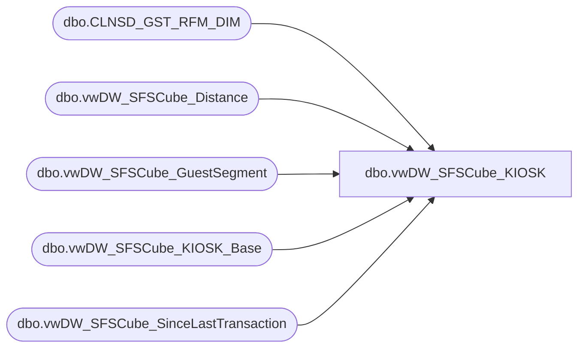

# dbo.vwDW_SFSCube_KIOSK

**Database:** dw  
**Server:** papamart  

## Architecture Diagram



## Table Dependencies

| Referenced Table |
|---|
| dbo.CLNSD_GST_RFM_DIM |
| dbo.vwDW_SFSCube_Distance |
| dbo.vwDW_SFSCube_GuestSegment |
| dbo.vwDW_SFSCube_KIOSK_Base |
| dbo.vwDW_SFSCube_SinceLastTransaction |

## View Code

```sql
CREATE VIEW [dbo].[vwDW_SFSCube_KIOSK]
AS SELECT
       BASE.CLNSD_GST_ID
      ,BASE.Store_Key
      ,BASE.Product_Key
      ,BASE.Date_key
      ,BASE.Recepient_Gender
      ,BASE.Recepient_Age_Purchase
      ,BASE.PurchaserAgePurchase
      ,BASE.lifetimeVisitNumber
      ,BASE.DaysSinceLastTransaction
      ,BASE.Recepient_hasBirthDate
      ,BASE.lifetime_key
      ,ISNULL(SLT.ageKey, -1) AS SLT_Age_Key
      ,BASE.[12MoVisit]
      ,BASE.[24MoVisit]
      ,Y2GS.GS_ID AS y2_GS_ID
      ,Y1GS.GS_ID AS Y1_GS_ID
      ,LTGS.GS_ID AS LT_GS_ID
      ,CAST(CASE
                 WHEN base.PurchaserAgePurchase > 0 THEN 1
                 ELSE 0
            END AS bit) AS Purchaser_hasBirthDate
      ,BASE.CurrentAge
      ,BASE.Current_sfs_rfm_key
      ,ISNULL(RFM.sfs_rfm_key, -1) AS Visit_sfs_rfm_key
      ,BASE.guest_class_key
      ,BASE.isGiftInd
      ,GST_Y2GS.GS_ID AS GST_y2_GS_ID
      ,GST_Y1GS.GS_ID AS GST_Y1_GS_ID
      ,GST_LTGS.GS_ID AS GST_LT_GS_ID
      ,BASE.psyte_clus_id
      ,CASE
            WHEN BASE.dstnc_to_str_qty >= 0 THEN BASE.dstnc_to_str_qty
            ELSE 0
       END AS dstnc_to_str_qty
      ,CAST(CASE
                 WHEN BASE.dstnc_to_str_qty > 0 THEN 1
                 ELSE 0
            END AS tinyint) AS num_with_distance
      ,ISNULL(DIST.distance_key, -1) AS distance_key
      ,CASE
            WHEN BASE.distance_to_nearest_store >= 0 THEN BASE.distance_to_nearest_store
            ELSE 0
       END AS distance_to_nearest_store
      ,CAST(CASE
                 WHEN BASE.distance_to_nearest_store > 0 THEN 1
                 ELSE 0
            END AS tinyint) AS num_with_distance_to_nearest_store
      ,ISNULL(DISTN.distance_key, -1) AS distance_to_nearest_store_key
      ,BASE.isParty
      ,BASE.nearest_store_key
      ,BASE.dma_code
      ,BASE.dateJoinedSFS
      ,BASE.isSFSHousehold
   FROM
       dbo.vwDW_SFSCube_KIOSK_Base AS BASE WITH (nolock)
   LEFT OUTER JOIN dbo.vwDW_SFSCube_SinceLastTransaction AS SLT WITH (nolock)
       ON BASE.DaysSinceLastTransaction BETWEEN SLT.minDays
          AND SLT.maxDays
   INNER JOIN dbo.vwDW_SFSCube_GuestSegment AS Y1GS WITH (nolock)
       ON BASE.[12MoVisit] BETWEEN Y1GS.minVisits
          AND Y1GS.maxVisits
   INNER JOIN dbo.vwDW_SFSCube_GuestSegment AS Y2GS WITH (nolock)
       ON BASE.[24MoVisit] BETWEEN Y2GS.minVisits
          AND Y2GS.maxVisits
   INNER JOIN dbo.vwDW_SFSCube_GuestSegment AS LTGS
       ON BASE.lifetimeVisitNumber BETWEEN LTGS.minVisits
          AND LTGS.maxVisits
   INNER JOIN dbo.vwDW_SFSCube_GuestSegment AS GST_Y1GS WITH (nolock)
       ON BASE.[GST_12MoKiosk] BETWEEN GST_Y1GS.minVisits
          AND GST_Y1GS.maxVisits
   INNER JOIN dbo.vwDW_SFSCube_GuestSegment AS GST_Y2GS WITH (nolock)
       ON BASE.[GST_24MoKiosk] BETWEEN GST_Y2GS.minVisits
          AND GST_Y2GS.maxVisits
   INNER JOIN dbo.vwDW_SFSCube_GuestSegment AS GST_LTGS
       ON BASE.GST_lifetimeKiosk BETWEEN GST_LTGS.minVisits
          AND GST_LTGS.maxVisits
   LEFT OUTER JOIN dbo.CLNSD_GST_RFM_DIM AS RFM WITH (nolock)
       ON RFM.CLNSD_GST_ID = BASE.CLNSD_GST_ID
          AND BASE.Date_key BETWEEN RFM.from_date_key
          AND RFM.thru_date_key
   LEFT JOIN dbo.vwDW_SFSCube_Distance DIST WITH (NOLOCK)
       ON BASE.dstnc_to_str_qty >= DIST.minDistance
          AND BASE.dstnc_to_str_qty < DIST.maxDistance
   LEFT JOIN dbo.vwDW_SFSCube_Distance DISTN WITH (NOLOCK)
       ON BASE.distance_to_nearest_store >= DISTN.minDistance
          AND BASE.distance_to_nearest_store < DISTN.maxDistance
```

