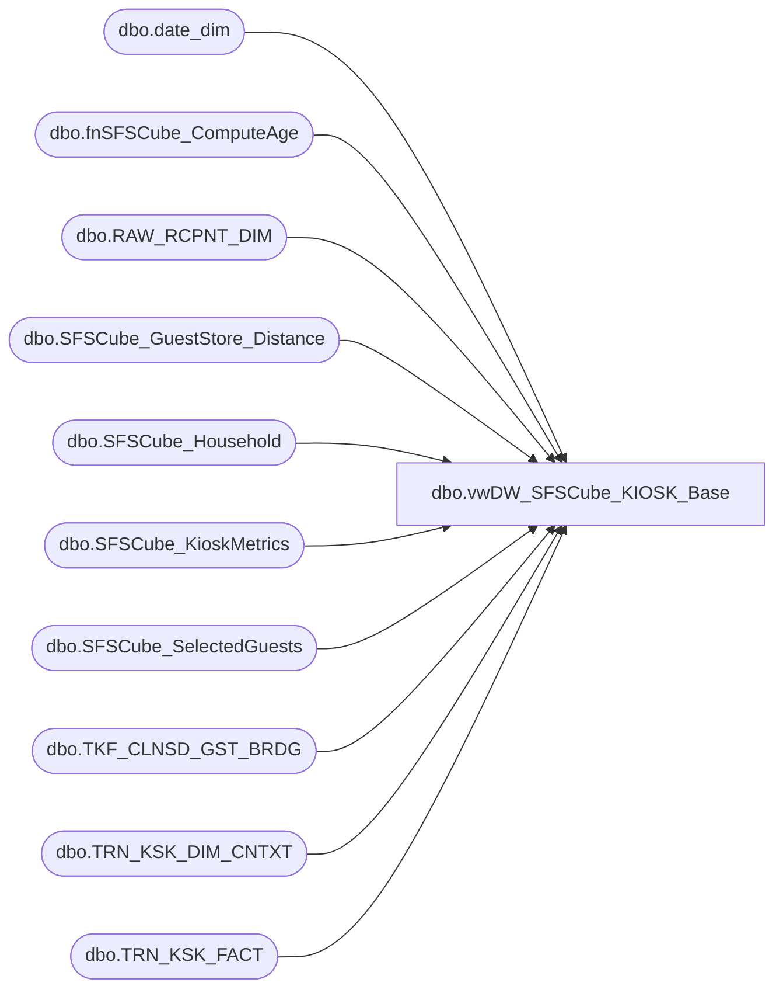

# dbo.vwDW_SFSCube_KIOSK_Base

**Database:** dw  
**Server:** papamart  

## Architecture Diagram



## Table Dependencies

| Referenced Table |
|---|
| dbo.date_dim |
| dbo.fnSFSCube_ComputeAge |
| dbo.RAW_RCPNT_DIM |
| dbo.SFSCube_GuestStore_Distance |
| dbo.SFSCube_Household |
| dbo.SFSCube_KioskMetrics |
| dbo.SFSCube_SelectedGuests |
| dbo.TKF_CLNSD_GST_BRDG |
| dbo.TRN_KSK_DIM_CNTXT |
| dbo.TRN_KSK_FACT |

## View Code

```sql
CREATE VIEW [dbo].[vwDW_SFSCube_KIOSK_Base]
AS SELECT
       BRDG.CLNSD_GST_ID
      ,TKF.STR_ID AS Store_Key
      ,TKF.PRDCT_ID AS Product_Key
      ,TKF.DT_ID AS Date_key
      ,CASE
            WHEN isnull(RCPT.DRVD_GNDR_CD, 'U') IN ('M', 'F', 'U') THEN isnull(RCPT.DRVD_GNDR_CD, 'U')
            ELSE 'U'
       END AS Recepient_Gender
      ,CAST(CASE
                 WHEN rcpt.BRTH_DT IS NULL
                 OR rcpt.BRTH_DT <= '1910-01-01' THEN-1
                 ELSE dw.dbo.fnSFSCube_ComputeAge(rcpt.BRTH_DT, trndte.actual_date)
            END AS int) AS Recepient_Age_Purchase
      ,ISNULL(CAST(CASE
                        WHEN isnull(MET.ageMonths, 0) <= 0
                        OR met.ageMonths > 1200 THEN-12
                        ELSE MET.ageMonths
                   END / 12 AS int), 1) AS PurchaserAgePurchase
      ,MET.lifetimeVisitNumber
      ,MET.DaysSinceLastTransaction
      ,CAST(CASE
                 WHEN rcpt.BRTH_DT IS NULL
                 OR rcpt.BRTH_DT <= '1910-01-01' THEN 0
                 ELSE 1
            END AS bit) AS Recepient_hasBirthDate
      ,CAST(CASE
                 WHEN met.lifetimeVisitNumber = 1 THEN 1
                 WHEN met.lifetimevisitnumber BETWEEN 2
                 AND 5 THEN 2
                 WHEN met.lifetimevisitnumber BETWEEN 6
                 AND 9 THEN 3
                 ELSE 4
            END AS smallint) AS lifetime_key
      ,MET.[12MoVisit]
      ,MET.[24MoVisit]
      ,SEL.CurrentAge
      ,SEL.sfs_rfm_key AS Current_sfs_rfm_key
      ,SEL.guest_class_key
      ,CAST(CASE
                 WHEN CNTX.GIFT_IND = 'Y' THEN 1
                 ELSE 0
            END AS bit) AS isGiftInd
      ,SEL.[12MoKiosk] AS GST_12MoKiosk
      ,SEL.[24MoKiosk] AS GST_24MoKiosk
      ,SEL.lifetimeKiosk AS GST_lifetimeKiosk
      ,HSH.psyte_clus_id
      ,ISNULL(DST.dstnc_to_store_qty, -1) AS dstnc_to_str_qty
      ,ISNULL(HSH.dstnc_to_str_qty, -1) AS distance_to_nearest_Store
      ,ISNULL(HSH.NRST_STR_KEY, -4) AS nearest_store_key
      ,CAST(CASE
                 WHEN ISNULL(CNTX.PRTY_TRN_IND, '') = 'Y' THEN 1
                 ELSE 0
            END AS tinyint) AS isParty
      ,ISNULL(HSH.dma_code, -1) AS dma_code
      ,ISNULL(SEL.dateJoinedSFS, 1) AS dateJoinedSFS
      ,ISNULL(HSH.isSFSHousehold, 0) AS isSFSHousehold
   FROM
       dbo.TRN_KSK_FACT AS TKF WITH (NOLOCK)
   LEFT OUTER JOIN dbo.RAW_RCPNT_DIM AS RCPT WITH (NOLOCK)
       ON TKF.RAW_RCPNT_ID = RCPT.RAW_RCPNT_ID
   INNER JOIN dbo.TKF_CLNSD_GST_BRDG AS BRDG WITH (NOLOCK)
       ON TKF.TKF_ID = BRDG.TKF_ID
   INNER JOIN dbo.date_dim AS TRNDTE WITH (NOLOCK)
       ON TRNDTE.date_key = TKF.DT_ID
   INNER JOIN queries.dbo.SFSCube_KioskMetrics AS MET WITH (NOLOCK)
       ON BRDG.CLNSD_GST_ID = MET.clnsd_gst_id
          AND TKF.DT_ID = MET.dt_id
   INNER JOIN queries.dbo.SFSCube_SelectedGuests AS SEL WITH (NOLOCK)
       ON BRDG.CLNSD_GST_ID = SEL.clnsd_gst_id
   INNER JOIN queries.dbo.SFSCube_Household AS HSH WITH (NOLOCK)
       ON SEL.CLNSD_ADDR_id = HSH.clnsd_addr_id
   INNER JOIN dw.dbo.TRN_KSK_DIM_CNTXT CNTX WITH (NOLOCK)
       ON CNTX.trn_ksk_cntxt_id = tkf.trn_ksk_cntxt_id
   LEFT JOIN queries.dbo.SFSCube_GuestStore_Distance DST WITH (NOLOCK)
       ON DST.clnsd_gst_id = SEL.clnsd_gst_id
          AND DST.store_key = TKF.STR_ID
   WHERE
       (1=1
       --AND TKF.DT_ID > 4019
       AND SEL.clnsd_gst_id > 0)
```

