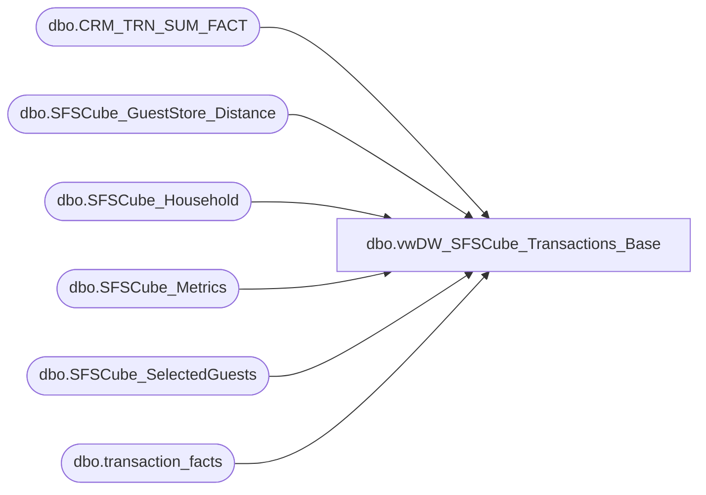

# dbo.vwDW_SFSCube_Transactions_Base

**Database:** dw  
**Server:** papamart  

## Architecture Diagram



## Table Dependencies

| Referenced Table |
|---|
| dbo.CRM_TRN_SUM_FACT |
| dbo.SFSCube_GuestStore_Distance |
| dbo.SFSCube_Household |
| dbo.SFSCube_Metrics |
| dbo.SFSCube_SelectedGuests |
| dbo.transaction_facts |

## View Code

```sql
CREATE VIEW [dbo].[vwDW_SFSCube_Transactions_Base]
AS SELECT
       TDF.currency_key
      ,TDF.transaction_id
      ,TDF.store_key
      ,ISNULL(TSF.CLNSD_GST_ID, -1) AS CLNSD_GST_ID
      ,TSF.DT_ID as date_key
      ,MET.lifetimeVisitNumber
      ,MET.DaysSinceLastTransaction
      ,ISNULL(CAST(CASE
                        WHEN MET.ageMonths < 0
                        OR met.ageMonths > 1200 THEN-12
                        ELSE MET.ageMonths
                   END / 12 AS int), 1) AS SalesAge
      ,CAST(ISNULL(CASE
                        WHEN met.lifetimeVisitNumber = 1 THEN 1
                        WHEN met.lifetimevisitnumber BETWEEN 2
                        AND 5 THEN 2
                        WHEN met.lifetimevisitnumber BETWEEN 6
                        AND 9 THEN 3
                        ELSE 4
                   END, 1) AS smallint) AS lifetime_key
      ,TDF.transaction_type_key
      ,TDF.unit_gross_amount as UnitGrossAmount
      ,TDF.unit_discount_amount as UnitDiscAmount
      ,TDF.GAAP_sales_amount as GaapSales
      ,TDF.merchandise_units as MerchandiseUnits
      ,MET.[12MoVisit]
      ,MET.[24MoVisit]
      ,TDF.Animal_UGA
      ,TDF.Non_Animal_UGA
      ,TDF.Footwear_UGA
      ,TDF.Accessories_UGA
      ,TDF.Sounds_UGA
      ,TDF.Clothing_UGA
      ,TDF.Other_UGA
      ,TDF.merchandise_UGA as MerchandiseUga
      ,TDF.giftcard_UGA as GiftCardsSoldUga
      ,TDF.giftcard_discount_amount as GiftCardDiscount
      ,TDF.donations_UGA as DonationsUga
      ,TDF.stuffing_supplies_UGA as StuffingAndSuppliesUGA
      ,TDF.animal_units as AnimalUnits
      ,TDF.footwear_units as ShoeUnits
      ,TDF.sounds_units as SoundUnits
      ,CAST(TDF.GAAP_transaction_flag AS smallint) AS numGAAPTrans
      ,CAST(CASE
                 WHEN TDF.giftcard_UGA > 0 THEN 1
                 ELSE 0
            END AS smallint) AS numGiftCardsTrans
      ,TDF.line_count AS numItems
      ,SEL.CurrentAge
      ,SEL.sfs_rfm_key AS Current_sfs_rfm_key
      ,SEL.guest_class_key
      ,SEL.[12MoVisit] AS Gst_12MoVisit
      ,SEL.[24MoVisit] AS Gst_24MoVisit
      ,SEL.[lifetimeVisitNumber] AS Gst_lifetimeVisitNumber
      ,HSH.psyte_clus_id
      ,ISNULL(DST.dstnc_to_store_qty, -1) AS dstnc_to_str_qty
      ,ISNULL(HSH.dstnc_to_str_qty,-1) AS distance_to_nearest_Store
	  ,ISNULL(HSH.NRST_STR_KEY,-4) AS nearest_store_key
	  ,CAST(CASE WHEN ISNULL(TDF.party_flag,0) = 1 THEN 1 ELSE 0 END AS tinyint) AS isParty
	  ,ISNULL(HSH.dma_code,-1) AS dma_code
	  ,ISNULL(SEL.dateJoinedSFS,1) AS dateJoinedSFS
	  ,ISNULL(HSH.isSFSHousehold,0) AS isSFSHousehold
   FROM
		dbo.CRM_TRN_SUM_FACT AS TSF with (nolock)
   INNER JOIN queries.dbo.SFSCube_SelectedGuests AS SEL WITH (nolock)
       ON SEL.clnsd_gst_id = TSF.CLNSD_GST_ID
   INNER JOIN queries.dbo.SFSCube_Household AS HSH WITH (NOLOCK)
	   ON SEL.clnsd_addr_id = HSH.clnsd_addr_id
   INNER JOIN dbo.transaction_facts AS TDF WITH (NOLOCK)
       ON TSF.TDF_TRN_ID = TDF.transaction_id
       and TSF.STR_ID = TDF.store_key
   LEFT JOIN queries.dbo.SFSCube_Metrics AS MET WITH (NOLOCK)
       ON TSF.CLNSD_GST_ID = MET.clnsd_gst_id
          AND TSF.DT_ID = MET.dt_id
   LEFT JOIN queries.dbo.SFSCube_GuestStore_Distance DST WITH (NOLOCK)
		ON DST.clnsd_gst_id = tsf.clnsd_gst_id
		AND DST.store_key = TSF.STR_ID
```

