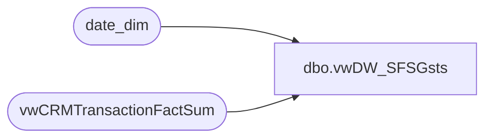

# dbo.vwDW_SFSGsts

**Database:** dw  
**Server:** papamart  

## Architecture Diagram



## Table Dependencies

| Referenced Table |
|---|
| date_dim |
| vwCRMTransactionFactSum |

## View Code

```sql
/***********************************************************************************************
Object Name:	[vwDW_SFSGsts]

Author			Date			Comment
Gary Murrish	10/17/2011		Removed logic for Transaction table for performance reasons.
Funmi Agbebi	11/4/2009		Added VALID_CRM_MBRSHP_DT field. Included case statements to nullify all CRM_MBRSHP_DT earlier than 6/1/2008
Funmi Agbebi	3/6/2009		original creation

Purpose:		View used for reporting.  Primarily used by the used the 'SFS Guest Facts' and 
				'SFS Guest With Email Facts' measure groups of the SSAS papa mart cube to identify
				 new vs repeat sfs guests and sfs gsts with email.
				Joins transaction_detail_facts to vwCRM_TRN_SUM_FACT, vwDW_store and date_dim
**********************************************************************************************/
CREATE VIEW [dbo].[vwDW_SFSGsts]
AS
/***********************************
vwDW_Transactions_original
************************************/
SELECT temp.*

	FROM
	(
		SELECT tdf.date_key
			,trans_date_dim.fiscal_year
			,trans_date_dim.fiscal_quarter
			,trans_date_dim.fiscal_period
			,trans_date_dim.fiscal_week
			,tdf.store_key
			,tdf.transaction_id
			,1 as all_trans_cnt  -- (FA 7/21/2009)
			,tdf.sfs_trans_cnt   -- (FA 7/21/2009)
			,tdf.SFSGstID
			,tdf.CRM_MBRSHP_DT
			,tdf.VALID_CRM_MBRSHP_DT
			,tdf.SFS_GstVisitType
			,tdf.New_SFSGstID
			,tdf.SFSValidEmail
			,tdf.SFSValidEmail_GstID 
			,tdf.NewSFSValidEmail_GstID
		FROM
			(SELECT cts.date_key
					,cts.store_key
					,cts.transaction_id
					,max(cts.sfs_trans_cnt) sfs_trans_cnt  -- (FA 7/21/2009)
					,cts.SFSGstID
					,cts.CRM_MBRSHP_DT
					,cts.VALID_CRM_MBRSHP_DT
					,cts.SFS_GstVisitType
					,cts.New_SFSGstID
					,cts.SFSValidEmail
					,cts.SFSValidEmail_GstID 
					,cts.NewSFSValidEmail_GstID
			FROM  (select top 100 Percent [TDF_TRN_ID] AS transaction_id
							, str_id AS store_key
							, [DT_ID] AS date_key
							, 1 AS sfs_trans_cnt   -- (FA 7/21/2009)
							,CLNSD_GST_ID as SFSGstID
							,CRM_MBRSHP_DT
							,VALID_CRM_MBRSHP_DT
							,SFS_GstVisitType
							,New_SFSGstID
							,SFSValidEmail
							,SFSValidEmail_GstID 
							,NewSFSValidEmail_GstID
							--from dw.dbo.[vwDW_CRM_TRN_SUM_FACT] WITH (NOLOCK)
							from vwCRMTransactionFactSum with (nolock) 
							group by tdf_trn_id
								, str_id
								, dt_id
								,CLNSD_GST_ID
								,CRM_MBRSHP_DT
								,VALID_CRM_MBRSHP_DT
								,SFS_GstVisitType
								,New_SFSGstID
								,SFSValidEmail 
								,SFSValidEmail_GstID 
								,NewSFSValidEmail_GstID
								order by dt_id) cts
			WHERE	
		 cts.date_Key <= (
SELECT date_key
FROM
	date_dim
WHERE
	actual_date = dateadd(D, -1, cast(convert(VARCHAR(10), GETDATE(), 101) AS SMALLDATETIME)))
			GROUP BY cts.date_key
					,cts.store_key
					,cts.transaction_id
					,cts.SFSGstID
					,cts.CRM_MBRSHP_DT
					,cts.VALID_CRM_MBRSHP_DT
					,cts.SFS_GstVisitType
					,cts.New_SFSGstID
					,cts.SFSValidEmail
					,cts.SFSValidEmail_GstID 
					,cts.NewSFSValidEmail_GstID
			) tdf

		INNER JOIN date_dim trans_date_dim WITH (NOLOCK) ON trans_date_dim.date_key = tdf.date_key
	) temp
  
 WHERE   ( date_key > 2555) -- ( date_key > 3280 and date_key < 4621 ) --FY 2007 - FP 07 2009
```

