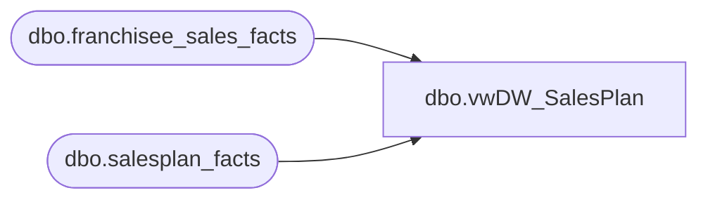

# dbo.vwDW_SalesPlan

**Database:** dw  
**Server:** papamart  

## Architecture Diagram



## Table Dependencies

| Referenced Table |
|---|
| dbo.franchisee_sales_facts |
| dbo.salesplan_facts |

## View Code

```sql
/*
	Kevin Shyr			2/6/2015		Remove date filter
	Gary Murrish		3/1/2013		Blocked zero entries from coming in and creating erroneous entries
*/

CREATE VIEW [dbo].[vwDW_SalesPlan]
AS

SELECT salesplan_facts_key
	, store_key
	, date_key
	, currency_key
	, amount
FROM dbo.salesplan_facts WITH(READCOMMITTED)
WHERE amount <> 0
		--AND date_key <=
		--(SELECT date_key
		--FROM date_dim
		--WHERE actual_date = CONVERT(datetime, CONVERT(char(10), GETDATE() - 1, 101)))
		 
		--and store_key = 735
		--(SELECT MAX(date_key) FROM transaction_detail_facts)

/** uncomment below for franchisee data **/
UNION

SELECT -1 AS salesplan_facts_key
	, franchisee_store_key
	, week_ending_date_key
	, currency_key
	, sales_plan
FROM dbo.franchisee_sales_facts WITH(READCOMMITTED)
/** uncomment above for franchisee data **/
```

