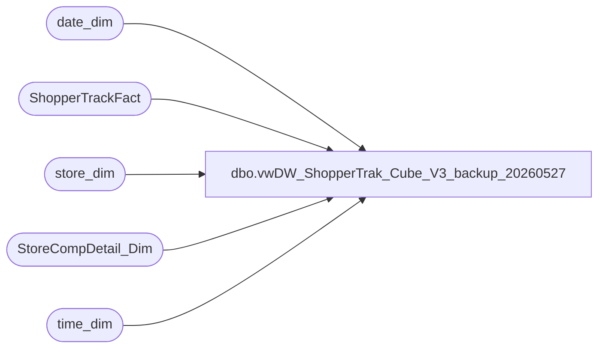

# dbo.vwDW_ShopperTrak_Cube_V3_backup_20260527

**Database:** dw  
**Server:** papamart  

## Architecture Diagram



## Table Dependencies

| Referenced Table |
|---|
| date_dim |
| ShopperTrackFact |
| store_dim |
| StoreCompDetail_Dim |
| time_dim |

## View Code

```sql
CREATE view [dbo].[vwDW_ShopperTrak_Cube_V3] --WITH SCHEMABINDING
as
-- =============================================================================================================
-- Name: [dbo].[vwDW_ShopperTrak_Cube_V3]
--
-- Description: View underlying the SSAS ShopperTrak Cube used on the dashboard.   
-- Aggregates ShopperTrak metrics by store and date
--
--
-- Dependencies: 
--
-- Revision History
--		Name:				Date:			Comments:
--		Gary Murrish		9/12/2012		Changed source for ShopperTrak Comp information
--		Gary Murrish		6/8/2012		Added ShopperTrak Comp and isShopperTrakHours
--		Gary Murrish		5/24/2012		Added Calc Attribute
--		Gary Murrish		5/7/2012		Initial deployment
--		Dan Tweedie			06/21/2016		Added hasTraffic column
--		Dan Tweedie			06/29/2016		Removed 'AND td.hour BETWEEN cmp.ShopperTrakStartHour AND cmp.ShopperTrakEndHour'  so no longer filtering by this
--		Tim Callahan		06/03/2020		Updated tables and fields referenced
--		Dan Tweedie			2022-08-08		Updated isSTCompNextYear to be equal to the isSTCompThisYear for the date that is 2 years in the future.. Meaning if current date is isSTCompNextYear, then the record from 2 years ago needs to have the NY value set to true...not a great construct
--		Dan Tweedie			2023-04-24		Updated isSTCompNextYear to use isShopperTrakCompTY after testing with Finance
-- =============================================================================================================

WITH hasTraf as
	(
		select 
			StoreKey AS store_key,
			DateKey AS date_key,
			case when sum(EXITS) = 0 
					then 0
				else 1
			end as hasTraffic
		FROM
			ShopperTrackFact STTF WITH (NOLOCK)
		group by 
			StoreKey,
			DateKey
	)

SELECT StoreKey AS store_key
	 , DateKey AS date_key
	 , TimeKey AS time_key
	 , ENTERS
	 , EXITS
	 , 1 AS calc
	 , cast(CASE
		   WHEN cmp.isShopperTrak IS NULL THEN
			   0
		   WHEN cmp.isShopperTrak = 1 
		   --AND td.hour BETWEEN cmp.ShopperTrakStartHour AND cmp.ShopperTrakEndHour 
			   THEN
				   1
		   ELSE
			   0
	   END AS SMALLINT) AS isShopperTrakHours
	 , cast(CASE
		   WHEN cmp.isShopperTrakCompTY IS NULL THEN
			   0
		   WHEN cmp.isShopperTrakCompTY = 1 
		   --AND td.hour BETWEEN cmp.ShopperTrakStartHour AND cmp.ShopperTrakEndHour 
			   THEN
				   1
		   ELSE
			   0
	   END AS INTEGER) AS isSTComp,

	 -- , cast(isnull(cmpFuture.isShopperTrakCompTY,0) as Integer) as isSTCompNextYear --ADDED 2022-08-08
	 --case 
		--when sd.store_id in (1,11,18,145,153,154,176,452,459,620,468)
		--	then 
		--		cast(CASE
		--		   WHEN cmp.isShopperTrakCompTY IS NULL THEN
		--			   0
		--		   WHEN cmp.isShopperTrakCompTY = 1 
		--		   --AND td.hour BETWEEN cmp.ShopperTrakStartHour AND cmp.ShopperTrakEndHour 
		--			   THEN
		--				   1
		--		   ELSE
		--			   0
		--	   END AS INTEGER) 
		--else cast(isnull(cmpFuture.isShopperTrakCompTY,0) as Integer)
	 -- end as isSTCompNextYear 
	  --cast(isnull(cmpFuture.isShopperTrakCompTY,0) as Integer) as isSTCompNextYear
	  cast(isnull(cmp.isShopperTrakCompTY,0) as Integer) as isSTCompNextYear
	 , cast(isnull(cmp.isCompTY, 0) AS INTEGER) AS isCompThisYear
	 , cast(isnull(cmp.isCompNY, 0) AS INTEGER) AS isCompNextYear
	 , cast(isnull(cmp.isSOTF, 0) AS INTEGER) AS isSOTF
	 , hasTraffic
FROM
	ShopperTrackFact STTF WITH (NOLOCK)
	INNER JOIN date_dim dd WITH (NOLOCK)
		ON dd.date_key = STTF.DateKey
	INNER JOIN time_dim td WITH (NOLOCK)
		ON td.time_key = STTF.TimeKey
	LEFT JOIN StoreCompDetail_Dim cmp WITH (NOLOCK)
		ON cmp.store_key = STTF.StoreKey AND cmp.date_key = STTF.DateKey
	INNER JOIN hasTraf ht on STTF.StoreKey = ht.store_key
		and dd.date_key = ht.date_key
--NEW 20220808
left join date_dim ddFuture with (nolock)
	on dd.week_id+(52*2)=ddFuture.week_id
	and dd.day_of_week=ddFuture.day_of_week
left join StoreCompDetail_Dim cmpFuture WITH (NOLOCK)
		ON cmp.store_key = cmpFuture.store_key
		AND ddFuture.date_key=cmpFuture.date_key
join store_dim sd on sttf.StoreKey=sd.store_key 
--WHERE
--	(ENTERS <> 0
--	OR EXITS <> 0)
```

