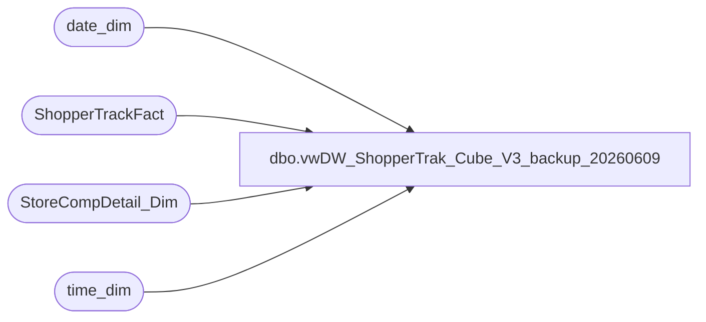

# dbo.vwDW_ShopperTrak_Cube_V3_backup_20260609

**Database:** dw  
**Server:** papamart  

## Architecture Diagram



## Table Dependencies

| Referenced Table |
|---|
| date_dim |
| ShopperTrackFact |
| StoreCompDetail_Dim |
| time_dim |

## View Code

```sql
CREATE view [dbo].[vwDW_ShopperTrak_Cube_V3_backup_20260609] --WITH SCHEMABINDING
as
-- =============================================================================================================
-- Name: [dbo].[vwDW_ShopperTrak_Cube_V3]
--
-- Description: View underlying the SSAS ShopperTrak Cube used on the dashboard.   
-- Aggregates ShopperTrak metrics by store and date
--
--
-- Dependencies: 
--
-- Revision History
--		Name:				Date:			Comments:
--		Gary Murrish		9/12/2012		Changed source for ShopperTrak Comp information
--		Gary Murrish		6/8/2012		Added ShopperTrak Comp and isShopperTrakHours
--		Gary Murrish		5/24/2012		Added Calc Attribute
--		Gary Murrish		5/7/2012		Initial deployment
--		Dan Tweedie			06/21/2016		Added hasTraffic column
--		Dan Tweedie			06/29/2016		Removed 'AND td.hour BETWEEN cmp.ShopperTrakStartHour AND cmp.ShopperTrakEndHour'  so no longer filtering by this
--		Tim Callahan		06/03/2020		Updated tables and fields referenced
--		Dan Tweedie			2022-08-08		Updated isSTCompNextYear to be equal to the isSTCompThisYear for the date that is 2 years in the future.. Meaning if current date is isSTCompNextYear, then the record from 2 years ago needs to have the NY value set to true...not a great construct
--		Dan Tweedie			2023-04-24		Updated isSTCompNextYear to use isShopperTrakCompTY after testing with Finance
--		Matt Lewis			2026-05-26		Reintroduced Dan's commented out logic from 08/08/22, but using CTEs to make it more efficient as I presume the performance is why it was commented out. 
-- =============================================================================================================

WITH hasTraf as
	(
		select 
			StoreKey AS store_key,
			DateKey AS date_key,
			case when sum(EXITS) = 0 
					then 0
				else 1
			end as hasTraffic
		FROM
			ShopperTrackFact STTF WITH (NOLOCK)
		group by 
			StoreKey,
			DateKey
	),
	STX as	(select StoreKey AS store_key
	 , DateKey AS date_key
	 , TimeKey AS time_key
	 , ENTERS
	 , EXITS
	 , 1 AS calc
	 , cast(CASE
		   WHEN cmp.isShopperTrak IS NULL THEN
			   0
		   WHEN cmp.isShopperTrak = 1 
		   --AND td.hour BETWEEN cmp.ShopperTrakStartHour AND cmp.ShopperTrakEndHour 
			   THEN
				   1
		   ELSE
			   0
	   END AS SMALLINT) AS isShopperTrakHours
	 , cast(CASE
		   --WHEN cmp.isShopperTrakCompTY IS NULL THEN
			  -- 0
		   --WHEN cmp.isShopperTrakCompTY = 1 
		   ----AND td.hour BETWEEN cmp.ShopperTrakStartHour AND cmp.ShopperTrakEndHour 
			  -- THEN
				 --  1
		   --ELSE
			  -- CASE
					WHEN isnull(cmp.isCompTY, 0) > 0 then 1 else 0
					--END
	   END AS INTEGER) AS isSTComp,
	  cast(isnull(cmp.isShopperTrakCompTY,0) as Integer) as isSTCompNextYear
	 , cast(isnull(cmp.isCompTY, 0) AS INTEGER) AS isCompThisYear
	 , cast(isnull(cmp.isCompNY, 0) AS INTEGER) AS isCompNextYear
	 , cast(isnull(cmp.isSOTF, 0) AS INTEGER) AS isSOTF
	 ,dd.[month] as dmonth
	 ,dd.[year] as dyear
	 from ShopperTrackFact STTF WITH (NOLOCK)
	INNER JOIN date_dim dd WITH (NOLOCK)
		ON dd.date_key = STTF.DateKey
	INNER JOIN time_dim td WITH (NOLOCK)
		ON td.time_key = STTF.TimeKey
	LEFT JOIN StoreCompDetail_Dim cmp WITH (NOLOCK)
		ON cmp.store_key = STTF.StoreKey AND cmp.date_key = STTF.DateKey
),
STXNY as (select distinct  store_key, month as dmonth, year as dyear, isShopperTrakCompTY
	 from ShopperTrackFact STTF WITH (NOLOCK)
	INNER JOIN date_dim dd WITH (NOLOCK)
		ON dd.date_key = STTF.DateKey
	INNER JOIN time_dim td WITH (NOLOCK)
		ON td.time_key = STTF.TimeKey
	LEFT JOIN StoreCompDetail_Dim cmp WITH (NOLOCK)
		ON cmp.store_key = STTF.StoreKey AND cmp.date_key = STTF.DateKey
		)
SELECT STXC.store_key, STXC.date_key, STXC.time_key, STXC.ENTERS, STXC.EXITS, STXC.calc, STXC.isShopperTrakHours,
STXC.isSTComp,
CASE WHEN STXNY.isShopperTrakCompTY = 1 then 1 else CASE WHEN STXNY2.isShopperTrakCompTY = 1 THEN 1 ELSE STXC.isSTCompNextYear END end as isSTCompNextYear, 
STXC.isCompThisYear, STXC.isCompNextYear, STXC.isSOTF , hasTraffic
FROM
	STX as STXC
	INNER JOIN hasTraf ht on STXC.Store_Key = ht.store_key
		and STXC.date_key = ht.date_key
left join STXNY
	on STXC.store_key = STXNY.store_key  and STXC.dmonth = STXNY.dmonth and STXC.dyear + 1 = STXNY.dyear
left join STXNY as STXNY2
	on STXC.store_key = STXNY2.store_key  and STXC.dmonth = STXNY2.dmonth and STXC.dyear + 2 = STXNY2.dyear
```

