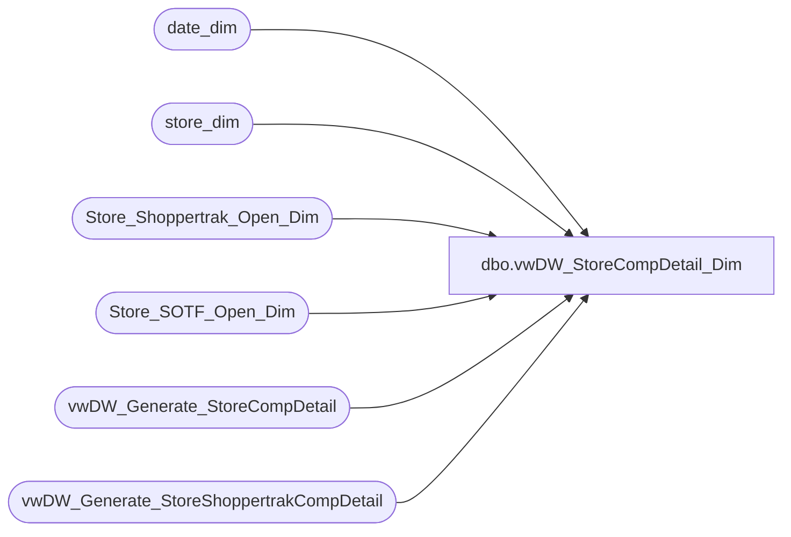

# dbo.vwDW_StoreCompDetail_Dim

**Database:** dw  
**Server:** papamart  

## Architecture Diagram



## Table Dependencies

| Referenced Table |
|---|
| date_dim |
| store_dim |
| Store_Shoppertrak_Open_Dim |
| Store_SOTF_Open_Dim |
| vwDW_Generate_StoreCompDetail |
| vwDW_Generate_StoreShoppertrakCompDetail |

## View Code

```sql
CREATE VIEW [dbo].[vwDW_StoreCompDetail_Dim]
AS
-- =============================================================================================================
-- Name: [dbo].[vwDW_StoreCompDetail_Dim]
--
-- Description: View underlying the construction of the StoreCompDetail_Dim table
--
--
-- Dependencies: 
--
-- Revision History
--		Name:				Date:			Comments:
--		Gary Murrish		2/20/2013		Ignore the Zero date
--		Gary Murrish		8/29/2012		Initial deployment
-- =============================================================================================================

SELECT store_key
	 , date_key
	 , isCompTY
	 , isCompNY
	 , isShopperTrak
	 , isShopperTrakCompTY
	 , isShopperTrakCompNY
	 , isSOTF
	 , hour_day_start
	 , hour_day_end
FROM
	(
	 SELECT sd.store_key
		  , dd.date_key
		  , cast(CASE
				WHEN SOTF.recID IS NULL THEN
					0
				ELSE
					1
			END AS BIT) AS isSOTF
		  , isnull(scd.isCompTY, 0) AS isCompTY
		  , isnull(scd.isCompNY, 0) AS isCompNY
		  , cast(CASE
				WHEN sto.recID IS NULL THEN
					0
				ELSE
					1
			END AS BIT) AS isShopperTrak
		  , isnull(stcd.isCompTY, 0) AS isShopperTrakCompTY
		  , isnull(stcd.isCompNY, 0) AS isShopperTrakCompNY
		  , isnull(sto.hour_day_start, 8) AS hour_day_start
		  , isnull(sto.hour_day_end, 22) AS hour_day_end

	 FROM
		 store_dim sd WITH (NOLOCK)
		 CROSS JOIN date_dim dd WITH (NOLOCK)
		 LEFT JOIN Store_SOTF_Open_Dim SOTF WITH (NOLOCK)
			ON SOTF.store_key = sd.store_key AND dd.date_key BETWEEN SOTF.date_key_from AND SOTF.date_key_thru
		 LEFT JOIN Store_Shoppertrak_Open_Dim ssod WITH (NOLOCK)
			 ON ssod.store_key = sd.store_key AND dd.date_key BETWEEN ssod.date_key_from AND ssod.date_key_thru
		 LEFT JOIN vwDW_Generate_StoreCompDetail scd WITH (NOLOCK)
			 ON scd.store_key = sd.store_key AND scd.date_key = dd.date_key
		 LEFT JOIN Store_Shoppertrak_Open_Dim sto WITH (NOLOCK)
			 ON sd.store_key = sto.store_key AND dd.date_key BETWEEN sto.date_key_from AND sto.date_key_thru
		 LEFT JOIN vwDW_Generate_StoreShoppertrakCompDetail stCD WITH (NOLOCK)
			 ON sd.store_key = stCD.store_key AND dd.date_key = stCD.date_key) x
WHERE
	(isSOTF <> 0
	OR isCompTY <> 0
	OR isCompNY <> 0
	OR isShopperTrak <> 0
	OR isShopperTrakCompTY <> 0
	OR isShopperTrakCompNY <> 0)
	AND x.date_key <> 0
```

