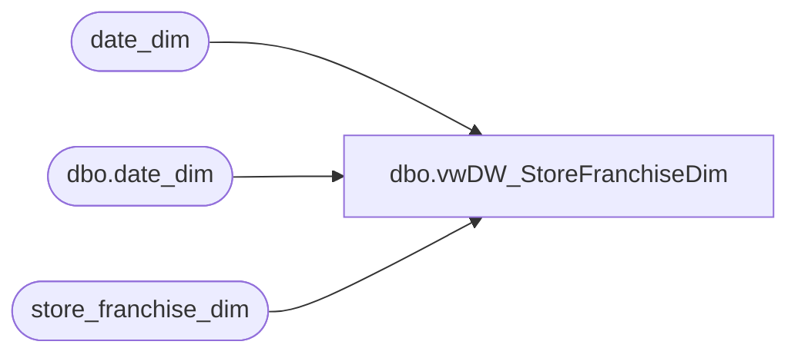

# dbo.vwDW_StoreFranchiseDim

**Database:** dw  
**Server:** papamart  

## Architecture Diagram



## Table Dependencies

| Referenced Table |
|---|
| date_dim |
| dbo.date_dim |
| store_franchise_dim |

## View Code

```sql
CREATE VIEW [dbo].[vwDW_StoreFranchiseDim] 
/*-- =============================================================================================================
-- Name: [dbo].[vwDW_Store]
--
-- Description/Purpose: Returns all needed information for Franchisee stores including comp and closing information.  
	Joins store_franchisee_dim and date_dim
--
-- Dependencies: 
--
-- Revision History

--		Name:			Date:			Comments:
 			
--		Funmi Agbebi	12/11/2009		Creation 

-- ============================================================================================================*/
--select * from [vwDW_StoreFranchiseDim] where store_closing_date is not null

AS

			SELECT

				f.store_key
				,CAST(f.store_id AS varchar) AS store_id
				,'Unranked' as StoreRanking
		--Removed storeNameOriginal  and storeNameNumOriginal Fields (FA - 10/28/2009)
--				,f.store_name storeNameOriginal  --FA 8/13/2009
--				,f.store_id + ' ' + f.store_name storeNameNumOriginal  --FA 8/13/2009
				,f.store_name
				,storeNameNum = f.store_id + ' ' + f.store_name
				,f.bearea
				,f.bearritory
				,f.region
				,f.region AS GeographyRegion
				,f.country_name AS ParentCountry --FA 9/29/2009
				,f.country_name AS ChildCountry --FA 9/29/2009
				,f.country
				,f.country_name
				,f.country_name as country_display
			    ,f.state_province
				,state_province_key = f.country + ISNULL(f.state_province, '')
				,f.city
				,f.postal_code
				,f.latitude
				,f.longitude
				,dma_name = 'Other'
				,f.opening_date
				,dd.day_id AS opening_date_id
		--		,f.closing_date
				,f.comp_week_id
				,dd.period_id AS open_fp_id
				,dd.week_id AS open_week_id

	,f.closing_date as store_closing_date
	,closing_date.closing_date_key
	,closing_date.closing_max_comp_date_key 
--	,closing_date.storeNameNum 
	,closing_date.d_closing_date
	,closing_date.closing_max_comp_date 		
	,closing_date.closing_max_fiscal_year
	,closing_date.closing_max_ly_fiscal_year
	,closing_date.closing_max_fiscal_week
	,closing_date.closing_max_ly_org_fiscal_week 
	,closing_date.closing_max_ly_fiscal_week
	,closing_date.closing_max_fiscal_period
	,closing_date.closing_max_ly_org_fiscal_period 
	,closing_date.closing_max_ly_fiscal_period
	,closing_date.closing_max_ly_fp_id
	,closing_date.closing_max_ly_week_id


				,(SELECT date_key FROM date_dim WHERE actual_date = f.comp_date) AS comp_date_key
				,ReportFlag = 1
				,ClubMaxFlag = 0
				,f.BearRange
				,CompanyLevel = 'Franchisees'
			FROM store_franchise_dim f
			LEFT JOIN date_dim dd ON f.opening_date = dd.actual_date

LEFT JOIN  

----------------------------------------------
(select 
	cd.closing_date_key
	,cd.closing_max_comp_date_key 
--	,cd.storeNameNum 
	,cd.d_closing_date
	,cd.closing_max_comp_date 		
	,cd.closing_max_fiscal_year
	,d.fiscal_year AS  closing_max_ly_fiscal_year
	,cd.closing_max_fiscal_week
	,d.org_fiscal_week AS closing_max_ly_org_fiscal_week 
	,d.fiscal_week AS closing_max_ly_fiscal_week
	,cd.closing_max_fiscal_period
	,d.org_fiscal_period AS  closing_max_ly_org_fiscal_period 
	,d.fiscal_period AS  closing_max_ly_fiscal_period
	,d.period_id AS  closing_max_ly_fp_id
	,d.week_id AS  closing_max_ly_week_id

from  dw.dbo.date_dim d WITH (NOLOCK) JOIN

(select 
	cd2.d_closing_date
	,cd2.closing_date_key
--	,cd2.storeNameNum 
	,cd2.closing_max_comp_date_key --closing_max_ly_comp_date_key
	,cd2. closing_max_comp_date --closing_max_ly_comp_date		
	,d.period_id AS closing_max_fp_id -- closing_max_ly_fp_id
	,d.week_id AS  closing_max_week_id --closing_max_ly_week_id
	,d.fiscal_week AS closing_max_fiscal_week --closing_max_ly_fiscal_week
	,d.fiscal_period AS  closing_max_fiscal_period --closing_max_ly_fiscal_period
	,d.fiscal_year AS  closing_max_fiscal_year --closing_max_ly_fiscal_year
	,d.org_fiscal_week AS closing_max_org_fiscal_week --closing_max_ly_fiscal_week
	,d.org_fiscal_period AS  closing_max_org_fiscal_period --closing_max_ly_fiscal_period

from  dw.dbo.date_dim d WITH (NOLOCK) JOIN

(SELECT cd1.closing_date 
	,cd1.actual_date AS d_closing_date
	,cd1.date_key AS closing_date_key
--	,cd1.storeNameNum 
	,CASE WHEN cd1.date_key = max(d.date_key) THEN cd1.date_key 
	 ELSE (min(d.date_key) - 1) END AS closing_max_comp_date_key --closing_max_ly_comp_date_key
	,CASE WHEN cd1.date_key = max(d.date_key) THEN cd1.actual_date
	 ELSE dateadd(d, -1,min(d.actual_date)) END AS closing_max_comp_date	 --closing_max_ly_comp_date		
 FROM 
  dw.dbo.date_dim d WITH (NOLOCK) JOIN
	(SELECT --s.store_id + ' ' + s.store_Name as storeNameNum,
		s.closing_date,d.fiscal_year,d.fiscal_quarter,d.fiscal_period, d.fiscal_week, d.date_key, d.actual_date 
	,d.period_id --AS closing_fp_id
	,d.week_id --AS closing_week_id

	  FROM dw.dbo.date_dim d join store_franchise_dim s  
	   ON d.actual_date = s.closing_date 
--ORDER BY s.closing_date, s.store_id + ' ' + s.store_Name 
) cd1
 ON cd1.fiscal_year = d.fiscal_year
	and cd1.fiscal_period = d.fiscal_period
GROUP BY 
cd1.actual_date,cd1.date_key ,cd1.closing_date ,cd1.actual_date ,cd1.period_id ,cd1.week_id	-- ,cd1.storeNameNum 

--ORDER BY cd1.closing_date,cd1.storeNameNum  
 
) cd2
ON cd2.closing_max_comp_date_key = d.date_key 


GROUP BY 
	cd2.d_closing_date
	,cd2.closing_date_key
	,cd2.closing_max_comp_date_key
	,cd2.closing_max_comp_date		
--	,cd2.storeNameNum 
	,d.fiscal_year 
	,d.fiscal_period 
	,d.org_fiscal_period 
	,d.org_fiscal_week 
	,d.fiscal_week 
	,d.period_id 
	,d.week_id 

-- ORDER BY cd2.closing_date_key,cd2.storeNameNum  

) cd 
ON d.fiscal_year =cd.closing_max_fiscal_year - 1
AND d.org_fiscal_week =cd.closing_max_org_fiscal_week 
GROUP BY 
	cd.d_closing_date
--	,cd.storeNameNum 
	,cd.closing_date_key
	,cd.closing_max_comp_date_key 
	,cd.closing_max_comp_date 		
	,cd.closing_max_fiscal_week
	,cd.closing_max_fiscal_period
	,cd.closing_max_fiscal_year
	,d.fiscal_year 
	,d.fiscal_period 
	,d.org_fiscal_period 
	,d.fiscal_week 
	,d.org_fiscal_week  
	,d.period_id 
	,d.week_id ) closing_date
--order by 	closing_date.closing_date_key, closing_date.storeNameNum 
ON f.closing_date = closing_date.d_closing_date
```

