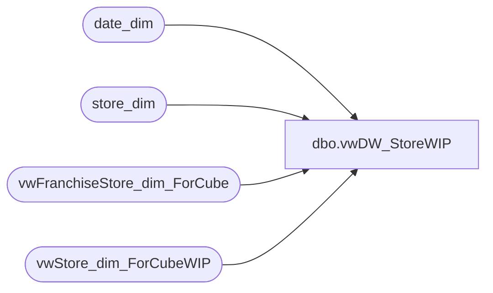

# dbo.vwDW_StoreWIP

**Database:** dw  
**Server:** papamart  

## Architecture Diagram



## Table Dependencies

| Referenced Table |
|---|
| date_dim |
| store_dim |
| vwFranchiseStore_dim_ForCube |
| vwStore_dim_ForCubeWIP |

## View Code

```sql
CREATE VIEW [dbo].[vwDW_StoreWIP] 
-- =============================================================================================================
-- Name: [dbo].[vwDW_Store]
--
-- Description: 
--
-- Dependencies: 
--
-- Revision History

--		Name:			Date:			Comments:
/* 			
--		Funmi Agbebi	12/03/2009		Added CountryKey field (CompanyLevel-Country) 
--		Funmi Agbebi	11/10/2009		Moved US Corporate Region to Company Level of 'Other', broke out 'UK Web Store' GeographyRegion
--		Funmi Agbebi	10/28/2009		Added fields for Store Ranking Hierarchy.  Removed  storeNameOriginal  and storeNameNumOriginal Fields
--		Funmi Agbebi	10/8/2009		Added country_display for CA, KR and US that have multiple country_names post RR4
--		Funmi Agbebi	9/29/2009		added GeographyRegion and ParentCountry fields for new 'Geography' Hierarchy per RR4.
--		Keith Missey	8/24/2009		updated for LMM
--		Funmi Agbebi	8/13/2009		pointed storeNameNum to use store_name_abbrv field
--		Keith Missey	8/12/2009		updated per uk re-alignment
--		Keith Missey	2/5/2009		updated per 2/1 re-alignment

07-28-06 CDG Added 'London' region to ReportFlag & added a new higher order level for use in Geography hierarchy
handled null country codes by using region value...
08-10-06 CDG added in columns for AD group names for supporting Aaron's automation of user defaults for the store dimension
08-11-06 CDG bearritory spelling changed in table Store_AD_Xref. updated view to match
		Changed Bear Range to use Region values as it's driver instead of country/region. Added "Corporate" Bear range
08-12-06 CDG added Default_Currency_Code to the Store_AD_Xref and to this view
08-19-06 TMK added code for new "Company" hierarchy level
08-31-06 TMK added unique keys for Bear Range, Region, and Bearitory
09-19-06 JLL added logic to change UK country to Europe and London region to UK
10-18-06 JLL added logic to move 2013 out of SE bearitory into WebStore grouping
11-14-2006 JLL remove UK Web store from its own bearitory; Change report flag and Club max flag logic*/

-- =============================================================================================================
/*

select --* 
CompanyLevel,BearRange,Region,Bearritory,storeNameNum
from [vwDW_Store] 
where CompanyLevel like 'Company'
group by CompanyLevel,BearRange,Region,Bearritory,storeNameNum
order by CompanyLevel,BearRange,Region,Bearritory,storeNameNum

select --* 
CompanyLevel,BearRange,ParentCountry, GeographyRegion ,storeNameNum
from [vwDW_Store] 
where CompanyLevel like 'Company'
group by CompanyLevel,BearRange,ParentCountry, GeographyRegion ,storeNameNum
order by CompanyLevel,BearRange,ParentCountry, GeographyRegion ,storeNameNum
*/

AS
	SELECT *

--		,LTRIM(RTRIM(MerchCompanyLevel)) + '-' + LTRIM(RTRIM(MerchBearRange)) + '-' + LTRIM(RTRIM(MerchRegion)) AS MerchRegionKey 
--		,LTRIM(RTRIM(MerchCompanyLevel)) + '-' + LTRIM(RTRIM(MerchBearRange)) + '-' + LTRIM(RTRIM(MerchRegion)) + '-' + LTRIM(RTRIM(MerchCountry)) AS MerchCountryKey
--		,LTRIM(RTRIM(MerchCompanyLevel)) + '-' + LTRIM(RTRIM(MerchBearRange)) + '-' + LTRIM(RTRIM(MerchRegion)) + '-' + LTRIM(RTRIM(MerchCountry))  + '-' + LTRIM(RTRIM(MerchBearritory)) AS MerchBearitoryKey

		,LTRIM(RTRIM(MerchCompanyLevel)) + '-' + LTRIM(RTRIM(MerchBearRange)) AS MerchBearRangeKey
		,LTRIM(RTRIM(MerchCompanyLevel)) + '-' + LTRIM(RTRIM(MerchBearRange)) + '-' + LTRIM(RTRIM(MerchCountry)) AS MerchCountryKey
		,LTRIM(RTRIM(MerchCompanyLevel)) + '-' + LTRIM(RTRIM(MerchBearRange)) + '-' + LTRIM(RTRIM(MerchCountry)) + '-' + LTRIM(RTRIM(MerchRegion)) AS MerchRegionKey
		,LTRIM(RTRIM(MerchCompanyLevel)) + '-' + LTRIM(RTRIM(MerchBearRange)) + '-' + LTRIM(RTRIM(MerchCountry)) + '-' + LTRIM(RTRIM(MerchRegion)) + '-' + LTRIM(RTRIM(MerchBearritory)) AS MerchBearitoryKey

		,LTRIM(RTRIM(CompanyLevel)) + '-' + LTRIM(RTRIM(Country)) AS CountryKey
		,LTRIM(RTRIM(StoreRanking)) + '-' + LTRIM(RTRIM(CompanyLevel)) AS RankedCompanyLevelKey
		,LTRIM(RTRIM(StoreRanking)) + '-' + LTRIM(RTRIM(CompanyLevel)) + '-' + LTRIM(RTRIM(BearRange)) AS RankedBearRangeKey
		,LTRIM(RTRIM(StoreRanking)) + '-' + LTRIM(RTRIM(CompanyLevel)) + '-' + LTRIM(RTRIM(BearRange)) + '-' + LTRIM(RTRIM(region)) AS RankedRegionKey
		,LTRIM(RTRIM(StoreRanking)) + '-' + LTRIM(RTRIM(CompanyLevel)) + '-' + LTRIM(RTRIM(BearRange)) + '-' + LTRIM(RTRIM(region)) + '-' + LTRIM(RTRIM(bearritory)) AS RankedBearitoryKey

		,LTRIM(RTRIM(CompanyLevel)) + '-' + LTRIM(RTRIM(BearRange)) AS BearRangeKey
		,LTRIM(RTRIM(CompanyLevel)) + '-' + LTRIM(RTRIM(BearRange)) + '-' + LTRIM(RTRIM(region)) AS RegionKey
		,LTRIM(RTRIM(CompanyLevel)) + '-' + LTRIM(RTRIM(BearRange)) + '-' + LTRIM(RTRIM(region)) + '-' + LTRIM(RTRIM(bearritory)) AS BearitoryKey
		,state_province_key + '-' + ISNULL(city, '') AS city_key
		,CASE WHEN city IS NULL OR city = '' THEN '(blank)' ELSE city END AS city_display
		,state_province_key + '-' + ISNULL(city, '') + '-' + ISNULL(postal_code, '') AS postal_code_key
		,CASE WHEN postal_code IS NULL OR postal_code = '' THEN '(blank)' ELSE postal_code END AS postal_code_display
		,LTRIM(RTRIM(CompanyLevel)) + '-' + LTRIM(RTRIM(BearRange)) + '-' + LTRIM(RTRIM(ParentCountry)) AS GeographyParentCountryKey --FA 9/29/2009
		,LTRIM(RTRIM(CompanyLevel)) + '-' + LTRIM(RTRIM(BearRange)) + '-' + LTRIM(RTRIM(ParentCountry))  + '-' + LTRIM(RTRIM(GeographyRegion)) AS GeographyRegionKey  --FA 9/29/2009
	FROM
	(
		SELECT s.store_key
				,CAST(s.store_id AS varchar) AS store_id
				,CASE WHEN s.store_id in (6,52,100,119,189,200,255) then 'Top 7 US Stores'
				 WHEN s.store_id in  (2001,2019,2020,2022,2045,2051,2052) THEN 'Top 7 UK Stores'
				 WHEN s.store_id in (2009,2017,2018,2027,2034,2036,2037) THEN 'Other Top UK Stores'
				 WHEN s.store_id in (2003,2004,2010,2014,2015,2016,2023,2024,2025,2033,2035,2038,2039,
				      2041,2043,2046,2047,2048,2050,2053) THEN 'Medium UK Stores'
				 WHEN s.store_id in (2002,2006,2007,2008,2011,2012,2021,2026,2028,2029,2030,2031,2032,
				      2040,2042,2044,2049) THEN 'Low UK Stores'
				 ELSE 'Unranked' END as StoreRanking

				--Removed storeNameOriginal  and storeNameNumOriginal Fields (FA - 10/28/2009)

--				,s.store_name storeNameOriginal  --FA 8/13/2009
--				,s.storeNameNum storeNameNumOriginal  --FA 8/13/2009
				,s.store_name_abbrv store_name  --FA 8/13/2009
				,s.storeAbbrvNum storeNameNum  --FA 8/13/2009
				,bearea = CASE WHEN s.bearea = 'Upper Midwest' THEN 'Upper Midwest/Central Canada'
				ELSE s.bearea END 

				--,s.bearritory
--commented out for UK alignment changes Aug 2007
				,bearritory = case
					when s.bearritory is null then 'Other'
					WHEN s.bearritory = 'Upper Midwest' THEN 'Upper Midwest/Central Canada'
					else s.bearritory
						end
				
				,region = case
					WHEN s.store_id in (-991) THEN 'US Corporate' --changed 11/10 by FA
					when s.region is null then 'Other'  --changed 11/10 by FA
					--when s.bearritory in ('Midlands', 'Scotland & North') then 'North UK' 
					when s.bearritory in ('Southeast-UK', 'Southern', 'Southwest-UK''Midlands', 'Scotland & North') then 'UK'
					---when s.bearritory in ('Southeast-UK', 'Southern', 'Southwest-UK') then 'South UK'
					WHEN s.store_id in (013, 136) THEN 'Web Stores' --changed 11/10 by FA
					else s.region
						end
				,GeographyRegion = cast(case
					when s.bearritory like ('UK Web Store') then 'UK Web Store' -- added 11/10/09 by FA
					WHEN s.region in ('France and Eire', 'UK') THEN  s.ChildCountry 
					when s.region is null then 'Other'
					else replace(s.region,' US','')	end as varchar(50))
				,ISNULL(s.ParentCountry, '') AS ParentCountry  --FA 9/29/2009
				,ISNULL(s.ChildCountry, '') AS ChildCountry  --FA 9/29/2009
				,ISNULL(s.country, '') AS country
				,CASE WHEN ISNULL(s.country_name, '') = '' THEN '(blank)' ELSE s.country_name END country_name

				--Add country_display to view for CA, KR and US that have multiple country_names (FA - 10/8/2009)
				,CASE WHEN s.country = 'CA' then 'Canada'
				 WHEN s.country = 'US' then 'United States'
				 WHEN s.country = 'KR' then 'South Korea'
				 WHEN ISNULL(s.country_name, '') = '' THEN '(blank)'
				 ELSE s.country_name end as country_display

				,CASE WHEN s.state_province IS NULL OR s.state_province = '' THEN '(blank)' ELSE s.state_province END AS state_province
				,s.country + ISNULL(s.state_province, '') AS state_province_key
				,s.city
				,s.postal_code
				,s.latitude
				,s.longitude

				,CASE WHEN s.dma_name IS NULL OR s.dma_name = '' THEN 'Other' ELSE s.dma_name END AS dma_name
				,s.opening_date
				,s.opening_date_id
--				,s.closing_date
				,s.comp_week_id
				,s.open_fp_id
				,s.open_week_id
				--,d.date_key AS comp_date_key
				
				--11/14 - Comment out the syntax for web store breakout
				--,(SELECT date_key FROM date_dim WHERE actual_date = store_table.comp_date) AS comp_date_key
				--,CASE
				--	WHEN s.bearritory like '%Closed%' THEN 0
				--	WHEN s.store_id in (480, 482, 013, 136, 473) THEN 2
				--	WHEN s.region IN ('North US', 'South US', 'West', 'London') THEN 1
				--	WHEN s.region IN ('US-Corporate', 'Web Stores') THEN 2
				--	ELSE 0
				--END AS ReportFlag
	
			--11/14 - Implement below for UK web store breakout
				,(SELECT date_key FROM date_dim WHERE actual_date = store_table.comp_date) AS comp_date_key
					,ReportFlag = 1
				,CASE
					WHEN s.bearritory like '%Closed%' THEN 0
					WHEN s.store_id in (480, 482, 013, 136, 473) THEN 2
					WHEN s.region IN ('Central US', 'East US', 'West US', 'UK') THEN 1
					WHEN s.region IN ('US-Corporate', 'Web Stores', 'UK Web Store') THEN 2
					ELSE 0
				END AS ClubMaxFlag
		
				,Case 	-- WHEN s.store_id in (480, 482, 013, 136, 473) then 'North America' 
						WHEN s.store_id in (013, 136) then 'North America' -- changed 11/10/2009 by FA
						WHEN s.region IN ('East US', 'Central US', 'West US') then 'North America'
						WHEN s.store_id in (2013) then 'Europe'
						WHEN s.store_id in (1401) then 'LMM'
						WHEN s.bearritory in ('Midlands', 'Scotland & North', 'Southeast-UK', 'Southern', 'Southwest-UK') THEN 'Europe'
						WHEN s.region in ('France and Eire', 'UK') THEN 'Europe'
--						WHEN s.region IN ('North UK', 'South UK', 'France And Eire') then 'Europe'
						when s.region in ('Web Stores','US-Corporate','Canada-Corporate','Canada Stores','Corporate - UK') then 'Corporate'
						WHEN s.region = 'Ridemakerz' THEN 'Ridemakerz'
						else 'Other' end
					as BearRange

				, CASE	WHEN s.bearritory like '%Closed%' THEN 'Other'
--						WHEN s.store_id in (480, 482, 013, 136, 473) THEN 'Company'
						WHEN s.store_id in (013, 136) THEN 'Company' --changed 11/10 by FA
						WHEN s.bearritory like 'US Corporate' THEN 'Other' --added 11/10 by FA
						WHEN s.store_id in (480, 482, 473) THEN 'Other' --changed 11/10 by FA
						WHEN s.store_id in (2013) THEN 'Company'
						WHEN s.store_id in (1401) then 'LMM'
						WHEN s.region IN ('East US', 'Central US', 'West US', 'UK', 'France And Eire') THEN 'Company'
						WHEN s.bearritory in ('Midlands', 'Scotland & North', 'Southeast-UK', 'Southern', 'Southwest-UK') THEN 'Company'
						WHEN s.region = 'Ridemakerz' THEN 'Ridemakerz'
						ELSE 'Other' END
				AS CompanyLevel

				,s.IsClosed
				,s.closing_date_key
				,s.closing_date 
				,s.closing_max_comp_date_key
				,s.closing_max_comp_date
				,s.closing_max_ly_comp_date_key
				,s.closing_max_ly_comp_date

				, CASE	WHEN  s.MerchStrCntRegion like '%Corporate%' then 'Other' -- changed 11/10/2009 by FA
						WHEN s.bearritory like '%Closed%' THEN 'Other'
						WHEN s.store_id in (013, 136) THEN 'Company' --changed 11/10 by FA
						WHEN s.bearritory like 'US Corporate' THEN 'Other' --added 11/10 by FA
						WHEN s.store_id in (480, 482, 473) THEN 'Other' --changed 11/10 by FA
						WHEN s.store_id in (2013) THEN 'Company'
						WHEN s.store_id in (1401) then 'LMM'
						WHEN s.region IN ('East US', 'Central US', 'West US', 'UK', 'France And Eire') THEN 'Company'
						WHEN s.bearritory in ('Midlands', 'Scotland & North', 'Southeast-UK', 'Southern', 'Southwest-UK') THEN 'Company'
						WHEN s.region = 'Ridemakerz' THEN 'Ridemakerz'
						ELSE 'Other' END
				AS MerchCompanyLevel

				,CASE 	WHEN s.MerchStrCntRegion like '%Corporate%' then 'Other' -- changed 11/10/2009 by FA
						WHEN s.store_id in (013, 136) then 'North America' -- changed 11/10/2009 by FA
						WHEN s.store_id in (013, 136) then 'North America' -- changed 11/10/2009 by FA
						WHEN s.region IN ('East US', 'Central US', 'West US') then 'North America'
						WHEN s.store_id in (2013) then 'Europe'
						WHEN s.store_id in (1401) then 'LMM'
						WHEN s.bearritory in ('Midlands', 'Scotland & North', 'Southeast-UK', 'Southern', 'Southwest-UK') THEN 'Europe'
						WHEN s.region in ('France and Eire', 'UK') THEN 'Europe'
						when s.region in ('Web Stores','US-Corporate','Canada-Corporate','Canada Stores','Corporate - UK') then 'Corporate'
						WHEN s.region = 'Ridemakerz' THEN 'Ridemakerz'
						else 'Other' end
				AS  MerchBearRange

				,s.MerchCountry
--				,s.MerchStrCntBearritory
--				,s.MerchStrCntRegion

				, MerchRegion = cast(case -- GeographyRegion = case
					WHEN s.MerchStrCntRegion in ('France and Eire', 'UK') THEN  s.MerchStrCntRegion --s.ChildCountry 
					when s.MerchStrCntBearritory like ('UK Web Store') then 'UK Web Store' -- added 11/10/09 by FA
					when s.MerchCountry ='CA' and s.MerchStrCntBearritory like 'Web Stores' then 'CA Web Stores' -- added 11/10/09 by FA
					when s.MerchCountry ='US' and s.MerchStrCntBearritory like 'Web Stores' then 'US Web Stores' -- added 11/10/09 by FA
					WHEN s.Bearritory like 'Ridemakerz' THEN 'Ridemakerz'
					WHEN s.store_id in (1401) THEN 'NY'
					WHEN s.MerchCountry like '%Corporate%' THEN s.MerchCountry
--					WHEN s.region like 'Corporate' THEN 'RZ Corporate'
--					WHEN s.region like 'US Corporate' THEN s.region
					when s.MerchCountry ='CA' then  replace(s.region,' US',' CA') --replace(s.MerchStrCntRegion,'US','CA') 
					when s.MerchCountry = 'US' then  s.region
					when s.MerchStrCntRegion is null then 'Other'	
--					else replace(s.MerchStrCntRegion,'US','')  end as varchar(50))
				 else  'Other' end as varchar(50)) 

				,MerchBearritory = cast(case
					WHEN s.MerchStrCntBearritory = 'Upper Midwest' THEN 'Upper Midwest/Central Canada'
--					WHEN s.MerchStrCntBearritory = 'Web Stores' THEN 'Web Store'
					when s.MerchStrCntBearritory is null then 'Other'
					else s.MerchStrCntBearritory end as varchar(50))


			FROM vwStore_dim_ForCubeWIP s
			INNER JOIN store_dim store_table ON store_table.store_key = s.store_key
			LEFT JOIN date_dim d ON d.week_id = s.comp_week_id
				AND d.day_of_week = 7
			WHERE s.store_name IS NOT NULL   --	)t

			/** uncomment below for franchisee data **/

			UNION

			SELECT

				f.store_key
				,f.store_id
				,f.StoreRanking
				,f.store_name
				,f.storeNameNum 
				,f.bearea
				,f.bearritory
				,f.region
				,f.GeographyRegion
				,f.ParentCountry 
				,f.ChildCountry 
				,f.country
				,f.country_name
				,f.country_display
			    ,f.state_province
				,f.state_province_key 
				,f.city
				,f.postal_code
				,f.latitude
				,f.longitude
				,f.dma_name 
				,f.opening_date
				,f.opening_date_id
				,f.comp_week_id
				,f.open_fp_id
				,f.open_week_id
				,f.comp_date_key
				,f.ReportFlag 
				,f.ClubMaxFlag 
				,f.BearRange
				,f.CompanyLevel 

--			new fields added 02/16/2010
				,f.IsClosed
				,f.closing_date_key
				,f.closing_date 
				,f.closing_max_comp_date_key
				,f.closing_max_comp_date
				,f.closing_max_ly_comp_date_key
				,f.closing_max_ly_comp_date

				,f.MerchCompanyLevel
				,f.MerchBearRange
				,f.MerchCountry 
--				,f.MerchStrCntBearritory
--				,f.MerchStrCntRegion
				,f.MerchRegion
				,f.MerchBearritory

			FROM [vwFranchiseStore_dim_ForCube] f

		) t


/*

--select * from [vwDW_StoreWIP] where MerchStrCntRegion like '%US Corporate%'

--select * from [vwDW_StoreWIP] where MerchStrCntBearRange like '%Other%'

SELECT [store_key]
      ,[store_id]
      ,[store_name]
      ,[CompanyLevel]
      ,[MerchCompanyLevel]
     ,[BearRange]
      ,[MerchBearRange]
      ,[ParentCountry]
      ,[MerchCountry]
      ,[region]
      ,[MerchRegion]
      ,[bearritory]
       ,[MerchBearritory]
     ,[storeNameNum]
      ,[country]
      ,[country_name]
      ,[country_display]
      ,[opening_date]
      ,[comp_date_key]
      ,[IsClosed]
      ,[closing_date_key]
      ,[closing_date]
      ,[closing_max_comp_date_key]
      ,[closing_max_comp_date]
      ,[closing_max_ly_comp_date_key]
      ,[closing_max_ly_comp_date]
      ,[BearRangeKey]
      ,[RegionKey]
      ,[BearitoryKey]
  FROM [dw].[dbo].[vwDW_StoreWIP]
 --where MerchBearRange like 'LMM'
-- where MerchBearRange like 'Europe'
 where MerchBearRange like 'North America'
-- where MerchBearRange like 'Ridemakerz'
-- where MerchBearRange like '%Other%'
order by 
      [MerchCompanyLevel]
      ,[MerchBearRange]
      ,[MerchCountry]
      ,[MerchRegion]
      ,[MerchBearritory]


*/
```

