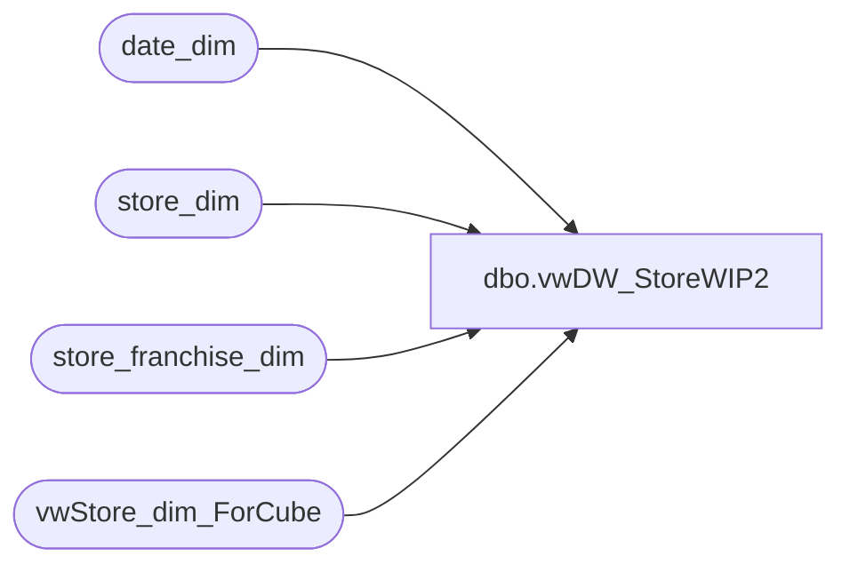

# dbo.vwDW_StoreWIP2

**Database:** dw  
**Server:** papamart  

## Architecture Diagram



## Table Dependencies

| Referenced Table |
|---|
| date_dim |
| store_dim |
| store_franchise_dim |
| vwStore_dim_ForCube |

## View Code

```sql
CREATE VIEW [dbo].[vwDW_StoreWIP2] 
-- =============================================================================================================
-- Name: [dbo].[vwDW_Store]
--
-- Description: 
--
-- Dependencies: 
--
-- Revision History
/*
--		Name:			Date:			Comments:
--		Funmi Agbebi	8/18/2009		added GeographyCountry column for Geography Hierarchy
--		Keith Missey	8/14/2009		updated for LMM
--		Keith Missey	2/5/2009		updated per 2/1 re-alignment

07-28-06 CDG Added 'London' region to ReportFlag & added a new higher order level for use in Geography hierarchy
handled null country codes by using region value...
08-10-06 CDG added in columns for AD group names for supporting Aaron's automation of user defaults for the store dimension
08-11-06 CDG bearritory spelling changed in table Store_AD_Xref. updated view to match
		Changed Bear Range to use Region values as it's driver instead of country/region. Added "Corporate" Bear range
08-12-06 CDG added Default_Currency_Code to the Store_AD_Xref and to this view
08-19-06 TMK added code for new "Company" hierarchy level
08-31-06 TMK added unique keys for Bear Range, Region, and Bearitory
09-19-06 JLL added logic to change UK country to Europe and London region to UK
10-18-06 JLL added logic to move 2013 out of SE bearitory into WebStore grouping
11-14-2006 JLL remove UK Web store from its own bearitory; Change report flag and Club max flag logic*/

-- =============================================================================================================


AS
	SELECT *
		,LTRIM(RTRIM(CompanyLevel)) + '-' + LTRIM(RTRIM(BearRange)) AS BearRangeKey
		,LTRIM(RTRIM(CompanyLevel)) + '-' + LTRIM(RTRIM(BearRange)) + '-' + LTRIM(RTRIM(region)) AS RegionKey
		,LTRIM(RTRIM(CompanyLevel)) + '-' + LTRIM(RTRIM(BearRange)) + '-' + LTRIM(RTRIM(region)) + '-' + LTRIM(RTRIM(bearritory)) AS BearitoryKey
		,state_province_key + '-' + ISNULL(city, '') AS city_key
		,CASE WHEN city IS NULL OR city = '' THEN '(blank)' ELSE city END AS city_display
		,state_province_key + '-' + ISNULL(city, '') + '-' + ISNULL(postal_code, '') AS postal_code_key
		,CASE WHEN postal_code IS NULL OR postal_code = '' THEN '(blank)' ELSE postal_code END AS postal_code_display
		,LTRIM(RTRIM(CompanyLevel)) + '-' + LTRIM(RTRIM(GeographyBearRange)) + '-' + LTRIM(RTRIM(country)) AS GeographyParentCountryKey
		,LTRIM(RTRIM(CompanyLevel)) + '-' + LTRIM(RTRIM(GeographyBearRange)) + '-' + LTRIM(RTRIM(country)) + '-' + LTRIM(RTRIM(GeographyCountry)) AS GeographyCountryKey
	FROM
	(
		SELECT s.store_key
				,CAST(s.store_id AS varchar) AS store_id
				,s.store_name
				,s.storeNameNum
				,bearea = CASE WHEN s.bearea = 'Upper Midwest' THEN 'Upper Midwest/Central Canada'
				ELSE s.bearea END 
				--,s.bearritory
--commented out for UK alignment changes Aug 2007
				,bearritory = case
					when s.bearritory is null then 'Other'
					WHEN s.bearritory = 'Upper Midwest' THEN 'Upper Midwest/Central Canada'
					else s.bearritory
						end
				
				,region = case
					when s.region is null then 'Other'
					--when s.bearritory in ('Midlands', 'Scotland & North') then 'North UK' 
					when s.bearritory in ('Southeast-UK', 'Southern', 'Southwest-UK''Midlands', 'Scotland & North') then 'UK'
					---when s.bearritory in ('Southeast-UK', 'Southern', 'Southwest-UK') then 'South UK'
					else s.region
						end
				,ISNULL(s.GeographyCountry, '') AS GeographyCountry  -- FA 8/18/2009
				,ISNULL(s.country, '') AS country
				,CASE WHEN ISNULL(s.country_name, '') = '' THEN '(blank)' ELSE s.country_name END country_name
				,CASE WHEN s.state_province IS NULL OR s.state_province = '' THEN '(blank)' ELSE s.state_province END AS state_province
				,s.country + ISNULL(s.state_province, '') AS state_province_key
				,s.city
				,s.postal_code
				,s.latitude
				,s.longitude

				,CASE WHEN s.dma_name IS NULL OR s.dma_name = '' THEN 'Other' ELSE s.dma_name END AS dma_name
				,s.opening_date
				,s.opening_date_id
				,s.closing_date
				,s.comp_week_id
				,s.open_fp_id
				,s.open_week_id
				--,d.date_key AS comp_date_key
				
				--11/14 - Comment out the syntax for web store breakout
				--,(SELECT date_key FROM date_dim WHERE actual_date = store_table.comp_date) AS comp_date_key
				--,CASE
				--	WHEN s.bearritory like '%Closed%' THEN 0
				--	WHEN s.store_id in (480, 482, 013, 136, 473) THEN 2
				--	WHEN s.region IN ('North US', 'South US', 'West', 'London') THEN 1
				--	WHEN s.region IN ('US-Corporate', 'Web Stores') THEN 2
				--	ELSE 0
				--END AS ReportFlag
	
			--11/14 - Implement below for UK web store breakout
				,(SELECT date_key FROM date_dim WHERE actual_date = store_table.comp_date) AS comp_date_key
--				,CASE
--					WHEN s.store_id in (2013) THEN 2
--					ELSE 1
--				END AS ReportFlag
					,ReportFlag = 1
				,CASE
					WHEN s.bearritory like '%Closed%' THEN 0
					WHEN s.store_id in (480, 482, 013, 136, 473) THEN 2
					WHEN s.region IN ('Central US', 'East US', 'West US', 'UK') THEN 1
					WHEN s.region IN ('US-Corporate', 'Web Stores', 'UK Web Store') THEN 2
					ELSE 0
				END AS ClubMaxFlag
		
				,Case 	WHEN s.store_id in (480, 482, 013, 136, 473) then 'North America'
						WHEN s.region IN ('East US', 'Central US', 'West US') then 'North America'
						WHEN s.store_id in (2013) then 'Europe'
						WHEN s.bearritory in ('Midlands', 'Scotland & North', 'Southeast-UK', 'Southern', 'Southwest-UK') THEN 'Europe'
						WHEN s.region in ('France and Eire', 'UK') THEN 'Europe'
--						WHEN s.region IN ('North UK', 'South UK', 'France And Eire') then 'Europe'
						when s.region in ('Web Stores','US-Corporate','Canada-Corporate','Canada Stores','Corporate - UK') then 'Corporate'
						WHEN s.region = 'Ridemakerz' THEN 'Ridemakerz'
						WHEN s.store_id IN (1401) THEN 'LMM'
						else 'Other' end
					as BearRange
				, CASE	WHEN s.bearritory like '%Closed%' THEN 'Other'
						WHEN s.store_id in (480, 482, 013, 136, 473) THEN 'Company'
						WHEN s.store_id in (2013) THEN 'Company'
						WHEN s.region IN ('East US', 'Central US', 'West US', 'UK', 'France And Eire') THEN 'Company'
						WHEN s.bearritory in ('Midlands', 'Scotland & North', 'Southeast-UK', 'Southern', 'Southwest-UK') THEN 'Company'
						WHEN s.region = 'Ridemakerz' THEN 'Ridemakerz'
						WHEN s.store_id IN (1401) THEN 'LMM'
						ELSE 'Other' END
					AS CompanyLevel
				,Case 	WHEN s.store_id in (480, 482, 013, 136, 473) then 'North America'
						WHEN s.region IN ('East US', 'Central US', 'West US') then 'North America'
						WHEN s.store_id in (2013) then 'Europe'
						WHEN s.bearritory in ('Midlands', 'Scotland & North', 'Southeast-UK', 'Southern', 'Southwest-UK') THEN 'Europe'
						WHEN s.region in ('France and Eire', 'UK') THEN 'Europe'
--						WHEN s.region IN ('North UK', 'South UK', 'France And Eire') then 'Europe'
						when s.region in ('Web Stores','US-Corporate','Canada-Corporate','Canada Stores','Corporate - UK') then 'Corporate'
						WHEN s.region = 'Ridemakerz' THEN 'Ridemakerz'
						WHEN s.store_id IN (1401) THEN 'LMM'
						else 'Other' end
					as GeographyBearRange

	
			FROM vwStore_dim_ForCube s
			INNER JOIN store_dim store_table ON store_table.store_key = s.store_key
			LEFT JOIN date_dim d ON d.week_id = s.comp_week_id
				AND d.day_of_week = 7
			WHERE s.store_name IS NOT NULL

			/** uncomment below for franchisee data **/

			UNION

			SELECT
				f.store_key
				,CAST(f.store_id AS varchar) AS store_id
				,f.store_name
				,storeNameNum = f.store_id + ' ' + f.store_name
				,f.bearea
				,f.bearritory
				,f.region
				,f.country_name AS geographical_country
				,f.country
				,f.country_name
				,f.state_province
				,state_province_key = f.country + ISNULL(f.state_province, '')
				,f.city
				,f.postal_code
				,f.latitude
				,f.longitude
				,dma_name = 'Other'
				,f.opening_date
				,dd.day_id AS opening_date_id
				,f.closing_date
				,f.comp_week_id
				,dd.period_id AS open_fp_id
				,dd.week_id AS open_week_id
				,(SELECT date_key FROM date_dim WHERE actual_date = f.comp_date) AS comp_date_key
				,ReportFlag = 1
				,ClubMaxFlag = 0
				,f.BearRange
				,CompanyLevel = 'Franchisees'
				,GeographyBearRange = 'Franchisees'  --FA 8/18/2009 

			FROM store_franchise_dim f
			LEFT JOIN date_dim dd ON f.opening_date = dd.actual_date
			/** uncomment above for franchisee data **/

		) t
```

