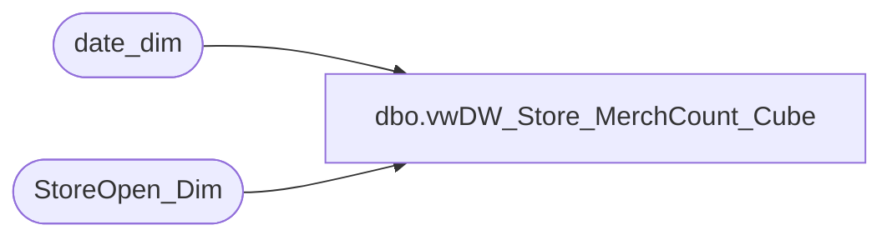

# dbo.vwDW_Store_MerchCount_Cube

**Database:** dw  
**Server:** papamart  

## Architecture Diagram



## Table Dependencies

| Referenced Table |
|---|
| date_dim |
| StoreOpen_Dim |

## View Code

```sql
CREATE VIEW [dbo].[vwDW_Store_MerchCount_Cube]
AS
-- =============================================================================================================
-- Name: [dbo].[vwDW_Store_MerchCount_Cube]
--
-- Description: View underlying the SSAS Merchandise Store Counts on the dashboard.
-- Determines the weighted number of stores at the end of each week.
--
--
-- Dependencies: 
--
-- Revision History
--		Name:				Date:			Comments:
--		Gary Murrish		5/23/2012		Initial deployment
-- =============================================================================================================
SELECT store_key
	 , dd.date_key
	 , MDSE_WGHT
	 , cast (1 AS INT) AS numStores
FROM
	StoreOpen_Dim sod WITH (NOLOCK)
	JOIN (
		  -- Weekending Dates
		  SELECT date_key
		  FROM
			  date_dim dd WITH (NOLOCK)
		  WHERE
			  day_of_week = 7) dd
		ON dd.date_key BETWEEN sod.date_key_from AND sod.date_key_thru
```

