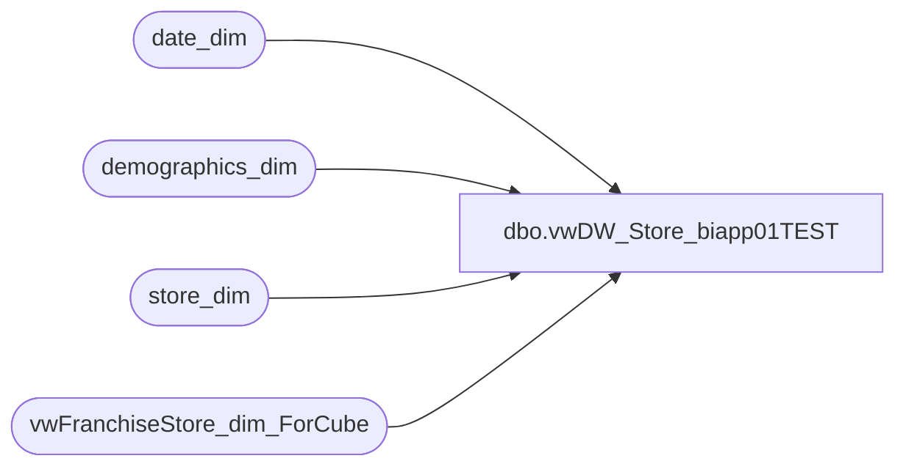

# dbo.vwDW_Store_biapp01TEST

**Database:** dw  
**Server:** papamart  

## Architecture Diagram



## Table Dependencies

| Referenced Table |
|---|
| date_dim |
| demographics_dim |
| store_dim |
| vwFranchiseStore_dim_ForCube |

## View Code

```sql
CREATE VIEW [dbo].[vwDW_Store_biapp01TEST]


AS
WITH CompDate_CTE
(	fiscal_year,
	fiscal_period,
	priorPeriodDate_key,
	priorPeriod_Actual_Date,
	thisPeriodDate_key,
	thisPeriod_Actual_date,
	ly_priorPeriodDate_key,
	ly_priorPeriod_Actual_Date,
	ly_thisPeriodDate_key,
	ly_thisPeriodActual_Date)
AS (SELECT
		ty.fiscal_year,
		ty.fiscal_period,
		ty.priorPeriodDate_key,
		pd.actual_date AS priorPeriod_Actual_Date,
		ty.thisPeriodDate_key,
		ty.thisPeriod_Actual_date,
		ly.priorPeriodDate_key AS ly_priorPeriodDate_key,
		lypd.actual_date AS ly_priorPeriod_Actual_Date,
		ly.thisPeriodDate_key AS ly_thisPeriodDate_key,
		ly.thisPeriod_Actual_date AS ly_thisPeriodActual_Date
	FROM
		(SELECT
				fiscal_year,
				fiscal_period,
				MIN(Date_key) - 1 AS priorPeriodDate_key,
				MAX(dd.Date_key) AS thisPeriodDate_key,
				MAX(dd.actual_date) AS thisPeriod_Actual_date
			FROM
				date_dim dd WITH (NOLOCK)

			GROUP BY	dd.fiscal_year,
						dd.fiscal_period)
		ty
		LEFT JOIN date_dim pd WITH (NOLOCK)
			ON pd.Date_key = ty.priorPeriodDate_key

		LEFT JOIN (SELECT
				fiscal_year,
				fiscal_period,
				MIN(Date_key) - 1 AS priorPeriodDate_key,
				MAX(dd.Date_key) AS thisPeriodDate_key,
				MAX(dd.actual_date) AS thisPeriod_Actual_Date
			FROM
				date_dim dd WITH (NOLOCK)
			GROUP BY	dd.fiscal_year,
						dd.fiscal_period)
		ly
			ON ly.fiscal_year = ty.fiscal_year - 1
			AND ly.fiscal_period = ty.fiscal_period

		LEFT JOIN date_dim lypd WITH (NOLOCK)
			ON lypd.Date_key = ly.priorPeriodDate_key)
SELECT
	Store_Key,
	store_id,
	StoreRanking,
	store_name,
	storeNameNum,
	Case 
		when bearea = 'n/a' then bearritory else bearea end as Area,
	bearea,
	bearritory,
	region,
	GeographyRegion,
	ParentCountry,
	ChildCountry,
	country,
	country_name,
	country_display,
	state_province,
	state_province_key,
	city,
	postal_code,
	latitude,
	longitude,
	dma_name,
	opening_date,
	opening_date_id,
	comp_week_id,
	open_fp_id,
	open_week_id,
	comp_date_key,
	ReportFlag,
	ClubMaxFlag,
	BearRange,
	CompanyLevel,
	IsClosed,
	closing_date_key,
	closing_date,
	closing_max_comp_date_key,
	closing_max_comp_date,
	closing_max_ly_comp_date_key,
	closing_max_ly_comp_date,
	MerchCompanyLevel,
	MerchBearRange,
	MerchCountry,
	MerchRegion,
	MerchBearritory,
	isHispanicStore,
	HispanicStoreGroup,
	LocationType,
	JurisdictionCode,
	LTRIM(RTRIM(MerchCompanyLevel)) + '-' + LTRIM(RTRIM(MerchBearRange)) AS MerchBearRangeKey,
	LTRIM(RTRIM(MerchCompanyLevel)) + '-' + LTRIM(RTRIM(MerchBearRange)) + '-' + LTRIM(RTRIM(MerchCountry)) AS MerchCountryKey,
	LTRIM(RTRIM(MerchCompanyLevel)) + '-' + LTRIM(RTRIM(MerchBearRange)) + '-' + LTRIM(RTRIM(MerchCountry)) + '-' + LTRIM(RTRIM(MerchRegion)) AS MerchRegionKey,
	LTRIM(RTRIM(MerchCompanyLevel)) + '-' + LTRIM(RTRIM(MerchBearRange)) + '-' + LTRIM(RTRIM(MerchCountry)) + '-' + LTRIM(RTRIM(MerchRegion)) + '-' + LTRIM(RTRIM(MerchBearritory)) AS MerchBearitoryKey,
	LTRIM(RTRIM(CompanyLevel)) + '-' + LTRIM(RTRIM(country)) AS CountryKey,
	LTRIM(RTRIM(StoreRanking)) + '-' + LTRIM(RTRIM(CompanyLevel)) AS RankedCompanyLevelKey,
	LTRIM(RTRIM(StoreRanking)) + '-' + LTRIM(RTRIM(CompanyLevel)) + '-' + LTRIM(RTRIM(BearRange)) AS RankedBearRangeKey,
	LTRIM(RTRIM(StoreRanking)) + '-' + LTRIM(RTRIM(CompanyLevel)) + '-' + LTRIM(RTRIM(BearRange)) + '-' + LTRIM(RTRIM(region)) AS RankedRegionKey,
	LTRIM(RTRIM(StoreRanking)) + '-' + LTRIM(RTRIM(CompanyLevel)) + '-' + LTRIM(RTRIM(BearRange)) + '-' + LTRIM(RTRIM(region)) + '-' + LTRIM(RTRIM(bearritory)) AS RankedBearitoryKey,
	LTRIM(RTRIM(CompanyLevel)) + '-' + LTRIM(RTRIM(BearRange)) AS BearRangeKey,
	LTRIM(RTRIM(CompanyLevel)) + '-' + LTRIM(RTRIM(BearRange)) + '-' + LTRIM(RTRIM(region)) AS RegionKey,
	LTRIM(RTRIM(CompanyLevel)) + '-' + LTRIM(RTRIM(BearRange)) + '-' + LTRIM(RTRIM(region)) + '-' + LTRIM(RTRIM(bearritory)) AS BearitoryKey,
	state_province_key + '-' + ISNULL(city, '') AS city_key,
	CASE
		WHEN city IS NULL OR city = '' THEN '(blank)'
		ELSE city
	END AS city_display,
	state_province_key + '-' + ISNULL(city, '') + '-' + ISNULL(postal_code, '') AS postal_code_key,
	CASE
		WHEN postal_code IS NULL OR postal_code = '' THEN '(blank)'
		ELSE postal_code
	END AS postal_code_display,
	LTRIM(RTRIM(CompanyLevel)) + '-' + LTRIM(RTRIM(BearRange)) + '-' + LTRIM(RTRIM(ParentCountry)) AS GeographyParentCountryKey,
	LTRIM(RTRIM(CompanyLevel)) + '-' + LTRIM(RTRIM(BearRange)) + '-' + LTRIM(RTRIM(ParentCountry)) + '-' + LTRIM(RTRIM(GeographyRegion)) AS GeographyRegionKey,
	isWebStore
FROM
	(/*	----------------------------------------------------------------------------------------------------------- */
		/*	Pull the Company information from Store_Dim in papamart.dw													*/
		/*	----------------------------------------------------------------------------------------------------------- */
		SELECT
			baseCompany.Store_Key,
			CAST(baseCompany.store_id AS varchar) AS store_id,
			baseCompany.StoreRanking,
			baseCompany.store_name,
			baseCompany.storeNameNum,
			baseCompany.bearea,
			baseCompany.bearritory,
			baseCompany.region,
			baseCompany.GeographyRegion,
			baseCompany.ParentCountry,
			baseCompany.ChildCountry,
			baseCompany.country,
			baseCompany.country_name,
			baseCompany.country_display,
			baseCompany.state_province,
			baseCompany.state_province_key,
			baseCompany.city,
			baseCompany.postal_code,
			baseCompany.latitude,
			baseCompany.longitude,
			baseCompany.dma_name,
			baseCompany.opening_date,
			baseCompany.opening_date_id,
			baseCompany.comp_week_id,
			baseCompany.open_fp_id,
			baseCompany.open_week_id,
			baseCompany.comp_date_key,
			baseCompany.ReportFlag,
			baseCompany.ClubMaxFlag,
			baseCompany.BearRange,
			baseCompany.CompanyLevel,
			baseCompany.IsClosed,
			baseCompany.closing_date_key,
			baseCompany.closing_date,
			baseCompany.closing_max_comp_date_key,
			baseCompany.closing_max_comp_date,
			baseCompany.closing_max_ly_comp_date_key,
			baseCompany.closing_max_ly_comp_date,
			baseCompany.CompanyLevel AS MerchCompanyLevel,
			baseCompany.BearRange AS MerchBearRange,
			baseCompany.country AS MerchCountry,
			baseCompany.region AS MerchRegion,
			baseCompany.bearritory AS MerchBearritory,
			baseCompany.isHispanicStore,
			baseCompany.HispanicStoreGroup,
			baseCompany.LocationType,
			baseCompany.JurisdictionCode,
			baseCompany.isWebStore

		FROM
			(SELECT
					sd.Store_Key,
					sd.store_id, --CAST(sd.store_id AS varchar) AS store_id,
					CASE
						WHEN sd.store_id IN (6, 52, 100, 119, 189, 200, 255) THEN 'Top 7 US Stores'
						--WHEN sd.store_id IN (2001,2033,2017,2019,2020,2022,2024,2045,2051,2052) THEN 'Top 7 UK Stores'
						WHEN sd.store_id in (2020,2001,2019,2022,2017,2052,2067,2051,2027,2037) THEN 'Top 7 UK Stores' --NEW LIST FROM ROGER PARRY 2018-01-23 - DAN TWEEDIE
						WHEN sd.store_id IN (2018, 2027, 2034, 2036, 2037, 2033,2045,2066) THEN 'Other Top UK Stores' -- 2052, 2051
						WHEN sd.store_id IN (2003, 2004, 2010, 2014, 2015, 2016, 2023, 2024, 2025, 2035, 2038, 2039, 2041, 2043, 2046, 2047, 2048, 2050, 2053) THEN 'Medium UK Stores'
						WHEN sd.store_id IN (2002, 2006, 2007, 2008, 2011, 2012, 2021, 2026, 2028, 2029, 2030, 2031, 2032, 2040, 2042, 2044, 2049) THEN 'Low UK Stores'
						ELSE 'Unranked'
					END AS StoreRanking,
					sd.store_name_abbrv AS store_name,
					CASE
						WHEN LEN(sd.store_id) < 4 THEN RIGHT('0000' + CAST(sd.store_id AS varchar), 3)
						ELSE RIGHT('0000' + CAST(sd.store_id AS varchar), 4)
					END
					+ ' ' + ISNULL(sd.store_name_abbrv, LEFT(sd.store_name, 20)) AS storeNameNum,
					ISNULL(sd.bearea, 'N/A') AS bearea,
					CASE
						WHEN sd.store_id IN (013, 136) THEN 'Web Stores'
						WHEN sd.store_id IN (2013) THEN 'UK Web Store'
						ELSE ISNULL(sd.bearritory, 'Other')
					END AS bearritory,
					CASE
						WHEN sd.store_id IN (013, 136) THEN 'Web Stores'
						WHEN sd.store_id IN (2013) THEN 'UK Web Store'
						ELSE ISNULL(sd.region, 'Other')
					END
					AS region,
					CASE
						WHEN sd.store_id IN (013, 136) THEN 'Web Stores'
						WHEN sd.store_id IN (2013) THEN 'UK Web Store'
						ELSE ISNULL(sd.region, 'Other')
					END AS GeographyRegion,
					ISNULL(sd.country_name, ISNULL(sd.country, '?')) AS ParentCountry,
					ISNULL(sd.country_name, ISNULL(sd.country, '?')) AS ChildCountry,
					ISNULL(sd.country, '?') AS country,
					CASE
						WHEN sd.country_name IS NULL THEN '(blank)'
						WHEN LEN(sd.country_name) = 0 THEN '(blank)'
						ELSE sd.country_name
					END AS country_name,
					CASE
						WHEN sd.country_name IS NULL THEN '(blank)'
						WHEN LEN(sd.country_name) = 0 THEN '(blank)'
						ELSE sd.country_name
					END AS country_display,
					CASE
						WHEN sd.state_province IS NULL OR LEN(sd.state_province) = 0 THEN '(blank)'
						ELSE sd.state_province
					END AS state_province,
					ISNULL(sd.country, '') + '-' + ISNULL(sd.state_province, '') AS state_province_key,
					sd.city,
					sd.postal_code,
					sd.latitude,
					sd.longitude,
					CASE
						WHEN d.dma_name IS NULL OR d.dma_name = '' THEN 'Other'
						ELSE d.dma_name
					END AS dma_name,
					sd.opening_date,
					openDate.Date_key AS opening_date_id,
					compDate.week_id AS comp_week_id,
					openDate.period_id AS open_fp_id,
					openDate.week_id AS open_week_id,
					compDate.Date_key AS comp_date_key,
					1 AS ReportFlag,
					CASE
						--WHEN sd.bearritory LIKE '%Closed%' THEN 0
						WHEN sd.store_id IN (480, 482, 013, 136, 473, 2013) THEN 2
						WHEN sd.region LIKE ('%Corporate%') THEN 2
						WHEN sd.country IN ('US', 'UK', 'IE') THEN 1
						ELSE 0
					END AS ClubMaxFlag,
					CASE
						when sd.store_id between 800 and 899 then 'Varsity' ----2023-12-27
						WHEN sd.store_id IN (013, 136) THEN 'North America' -- changed 11/10/2009 by FA
						WHEN sd.store_id IN (2013) THEN 'Europe'
						WHEN sd.store_id IN (1401) THEN 'LMM'
						WHEN sd.region LIKE ('%Corporate%') THEN 'Other'
						WHEN ISNULL(sd.region, 'Other') = 'Other' THEN 'Other'
						WHEN sd.region = 'Ridemakerz' THEN 'Ridemakerz'
						WHEN sd.country IN ('US', 'CA') THEN 'North America'
						WHEN sd.country IN ('UK', 'IE', 'DK','CN') THEN 'Europe' -- added CN 2016/05/31 by BB
						ELSE 'Other'
					END AS BearRange,
					CASE
						when sd.store_id between 800 and 899 then 'Varsity' ----2023-12-27
						WHEN sd.region = 'Ridemakerz' THEN 'Ridemakerz'
						WHEN sd.store_id IN (013, 136, 2013) THEN 'Company' --changed 11/10 by FA
						WHEN sd.store_id IN (480, 482, 473) THEN 'Other' --changed 11/10 by FA (Mobile Stores)
						WHEN sd.store_id IN (1401) THEN 'LMM'
						WHEN sd.bearritory LIKE '%Corporate%' THEN 'Other' --added 11/10 by FA
						WHEN sd.store_id > 9000 THEN 'Other'
						WHEN sd.country IN ('US', 'UK', 'CA', 'IE', 'DK','CN') THEN 'Company' -- added CN 2016/05/31 by BB
						ELSE 'Other'
					END AS CompanyLevel,
					CASE
						WHEN sd.closing_date IS NOT NULL
						OR sd.bearritory LIKE '%Closed%' THEN 1
						ELSE 0

					END AS IsClosed,
					closeDate.Date_key AS closing_date_key,
					sd.closing_date,
					CASE
						WHEN compDates.thisPeriodDate_key = closeDate.Date_key THEN compDates.thisPeriodDate_key
						ELSE compDates.priorPeriodDate_key
					END AS closing_max_comp_date_key,
					CASE
						WHEN compDates.thisPeriodDate_key = closeDate.Date_key THEN compDates.thisPeriod_Actual_date
						ELSE compDates.priorPeriod_Actual_Date
					END AS closing_max_comp_date,
					CASE
						WHEN compDates.thisPeriodDate_key = closeDate.Date_key THEN compDates.ly_thisPeriodDate_key
						ELSE compDates.ly_priorPeriodDate_key
					END AS closing_max_ly_comp_date_key,
					CASE
						WHEN compDates.thisPeriodDate_key = closeDate.Date_key THEN compDates.ly_thisPeriodActual_Date
						ELSE compDates.ly_priorPeriod_Actual_Date
					END AS closing_max_ly_comp_date,
					CAST(CASE
						WHEN sd.store_id IN (005, 011, 022, 028, 031, 033, 035, 041, 042, 055, 058, 066, 089, 090, 109, 110, 112, 118, 128, 133, 134, 149, 160, 161, 175, 178, 191, 192, 193, 198, 201, 208, 211, 214, 222, 226, 235, 236, 241, 248, 249, 254, 256, 260, 268, 271, 289, 297, 298, 299, 603, 607, 608, 015, 060, 080, 111, 230, 238, 246) THEN 1
						ELSE 0
					END AS bit) AS isHispanicStore,
					CAST(CASE
						WHEN sd.store_id IN (005, 011, 022, 028, 031, 033, 035, 041, 042, 055, 058, 066, 089, 090, 109, 110, 112, 118, 128, 133, 134, 149, 160, 161, 175, 178, 191, 192, 193, 198, 201, 208, 211, 214, 222, 226, 235, 236, 241, 248, 249, 254, 256, 260, 268, 271, 289, 297, 298, 299, 603, 607, 608) THEN 'Hispanic - Mexican'
						WHEN sd.store_id IN (015, 060, 080, 111, 230, 238, 246) THEN 'Hispanic - Non-Mexican'
						ELSE 'N/A'
					END AS varchar(50)) AS HispanicStoreGroup,
					CAST(CASE
						WHEN sd.store_id BETWEEN 1 AND 700 THEN 'Store' -- US/Canada
						WHEN sd.store_id BETWEEN 2000 AND 2499 THEN 'Store' -- UK
						WHEN sd.store_id BETWEEN 3000 AND 3499 THEN 'Store' -- CN -- added CN 2016/05/31 by BB
						WHEN sd.store_id BETWEEN 1500 AND 1599 THEN 'Store' -- Ridemakerz
						WHEN sd.store_id IN (950, 960, 980, 2970, 975,3970,3980) THEN 'Warehouse' -- CN -- added CN 2016/05/31 by BB
						ELSE 'Other'
					END AS varchar(50)) AS LocationType,
					--CAST(CASE
					--	WHEN ISNULL(juris.jurisdiction_code, '?') = 'HOME' THEN 'US'
					--	WHEN ISNULL(juris.jurisdiction_code, '?') = 'CN' THEN 'CN' -- CN -- added CN 2016/05/31 by BB
					--	ELSE ISNULL(juris.jurisdiction_code, '?')
					--END AS varchar(2)) AS JurisdictionCode,
					isnull(sd.country,'?') as JurisdictionCode, 
					CAST(CASE
						WHEN sd.store_id IN (013, 136, 2013, 473, 991) THEN 'Web'
						ELSE 'Not Web'
					END AS varchar(7)) AS isWebStore
				FROM
					store_dim sd WITH (NOLOCK)
					LEFT JOIN demographics_dim AS d
						ON sd.demographics_bg_key = d.demographics_bg_key
					LEFT JOIN date_dim openDate WITH (NOLOCK)
						ON openDate.actual_date = sd.opening_date
					LEFT JOIN date_dim compDate WITH (NOLOCK)
						ON compDate.actual_date =
							CASE
								WHEN ISNULL(sd.comp_date, (SELECT
										MAX(actual_date)
									FROM
										date_dim dd WITH (NOLOCK))
								) > (SELECT
										MAX(actual_date)
									FROM
										date_dim dd WITH (NOLOCK))
								THEN (SELECT
										MAX(actual_date)
									FROM
										date_dim dd WITH (NOLOCK))
								ELSE ISNULL(sd.comp_date, (SELECT
										MAX(actual_date)
									FROM
										date_dim dd WITH (NOLOCK))
								)
							END
					LEFT JOIN date_dim closeDate WITH (NOLOCK)
						ON sd.closing_date = closeDate.actual_date
					LEFT JOIN CompDate_CTE compDates
						ON closeDate.fiscal_year = compDates.fiscal_year
						AND closeDate.fiscal_period = compDates.fiscal_period
					--LEFT JOIN bedrockdb02.ma_01.dbo.location xref WITH (NOLOCK)
					--	ON sd.store_id = xref.location_code
					--LEFT JOIN bedrockdb02.ma_01.dbo.Jurisdiction juris WITH (NOLOCK)
					--	ON xref.jurisdiction_id = juris.jurisdiction_id

				WHERE
					sd.store_name IS NOT NULL)
			baseCompany
		UNION
		/*	----------------------------------------------------------------------------------------------------------- */
		/*	Pull the Franchisee information in papamart.dw																*/
		/*	----------------------------------------------------------------------------------------------------------- */
		SELECT
			f.Store_Key,
			replace(f.store_id,' ', '') as store_id,
			f.StoreRanking,
			f.store_name,
			f.storeNameNum,
			CASE
				WHEN f.bearea = '' THEN 'N/A'
				ELSE ISNULL(f.bearea, 'N/A')
			END AS bearea,
			f.bearritory,
			f.region,
			f.GeographyRegion,
			f.ParentCountry,
			f.ChildCountry,
			f.country,
			f.country_name,
			f.country_display,
			f.state_province,
			f.state_province_key,
			f.city,
			f.postal_code,
			f.latitude,
			f.longitude,
			f.dma_name,
			f.opening_date,
			f.opening_date_id,
			f.comp_week_id,
			f.open_fp_id,
			f.open_week_id,
			f.comp_date_key,
			f.ReportFlag,
			f.ClubMaxFlag,
			f.BearRange,
			f.CompanyLevel,
			f.IsClosed,
			f.closing_date_key,
			f.closing_date,
			f.closing_max_comp_date_key,
			f.closing_max_comp_date,
			f.closing_max_ly_comp_date_key,
			f.closing_max_ly_comp_date,
			f.MerchCompanyLevel,
			f.MerchBearRange,
			f.MerchCountry,
			f.MerchRegion,
			f.MerchBearritory,
			CAST(0 AS bit) AS isHispanicStore,
			CAST('N/A' AS varchar(50)) AS HispanicStoreGroup,
			CAST('N/A' AS varchar(50)) AS LocationType,
			CAST(f.country AS varchar(2)) AS JurisdictionCode,
			CAST(CASE
				WHEN f.store_id LIKE ('__99%') THEN 'Web'
				ELSE 'Not Web'
			END AS varchar(7)) AS isWebStore
		FROM
			vwFranchiseStore_dim_ForCube f
			--where f.Store_Key <> 11496646
			)

	t;
```

