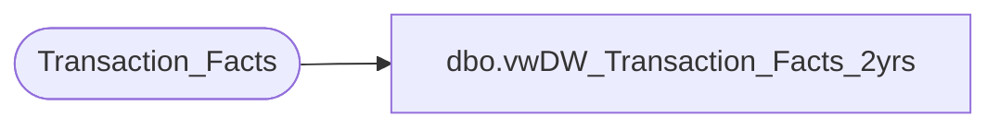

# dbo.vwDW_Transaction_Facts_2yrs

**Database:** dw  
**Server:** papamart  

## Architecture Diagram



## Table Dependencies

| Referenced Table |
|---|
| Transaction_Facts |

## View Code

```sql
CREATE VIEW [dbo].[vwDW_Transaction_Facts_2yrs]
AS
select * from Transaction_Facts
where date_key > 9667
```

