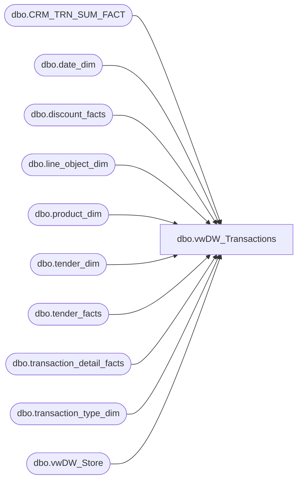

# dbo.vwDW_Transactions

**Database:** dw  
**Server:** papamart  

## Architecture Diagram



## Table Dependencies

| Referenced Table |
|---|
| dbo.CRM_TRN_SUM_FACT |
| dbo.date_dim |
| dbo.discount_facts |
| dbo.line_object_dim |
| dbo.product_dim |
| dbo.tender_dim |
| dbo.tender_facts |
| dbo.transaction_detail_facts |
| dbo.transaction_type_dim |
| dbo.vwDW_Store |

## View Code

```sql
CREATE VIEW [dbo].[vwDW_Transactions_gmRev]
AS
-- =============================================================================================================
-- Name: [dbo].[vwDW_Transactions]
--
-- Description: View underlying the SSAS Papa Mart Cube used on the dashboard.   
-- Aggregates POS transactions sales and product group metrics by store and date
--
--	NOTE: IF YOU CHANGE THIS, YOU WILL PROBABLY HAVE TO ALSO CHANGE spDW_Build_Transaction_Facts
--
-- Dependencies: 
--
-- Revision History
--		Name:				Date:			Comments:
--		Gary Murrish			03/02/2012		Changed definition of CouponDiscount
--		Gary Murrish			02/28/2012		Changed definition of GAAP Transaction Flag
--		Gary Murrish			12/29/2011		Removed subclass '48-06-01' from Merchandise Units
--		Rick Caminiti			10/24/2011	Changed references from tender_group_dim to tender_facts (new table)
--		Gary Murrish			2/18/2011		Added line object 104 to GAAP Sales (Merchandise)
--		Gary Murrish			11/18/2010		Removed 1103 from allowed Discounts included
--		Keith Missey			2/18/2010		updated gaap transaction flag definition
--		Keith Missey			12/14/2009		added updated merch units definition
--		Funmi Agbebi			1/08/2010		added null fields for Franchisee Royalty reporting
--		Funmi Agbebi			10/15/2009		added all transaction_type metric calculations directly to the view
--		Funmi Agbebi			9/14/2009		added transaction_type_key field for bare bare, bear plus and plus only transactiosn
--		Outside Consultant		2006			original creation
-- =============================================================================================================

--$$$$$$$$$$$$$$$$$$$$$$$$$$$$$$$$$$$$$$$$$$$$ level 3 begins $$$$$$$$$$$$$$$$$$$$$$$$$$$$$$$$$$$$$$$$$$$$$$$$$$

SELECT temp.*
--		,CASE WHEN temp.PartyFlag = 1 THEN temp.GaapSales ELSE 0 END AS GAAPPartySales
--		,CASE WHEN temp.GaapTransactionFlag = 1 and temp.PartyFlag = 0 THEN temp.GaapSales ELSE 0 END AS GAAPNonPartySales
--		,CASE WHEN temp.GaapTransactionFlag = 1 and temp.PartyFlag = 1 THEN temp.GaapTransactionFlag ELSE 0 END AS GAAPPartyCount
--		,CASE WHEN temp.GaapTransactionFlag = 1 and temp.PartyFlag = 0 THEN temp.GaapTransactionFlag ELSE 0 END AS GAAPNonPartyCount
--		,CASE WHEN temp.GaapTransactionFlag = 0 and THEN temp.GaapSales ELSE 0 END AS GAAPNonPartySales


		,CASE WHEN temp.transaction_type_key = 1 THEN temp.GaapSales ELSE 0 END AS BareBearSales
		,CASE WHEN temp.transaction_type_key = 2 THEN temp.GaapSales ELSE 0 END AS BearPlusSales
		,CASE WHEN temp.transaction_type_key = 3 THEN temp.GaapSales ELSE 0 END AS PlusOnlySales
		,CASE WHEN temp.transaction_type_key not in (1,2,3) THEN temp.GaapSales ELSE 0 END AS OtherTypeSales

		,CASE WHEN temp.transaction_type_key = 1 AND temp.GaapTransactionFlag = 1 
			THEN temp.GaapTransactionFlag ELSE 0 END AS BareBearTrans
		,CASE WHEN temp.transaction_type_key = 2 AND temp.GaapTransactionFlag = 1 
			THEN temp.GaapTransactionFlag ELSE 0 END AS BearPlusTrans
		,CASE WHEN temp.transaction_type_key = 3 AND temp.GaapTransactionFlag = 1 
			THEN temp.GaapTransactionFlag ELSE 0 END AS PlusOnlyTrans
		,CASE WHEN temp.transaction_type_key not in (1,2,3) AND temp.GaapTransactionFlag = 1 
			THEN temp.GaapTransactionFlag ELSE 0 END AS OtherTypeTrans

		,CASE WHEN temp.IsComp = 1 THEN temp.GaapSales ELSE 0 END AS CompGaapSales
		,CASE WHEN temp.IsComp = 1 THEN temp.GAAPTransactionFlag ELSE 0 END AS CompGAAPTransactionFlag
		,CASE WHEN temp.IsComp = 1 THEN temp.AnimalUnits ELSE 0 END AS CompAnimalUnits
		,CASE WHEN temp.IsComp = 1 THEN temp.SoundUnits ELSE 0 END AS CompSoundUnits
		,CASE WHEN temp.IsComp = 1 THEN temp.ShoeUnits ELSE 0 END AS CompShoeUnits
		,CASE WHEN temp.IsComp = 1 THEN temp.radio_controlled_chassis_units ELSE 0 END AS CompRadioControlledChassisUnits
		,CASE WHEN temp.IsComp = 1 THEN temp.rimz_units ELSE 0 END AS CompRimzUnits
		,CASE WHEN temp.IsComp = 1 THEN temp.Animal_UGA ELSE 0 END AS CompAnimal_UGA
		,CASE WHEN temp.IsComp = 1 THEN temp.PartyFlag ELSE 0 END AS CompPartyFlag
		,CASE WHEN temp.IsComp = 1 THEN temp.MerchandiseUnits ELSE 0 END AS CompMerchandiseUnits

		,CASE WHEN temp.IsCompNextYear = 1 THEN temp.GaapSales ELSE 0 END AS GaapSalesForCompLY
		,CASE WHEN temp.IsCompNextYear = 1 THEN temp.GAAPTransactionFlag ELSE 0 END AS GAAPTransactionFlagForCompLY
		,CASE WHEN temp.IsCompNextYear = 1 THEN temp.AnimalUnits ELSE 0 END AS AnimalUnitsForCompLY
		,CASE WHEN temp.IsCompNextYear = 1 THEN temp.SoundUnits ELSE 0 END AS SoundUnitsForCompLY
		,CASE WHEN temp.IsCompNextYear = 1 THEN temp.ShoeUnits ELSE 0 END AS ShoeUnitsForCompLY
		,CASE WHEN temp.IsCompNextYear = 1 THEN temp.radio_controlled_chassis_units ELSE 0 END AS RadioControlledChassisUnitsForCompLY
		,CASE WHEN temp.IsCompNextYear = 1 THEN temp.rimz_units ELSE 0 END AS RimzUnitsForCompLY
		,CASE WHEN temp.IsCompNextYear = 1 THEN temp.Animal_UGA ELSE 0 END AS Animal_UGAForCompLY
		,CASE WHEN temp.IsCompNextYear = 1 THEN temp.PartyFlag ELSE 0 END AS PartyFlagForCompLY
		,CASE WHEN temp.IsCompNextYear = 1 THEN temp.MerchandiseUnits ELSE 0 END AS MerchandiseUnitsForCompLY

		,CAST(NULL AS int) AS FranchiseePartyCount
		,CAST(NULL AS decimal) AS FranchiseePartySales
		,CAST(NULL AS int) AS FranchiseeCompPartyCount
		,CAST(NULL AS int) AS FranchiseePartyCountForCompLY

		,CASE WHEN temp.IsComp = 1 THEN temp.accessories_units ELSE 0 END AS CompAccessoriesUnits
		,CASE WHEN temp.IsComp = 1 THEN temp.clothes_units ELSE 0 END AS CompClothesUnits
		,CASE WHEN temp.IsComp = 1 THEN temp.SportsUGA ELSE 0 END AS CompSportsUGA
		,CASE WHEN temp.IsComp = 1 THEN temp.sports_units ELSE 0 END AS CompSportsUnits
		,CASE WHEN temp.IsComp = 1 THEN temp.UnstuffedUGA ELSE 0 END AS CompUnstuffedUGA
		,CASE WHEN temp.IsComp = 1 THEN temp.unstuffed_units ELSE 0 END AS CompUnstuffedUnits
		,CASE WHEN temp.IsComp = 1 THEN temp.Clothing_UGA ELSE 0 END AS CompClothingUGA
		,CASE WHEN temp.IsComp = 1 THEN temp.Footwear_UGA ELSE 0 END AS CompFootwearUGA
		,CASE WHEN temp.IsComp = 1 THEN temp.Sounds_UGA ELSE 0 END AS CompSoundsUGA
		,CASE WHEN temp.IsComp = 1 THEN temp.Accessories_UGA ELSE 0 END AS CompAccessoriesUGA

		,CASE WHEN temp.IsCompNextYear = 1 THEN temp.accessories_units ELSE 0 END AS AccessoriesUnitsForCompLY
		,CASE WHEN temp.IsCompNextYear = 1 THEN temp.clothes_units ELSE 0 END AS ClothesUnitsForCompLY
		,CASE WHEN temp.IsCompNextYear = 1 THEN temp.SportsUGA ELSE 0 END AS SportsUGAForCompLY
		,CASE WHEN temp.IsCompNextYear = 1 THEN temp.sports_units ELSE 0 END AS SportsUnitsForCompLY
		,CASE WHEN temp.IsCompNextYear = 1 THEN temp.UnstuffedUGA ELSE 0 END AS UnstuffedUGAForCompLY
		,CASE WHEN temp.IsCompNextYear = 1 THEN temp.unstuffed_units ELSE 0 END AS UnstuffedUnitsForCompLY
		,CASE WHEN temp.IsCompNextYear = 1 THEN temp.Clothing_UGA ELSE 0 END AS ClothingUGAForCompLY
		,CASE WHEN temp.IsCompNextYear = 1 THEN temp.Footwear_UGA ELSE 0 END AS FootwearUGAForCompLY
		,CASE WHEN temp.IsCompNextYear = 1 THEN temp.Sounds_UGA ELSE 0 END AS SoundsUGAForCompLY
		,CASE WHEN temp.IsCompNextYear = 1 THEN temp.Accessories_UGA ELSE 0 END AS AccessoriesUGAForCompLY


--select top 3 * from [vwDW_TransactionsWIP] 
--select top 3 * from [tmp_vwDW_fact_franchisee_transactions]
		,CAST(NULL AS decimal) as GiftCardsRedeemedUGA
		,CAST(NULL AS decimal) as [ReturnsUGA]
		,CAST(NULL AS decimal) as Franchisee_Exchange_Rate
		,CAST(NULL AS decimal) as Franchisee_Withholding_Tax_Rate


--$$$$$$$$$$$$$$$$$$$$$$$$$$$$$$$$$$$$$$$$$$$$ level 3 ends $$$$$$$$$$$$$$$$$$$$$$$$$$$$$$$$$$$$$$$$$$$$$$$$$$

	FROM
	(
--$$$$$$$$$$$$$$$$$$$$$$$$$$$$$$$$$$$$$$$$$$$$ level 2 begins $$$$$$$$$$$$$$$$$$$$$$$$$$$$$$$$$$$$$$$$$$$$$$$$$$

		SELECT tdf.date_key
			,tdf.store_key
			,tdf.transaction_id
			,null tender_group_key  --no longer populating this column in tdf.  using tender_facts - RSC 10/24/2011
			,CAST(tdf.transaction_id AS varchar) 
				+ '-' + CAST(tdf.store_key AS varchar) 
				+ '-' + CAST(tdf.date_key AS varchar) AS transaction_key
			,CASE tdf.party_y_n WHEN 'y' THEN 1 ELSE 0 END AS PartyFlag
			,tdf.LineCount
			,tdf.currency_key
			,CASE WHEN
					tdf.hasGAAPUnits > 0
				THEN 1
				ELSE 0
			END AS GAAPTransactionFlag
			
			,tdf.unit_net_amount
			,tdf.ttlanimalUGA AS Animal_UGA
			,tdf.ttlnonanimalUGA AS Non_Animal_UGA
			,tdf.ttlFootwearUGA AS Footwear_UGA
			,tdf.ttlAccessoriesUGA AS Accessories_UGA
			,tdf.ttlSoundsUGA AS Sounds_UGA
			,tdf.ttlClothingUGA AS Clothing_UGA
			,tdf.ttlOtherUGA AS Other_UGA
			,tdf.ttlRadioControlledChassisUGA AS RadioControlledChassis_UGA
			,tdf.ttlRimzUGA AS Rimz_UGA

			,tdf.UnitGrossAmount
			,tdf.UnitDiscAmount
			,ISNULL(tdf.merchandise, 0) + ISNULL(df.CouponDiscount, 0) + ISNULL(df.TotalDiscount, 0) - ISNULL(tdf.GiftCardDiscount, 0)
				+ ISNULL(tdf.CubCashUGA, 0) + ISNULL(tender.RewardCertificateAmt, 0) + ISNULL(tender.BuyStuffAmt, 0) + ISNULL(tdf.ShippingUGA, 0)
				+ ISNULL(tdf.OtherFeesUGA, 0) + ISNULL(tdf.StuffingAndSuppliesUGA, 0) AS GaapSales
			,ISNULL(tdf.merchandise, 0) + ISNULL(df.CouponDiscount, 0) + ISNULL(df.TotalDiscount, 0) + ISNULL(tender.RedemptionsAmt, 0)
				+ ISNULL(tdf.giftcards, 0) + ISNULL(tdf.CubCashUGA, 0) + ISNULL(tdf.partydep, 0) + ISNULL(tdf.ShippingUGA, 0)
				+ ISNULL(tdf.OtherFeesUGA, 0) + ISNULL(tdf.StuffingAndSuppliesUGA, 0) AS NetSales
			,tdf.GiftCardDiscount
			,tdf.giftcards AS GiftCardsSoldUga
			,tdf.MerchandiseUnits
			,tdf.merchandise AS MerchandiseUga
			,tdf.donations AS DonationsUga
			,tdf.StuffingAndSuppliesUGA
			,tdf.ShippingUGA
			,tdf.OtherFeesUGA
			,tdf.CubCashUGA
			,tdf.partydep AS PartyDepositUGA
			,tender.RewardCertificateAmt AS RewardCertificate
			,tender.BuyStuffAmt AS BuyStuff
			,tender.TaxAmt AS Tax
			,tender.RedemptionsAmt AS Redemptions
			,df.CouponDiscount
			,df.TotalDiscount
			,tdf.AnimalUnits
			,tdf.ShoeUnits
			,tdf.SoundUnits

			,tdf.radio_controlled_chassis_units
			,tdf.rimz_units

			/* 10/30/06 - TMK - added comp logic to view */
			,CAST(CASE WHEN trans_date_dim.week_id >= comp_date_dim.week_id THEN 1 ELSE 0 END AS bit) AS IsComp
			,CAST(CASE WHEN date_dim_for_next_year.week_id >= comp_date_dim.week_id THEN 1 ELSE 0 END AS bit) AS IsCompNextYear
			,tdf.customer_demographics_key
			,tdf.customer_geography_key
			,tdf.sfs_transaction_type_key
			,CAST(tdf.visit_count_key_12months AS int) AS visit_count_key_12months
			,CAST(tdf.visit_count_key_24months AS int) AS visit_count_key_24months
			,CAST(tdf.visit_count_key_36months AS int) AS visit_count_key_36months

			-- 11/19/2007 - TMK - added reward_redemption_key
			,tender.reward_redemption_key

			-- 11/20/2007 - TMK - added new fields which were added to franchisee data, need to have the same columns - these are dummy columns
			,CAST(NULL AS int) AS accessories_units
			,CAST(NULL AS int) AS clothes_units
			,CAST(NULL AS float) AS SportsUGA
			,CAST(NULL AS int) AS sports_units
			,CAST(NULL AS float) AS UnstuffedUGA
			,CAST(NULL AS int) AS unstuffed_units

			-- 12/26/2007 - SFM - added new fields which were added to franchisee data, need to have the same columns - these are dummy columns
			,CAST(NULL AS int) AS [gift_card_units]
			,CAST(NULL AS float) AS PrestuffedUGA
			,CAST(NULL AS int) AS prestuffed_units

			,CAST(NULL AS float) AS CompFranchiseePartySales
			,CAST(NULL AS float) AS CompGiftCardsSoldUga
			,CAST(NULL AS int) AS CompGiftCardUnits
			,CAST(NULL AS float) AS CompPrestuffedUGA
			,CAST(NULL AS int) AS CompPrestuffedUnits

			,CAST(NULL AS float) AS FranchiseePartySalesForCompLY
			,CAST(NULL AS float) AS GiftCardsSoldUgaForCompLY
			,CAST(NULL AS int) AS GiftCardUnitsForCompLY
			,CAST(NULL AS float) AS PrestuffedUGAForCompLY
			,CAST(NULL AS int) AS PrestuffedUnitsForCompLY

			-- 9/2/09 - JMay - add new field for transaction type key
			,tdf.transaction_type_key
			-- end add
			---- FA - 10/15/2009 include transaction_type 
			,tdf.transaction_type
			-- end add

		FROM
			(
--$$$$$$$$$$$$$$$$$$$$level 1 begins $$$$$$$$$$$$$$$$$$$$$$$$$$$$$$$$$$$$$$$$$$$$$$$$$$
			
				SELECT tdf1.date_key
					,tdf1.store_key
					,tdf1.transaction_id
					-- end add
					,max(tdf1.currency_key)		as currency_key
					,max(tdf1.party_y_n)		as party_y_n
					,COUNT(*)					as LineCount
					,SUM(ISNULL(tdf1.unit_gross_amount, 0)) AS UnitGrossAmount
					,SUM(ISNULL(tdf1.unit_disc_amount, 0)) AS UnitDiscAmount

--					/*** START - Adding new keys - TMK - 2007-05-29 ***/
--					,MAX(tdf1.customer_geography_key) AS customer_geography_key
--					,ISNULL(MAX(tdf1.customer_demographics_key), 0) AS customer_demographics_key
--					,MAX(tdf1.sfs_transaction_type_key) AS sfs_transaction_type_key
--					/*** END - Adding new keys - TMK - 2007-05-29 ***/
--
--					/*** START - Adding new keys - TMK - 2007-08-27 ***/
--					,MAX(visit_count_key_12months) AS visit_count_key_12months
--					,MAX(visit_count_key_24months) AS visit_count_key_24months
--					,MAX(visit_count_key_36months) AS visit_count_key_36months
--					/*** END - Adding new keys - TMK - 2007-08-27 ***/

					/*** START - Replace metrics - SFM - 2008-01-18 ***/
					,0 AS customer_geography_key
					,0 AS customer_demographics_key
					,MAX(cts.sfs_transaction_type_key) AS sfs_transaction_type_key
					,MAX(cts.visit_count_key_12months) AS visit_count_key_12months
					,MAX(cts.visit_count_key_24months) AS visit_count_key_24months
					,MAX(cts.visit_count_key_36months) AS visit_count_key_36months
					/*** END - Replace metrics - SFM - 2008-01-18 ***/


					,SUM(CASE WHEN lo.line_object IN (100, 102, 103, 104) 
						AND RIGHT(p.subclass_code,8) NOT IN ('57-01-01')
						THEN ISNULL(tdf1.unit_gross_amount, 0) ELSE 0 END) as merchandise
					,SUM(CASE WHEN lo.line_object IN (101,292) THEN ISNULL(tdf1.unit_gross_amount, 0) ELSE 0 END) as donations
					,SUM(CASE WHEN lo.line_object IN (294,400,401,402,403,404,410,1625) THEN ISNULL(tdf1.unit_gross_amount, 0) ELSE 0 END) as giftcards
					,SUM(CASE WHEN tdf1.product_key = -18 THEN ISNULL(tdf1.unit_gross_amount, 0) ELSE 0 END) as partydep
					,SUM(CASE WHEN tdf1.product_key = -18 OR lo.line_object_key IS NOT NULL THEN ISNULL(tdf1.unit_gross_amount, 0) + ISNULL(tdf1.vat_tax_amount,0) ELSE 0 END) AS Tran_detail_Amt

					,SUM(CASE WHEN lo.line_object IN (101,294,400,401,402,403,404,410) THEN ISNULL(tdf1.unit_disc_amount, 0) * CASE WHEN ISNULL(tdf1.unit_gross_amount, 0) >= 0 THEN -1 ELSE 1 END ELSE 0 END) AS GiftCardDiscount
	--				,SUM(ISNULL(CASE WHEN tdf1.unit_gross_amount >= 0 AND lo.line_object IN (101,294,400,401,402,403,404,410) --including heart donation line obj 
	--					THEN (tdf1.unit_disc_amount * -1)
	--					WHEN tdf1.unit_gross_amount < 0  AND lo.line_object IN (101,294,400,401,402,403,404,410)
	--					THEN tdf1.unit_disc_amount END ,0)) AS GiftCardDiscount
					,SUM(CASE WHEN lo.line_object = 291 THEN ISNULL(tdf1.unit_gross_amount, 0) ELSE 0 END) AS CubCashUGA
					,SUM(CASE WHEN lo.line_object IN (200,203) THEN ISNULL(tdf1.unit_gross_amount, 0) ELSE 0 END) AS ShippingUGA
					,SUM(CASE WHEN lo.line_object IN (202,204,205,206, 296) THEN ISNULL(tdf1.unit_gross_amount, 0) ELSE 0 END) AS OtherFeesUGA
					,SUM(CASE WHEN lo.line_object IN (210,250) THEN ISNULL(tdf1.unit_gross_amount, 0) ELSE 0 END) AS StuffingAndSuppliesUGA
					
							/* NOTE: Be sure to repeat the criteria for Merchandise Units and hasGAAPUnits */
					,SUM(CASE WHEN lo.line_object IN (100,102,103,104) 
					AND RIGHT(p.department_code, 2) NOT IN ('45','46','47','49','50','51','55','60','70','75','80','85')
					AND RIGHT(p.subclass_code,8) NOT IN ('48-06-01', '57-01-01')
						THEN ISNULL(tdf1.units, 0) ELSE 0 END) as MerchandiseUnits

					,SUM(CASE WHEN lo.line_object IN (100,102,103,104) 
					AND RIGHT(p.department_code, 2) NOT IN ('45','46','47','49','50','51','55','60','70','75','80','85')
					AND RIGHT(p.subclass_code,8) NOT IN ('48-06-01', '57-01-01')
					and isnull(tdf1.units,0) > 0
						THEN 1 ELSE 0 END) as hasGAAPUnits
						
					-- 6/22/2007 - TMK - Modifying department logic for RZ stores

					,SUM(CASE WHEN
						-- Existing BAB logic
						(((RIGHT(p.department_code, 2) = '25' OR RIGHT(p.subclass_code, 2) = '25') AND LEFT(p.department_code, 5) <> 'R-R-R')
						-- New RZ logic
						OR (p.department_code = 'R-R-R-02'))
							THEN ISNULL(tdf1.units, 0)
						ELSE 0 END
					) AS AnimalUnits
					,SUM(CASE WHEN
						-- Existing BAB logic
						((RIGHT(p.department_code, 2) = '15' AND LEFT(p.department_code, 5) <> 'R-R-R')
						-- New RZ logic
						OR (p.department_code = 'R-R-R-10'))
							THEN ISNULL(tdf1.units, 0)
						ELSE 0 END
					) AS ShoeUnits
					,SUM(CASE WHEN
						-- Existing BAB logic
						((RIGHT(p.department_code, 2) = '20' AND LEFT(p.department_code, 5) <> 'R-R-R')
						-- New RZ logic
						OR (p.department_code = 'R-R-R-06'))
							THEN ISNULL(tdf1.units, 0)
						ELSE 0 END
					) AS SoundUnits

					-- 6/22/2007 - TMK - Adding new departments for RZ

					,SUM(CASE WHEN p.department_code = 'R-R-R-04' AND RIGHT(p.subclass_code, 2) = '02' THEN ISNULL(tdf1.units, 0)
						ELSE 0 END) AS radio_controlled_chassis_units
					,SUM(CASE WHEN p.department_code = 'R-R-R-08' THEN ISNULL(tdf1.units, 0) ELSE 0 END) AS rimz_units

					,SUM(ISNULL(CASE WHEN (tdf1.unit_gross_amount > 0 AND tdf1.unit_disc_amount > 0) 
										THEN tdf1.unit_gross_amount - tdf1.unit_disc_amount
										WHEN (tdf1.unit_gross_amount > 0 AND tdf1.unit_disc_amount < 0)
										THEN tdf1.unit_gross_amount - tdf1.unit_disc_amount
										WHEN (tdf1.unit_gross_amount < 0 AND tdf1.unit_disc_amount > 0)
										THEN tdf1.unit_gross_amount + tdf1.unit_disc_amount
										WHEN (tdf1.unit_gross_amount < 0 AND tdf1.unit_disc_amount < 0)	
										THEN tdf1.unit_gross_amount + tdf1.unit_disc_amount
										WHEN (tdf1.unit_gross_amount = 0 AND tdf1.unit_disc_amount < 0)
										THEN tdf1.unit_gross_amount + tdf1.unit_disc_amount
										WHEN (tdf1.unit_gross_amount = 0 AND tdf1.unit_disc_amount > 0)
										THEN tdf1.unit_gross_amount - tdf1.unit_disc_amount
										WHEN (tdf1.unit_disc_amount = 0)
										THEN tdf1.unit_gross_amount 
										ELSE tdf1.unit_gross_amount END, 0)) AS unit_net_amount

					-- 6/22/2007 - TMK - Modifying department logic for RZ stores

					,sum(isnull(CASE WHEN
						-- Existing BAB Logic
						(((right(p.department_code,2) = 25 OR right(p.subclass_code,2) = 25) AND LEFT(p.department_code, 5) <> 'R-R-R')
						-- New RZ logic
						OR (p.department_code = 'R-R-R-02'))
							THEN
								ISNULL(CASE WHEN (tdf1.unit_gross_amount > 0 AND tdf1.unit_disc_amount > 0) 
								THEN tdf1.unit_gross_amount - tdf1.unit_disc_amount
								WHEN (tdf1.unit_gross_amount > 0 AND tdf1.unit_disc_amount < 0)
								THEN tdf1.unit_gross_amount - tdf1.unit_disc_amount
								WHEN (tdf1.unit_gross_amount < 0 AND tdf1.unit_disc_amount > 0)
								THEN tdf1.unit_gross_amount + tdf1.unit_disc_amount
								WHEN (tdf1.unit_gross_amount < 0 AND tdf1.unit_disc_amount < 0)	
								THEN tdf1.unit_gross_amount + tdf1.unit_disc_amount
								WHEN (tdf1.unit_gross_amount = 0 AND tdf1.unit_disc_amount < 0)
								THEN tdf1.unit_gross_amount + tdf1.unit_disc_amount
								WHEN (tdf1.unit_gross_amount = 0 AND tdf1.unit_disc_amount > 0)
								THEN tdf1.unit_gross_amount - tdf1.unit_disc_amount
								WHEN (tdf1.unit_disc_amount = 0)
								THEN tdf1.unit_gross_amount 
								ELSE tdf1.unit_gross_amount END, 0)
							END,0)) as ttlanimalUGA
					,sum(isnull(CASE WHEN
						(((right(p.department_code,2) IN (10,15,20,05,30,35,12) and right(p.subclass_code,2) <> 25) and lo.line_object = 100) AND LEFT(p.department_code, 5) <> 'R-R-R')
							THEN
								ISNULL(CASE WHEN (tdf1.unit_gross_amount > 0 AND tdf1.unit_disc_amount > 0) 
								THEN tdf1.unit_gross_amount - tdf1.unit_disc_amount
								WHEN (tdf1.unit_gross_amount > 0 AND tdf1.unit_disc_amount < 0)
								THEN tdf1.unit_gross_amount - tdf1.unit_disc_amount
								WHEN (tdf1.unit_gross_amount < 0 AND tdf1.unit_disc_amount > 0)
								THEN tdf1.unit_gross_amount + tdf1.unit_disc_amount
								WHEN (tdf1.unit_gross_amount < 0 AND tdf1.unit_disc_amount < 0)	
								THEN tdf1.unit_gross_amount + tdf1.unit_disc_amount
								WHEN (tdf1.unit_gross_amount = 0 AND tdf1.unit_disc_amount < 0)
								THEN tdf1.unit_gross_amount + tdf1.unit_disc_amount
								WHEN (tdf1.unit_gross_amount = 0 AND tdf1.unit_disc_amount > 0)
								THEN tdf1.unit_gross_amount - tdf1.unit_disc_amount
								WHEN (tdf1.unit_disc_amount = 0)
								THEN tdf1.unit_gross_amount 
								ELSE tdf1.unit_gross_amount END, 0)
							END,0)) as ttlnonanimalUGA
					,sum(isnull(CASE WHEN
						((right(p.department_code,2) = 15 AND LEFT(p.department_code, 5) <> 'R-R-R')
						OR
						(p.department_code = 'R-R-R-10'))
							THEN
								ISNULL(CASE WHEN (tdf1.unit_gross_amount > 0 AND tdf1.unit_disc_amount > 0) 
								THEN tdf1.unit_gross_amount - tdf1.unit_disc_amount
								WHEN (tdf1.unit_gross_amount > 0 AND tdf1.unit_disc_amount < 0)
								THEN tdf1.unit_gross_amount - tdf1.unit_disc_amount
								WHEN (tdf1.unit_gross_amount < 0 AND tdf1.unit_disc_amount > 0)
								THEN tdf1.unit_gross_amount + tdf1.unit_disc_amount
								WHEN (tdf1.unit_gross_amount < 0 AND tdf1.unit_disc_amount < 0)	
								THEN tdf1.unit_gross_amount + tdf1.unit_disc_amount
								WHEN (tdf1.unit_gross_amount = 0 AND tdf1.unit_disc_amount < 0)
								THEN tdf1.unit_gross_amount + tdf1.unit_disc_amount
								WHEN (tdf1.unit_gross_amount = 0 AND tdf1.unit_disc_amount > 0)
								THEN tdf1.unit_gross_amount - tdf1.unit_disc_amount
								WHEN (tdf1.unit_disc_amount = 0)
								THEN tdf1.unit_gross_amount 
								ELSE tdf1.unit_gross_amount END, 0)
							END,0)) as ttlFootwearUGA
					,sum(isnull(CASE WHEN
						((right(p.department_code,2) = 05 AND LEFT(p.department_code, 5) <> 'R-R-R')
						OR
						(p.department_code IN ('R-R-R-12', 'R-R-R-14', 'R-R-R-16')))
							THEN
								ISNULL(CASE WHEN (tdf1.unit_gross_amount > 0 AND tdf1.unit_disc_amount > 0) 
								THEN tdf1.unit_gross_amount - tdf1.unit_disc_amount
								WHEN (tdf1.unit_gross_amount > 0 AND tdf1.unit_disc_amount < 0)
								THEN tdf1.unit_gross_amount - tdf1.unit_disc_amount
								WHEN (tdf1.unit_gross_amount < 0 AND tdf1.unit_disc_amount > 0)
								THEN tdf1.unit_gross_amount + tdf1.unit_disc_amount
								WHEN (tdf1.unit_gross_amount < 0 AND tdf1.unit_disc_amount < 0)	
								THEN tdf1.unit_gross_amount + tdf1.unit_disc_amount
								WHEN (tdf1.unit_gross_amount = 0 AND tdf1.unit_disc_amount < 0)
								THEN tdf1.unit_gross_amount + tdf1.unit_disc_amount
								WHEN (tdf1.unit_gross_amount = 0 AND tdf1.unit_disc_amount > 0)
								THEN tdf1.unit_gross_amount - tdf1.unit_disc_amount
								WHEN (tdf1.unit_disc_amount = 0)
								THEN tdf1.unit_gross_amount 
								ELSE tdf1.unit_gross_amount END, 0)
							END,0)) as ttlAccessoriesUGA
					,sum(isnull(CASE WHEN
						((right(p.department_code,2) = 20 AND LEFT(p.department_code, 5) <> 'R-R-R')
						OR
						(p.department_code = 'R-R-R-06'))
							THEN
								ISNULL(CASE WHEN (tdf1.unit_gross_amount > 0 AND tdf1.unit_disc_amount > 0) 
								THEN tdf1.unit_gross_amount - tdf1.unit_disc_amount
								WHEN (tdf1.unit_gross_amount > 0 AND tdf1.unit_disc_amount < 0)
								THEN tdf1.unit_gross_amount - tdf1.unit_disc_amount
								WHEN (tdf1.unit_gross_amount < 0 AND tdf1.unit_disc_amount > 0)
								THEN tdf1.unit_gross_amount + tdf1.unit_disc_amount
								WHEN (tdf1.unit_gross_amount < 0 AND tdf1.unit_disc_amount < 0)	
								THEN tdf1.unit_gross_amount + tdf1.unit_disc_amount
								WHEN (tdf1.unit_gross_amount = 0 AND tdf1.unit_disc_amount < 0)
								THEN tdf1.unit_gross_amount + tdf1.unit_disc_amount
								WHEN (tdf1.unit_gross_amount = 0 AND tdf1.unit_disc_amount > 0)
								THEN tdf1.unit_gross_amount - tdf1.unit_disc_amount
								WHEN (tdf1.unit_disc_amount = 0)
								THEN tdf1.unit_gross_amount 
								ELSE tdf1.unit_gross_amount END, 0)
							END,0)) as ttlSoundsUGA
					,sum(isnull(CASE WHEN (right(p.department_code,2) = 10 AND LEFT(p.department_code, 5) <> 'R-R-R')
							THEN
								ISNULL(CASE WHEN (tdf1.unit_gross_amount > 0 AND tdf1.unit_disc_amount > 0) 
								THEN tdf1.unit_gross_amount - tdf1.unit_disc_amount
								WHEN (tdf1.unit_gross_amount > 0 AND tdf1.unit_disc_amount < 0)
								THEN tdf1.unit_gross_amount - tdf1.unit_disc_amount
								WHEN (tdf1.unit_gross_amount < 0 AND tdf1.unit_disc_amount > 0)
								THEN tdf1.unit_gross_amount + tdf1.unit_disc_amount
								WHEN (tdf1.unit_gross_amount < 0 AND tdf1.unit_disc_amount < 0)	
								THEN tdf1.unit_gross_amount + tdf1.unit_disc_amount
								WHEN (tdf1.unit_gross_amount = 0 AND tdf1.unit_disc_amount < 0)
								THEN tdf1.unit_gross_amount + tdf1.unit_disc_amount
								WHEN (tdf1.unit_gross_amount = 0 AND tdf1.unit_disc_amount > 0)
								THEN tdf1.unit_gross_amount - tdf1.unit_disc_amount
								WHEN (tdf1.unit_disc_amount = 0)
								THEN tdf1.unit_gross_amount 
								ELSE tdf1.unit_gross_amount END, 0)
							END,0)) as ttlClothingUGA
					,sum(isnull(CASE WHEN
						(((right(p.department_code,2) NOT IN ('25','10','15','20','05','30','35','12') AND LEFT(p.department_code, 5) <> 'R-R-R') or p.department_code is null)
						OR
						((LEFT(p.department_code, 5) = 'R-R-R'
							AND p.department_code <> 'R-R-R-02'
							AND (p.department_code <> 'R-R-R-04' AND RIGHT(p.subclass_code, 2) <> '02')
							AND p.department_code <> 'R-R-R-08'
							AND p.department_code <> 'R-R-R-06'
							AND p.department_code <> 'R-R-R-10'
							AND p.department_code NOT IN ('R-R-R-12', 'R-R-R-14', 'R-R-R-16')) OR p.department_code IS NULL))
							THEN
								ISNULL(CASE WHEN (tdf1.unit_gross_amount > 0 AND tdf1.unit_disc_amount > 0) 
								THEN tdf1.unit_gross_amount - tdf1.unit_disc_amount
								WHEN (tdf1.unit_gross_amount > 0 AND tdf1.unit_disc_amount < 0)
								THEN tdf1.unit_gross_amount - tdf1.unit_disc_amount
								WHEN (tdf1.unit_gross_amount < 0 AND tdf1.unit_disc_amount > 0)
								THEN tdf1.unit_gross_amount + tdf1.unit_disc_amount
								WHEN (tdf1.unit_gross_amount < 0 AND tdf1.unit_disc_amount < 0)	
								THEN tdf1.unit_gross_amount + tdf1.unit_disc_amount
								WHEN (tdf1.unit_gross_amount = 0 AND tdf1.unit_disc_amount < 0)
								THEN tdf1.unit_gross_amount + tdf1.unit_disc_amount
								WHEN (tdf1.unit_gross_amount = 0 AND tdf1.unit_disc_amount > 0)
								THEN tdf1.unit_gross_amount - tdf1.unit_disc_amount
								WHEN (tdf1.unit_disc_amount = 0)
								THEN tdf1.unit_gross_amount 
								ELSE tdf1.unit_gross_amount END, 0)
							END,0)) as ttlOtherUGA

					-- 6/22/2007 - TMK - Adding new departments for RZ
					,sum(isnull(CASE WHEN (p.department_code = 'R-R-R-04' AND RIGHT(p.subclass_code, 2) = '02')
							THEN
								ISNULL(CASE WHEN (tdf1.unit_gross_amount > 0 AND tdf1.unit_disc_amount > 0) 
								THEN tdf1.unit_gross_amount - tdf1.unit_disc_amount
								WHEN (tdf1.unit_gross_amount > 0 AND tdf1.unit_disc_amount < 0)
								THEN tdf1.unit_gross_amount - tdf1.unit_disc_amount
								WHEN (tdf1.unit_gross_amount < 0 AND tdf1.unit_disc_amount > 0)
								THEN tdf1.unit_gross_amount + tdf1.unit_disc_amount
								WHEN (tdf1.unit_gross_amount < 0 AND tdf1.unit_disc_amount < 0)	
								THEN tdf1.unit_gross_amount + tdf1.unit_disc_amount
								WHEN (tdf1.unit_gross_amount = 0 AND tdf1.unit_disc_amount < 0)
								THEN tdf1.unit_gross_amount + tdf1.unit_disc_amount
								WHEN (tdf1.unit_gross_amount = 0 AND tdf1.unit_disc_amount > 0)
								THEN tdf1.unit_gross_amount - tdf1.unit_disc_amount
								WHEN (tdf1.unit_disc_amount = 0)
								THEN tdf1.unit_gross_amount 
								ELSE tdf1.unit_gross_amount END, 0)
							END,0)) as ttlRadioControlledChassisUGA
					,sum(isnull(CASE WHEN p.department_code = 'R-R-R-08'
							THEN
								ISNULL(CASE WHEN (tdf1.unit_gross_amount > 0 AND tdf1.unit_disc_amount > 0) 
								THEN tdf1.unit_gross_amount - tdf1.unit_disc_amount
								WHEN (tdf1.unit_gross_amount > 0 AND tdf1.unit_disc_amount < 0)
								THEN tdf1.unit_gross_amount - tdf1.unit_disc_amount
								WHEN (tdf1.unit_gross_amount < 0 AND tdf1.unit_disc_amount > 0)
								THEN tdf1.unit_gross_amount + tdf1.unit_disc_amount
								WHEN (tdf1.unit_gross_amount < 0 AND tdf1.unit_disc_amount < 0)	
								THEN tdf1.unit_gross_amount + tdf1.unit_disc_amount
								WHEN (tdf1.unit_gross_amount = 0 AND tdf1.unit_disc_amount < 0)
								THEN tdf1.unit_gross_amount + tdf1.unit_disc_amount
								WHEN (tdf1.unit_gross_amount = 0 AND tdf1.unit_disc_amount > 0)
								THEN tdf1.unit_gross_amount - tdf1.unit_disc_amount
								WHEN (tdf1.unit_disc_amount = 0)
								THEN tdf1.unit_gross_amount 
								ELSE tdf1.unit_gross_amount END, 0)
							END,0)) as ttlRimzUGA
				-- 9/2/09 - JMay - add new field for transaction type key
			        ,tdf1.transaction_type_key
				---- include transaction_type (FA - 10/15/2009)
				,ttd.transaction_type

			FROM dbo.transaction_detail_facts tdf1 WITH (NOLOCK)
			LEFT JOIN dbo.line_object_dim lo WITH (NOLOCK)
				ON lo.line_object_key = tdf1.line_object_key
				--AND lo.line_object IN (100,101,292,210,250,200,203,202,204,205,206,294,400,401,402,403,404,410,1625)
			LEFT JOIN dbo.product_dim p WITH (NOLOCK)
				ON p.product_key = tdf1.product_key

			---- include transaction_type_dim (FA - 10/15/2009)
					--select top 1 * from transaction_type_dim
			LEFT JOIN dbo.transaction_type_dim ttd WITH (NOLOCK)
				ON ttd.transaction_key = tdf1.transaction_type_key

			left join (select top 100 Percent CRM_TRN_SUM_FACT.TDF_TRN_ID AS transaction_id
							, CRM_TRN_SUM_FACT.str_id AS store_key
							, CRM_TRN_SUM_FACT.DT_ID AS date_key
							, max(CRM_TRN_SUM_FACT.SFS_TRN_TYP_CD) as sfs_transaction_type_key
							, max(CRM_TRN_SUM_FACT.MNTH_01_12_VST_CNT) as visit_count_key_12months
							, max(CRM_TRN_SUM_FACT.MNTH_01_24_VST_CNT) as visit_count_key_24months
							, max(CRM_TRN_SUM_FACT.MNTH_01_36_VST_CNT) as visit_count_key_36months
							from dw.dbo.CRM_TRN_SUM_FACT WITH (NOLOCK)
							group by CRM_TRN_SUM_FACT.tdf_trn_id
								, CRM_TRN_SUM_FACT.str_id
								, CRM_TRN_SUM_FACT.dt_id
							order by CRM_TRN_SUM_FACT.dt_id) cts
				on cts.transaction_id = tdf1.transaction_id
					and cts.store_key = tdf1.store_key
					and cts.date_key  = tdf1.date_Key
			WHERE	tdf1.transaction_line_seq > 0
				AND tdf1.date_Key <= (SELECT date_dim.date_key FROM dbo.date_dim WHERE date_dim.actual_date = DATEADD(d, -1, CAST(CONVERT(varchar(10),GETDATE(),101) AS smalldatetime)))
-- select * from date_dim where actual_date = '7/17/2009'
--			and tdf1.store_key = 1 and tdf1.date_key = 4577 --(July 17 2009)
			GROUP BY tdf1.date_key
					,tdf1.store_key
					,tdf1.transaction_id
					-- 9/2/09 added by JMay
					,tdf1.transaction_type_key
					,ttd.transaction_type
					-- end add
--$$$$$$$$$$$$$$$$$$$$level 1 ends $$$$$$$$$$$$$$$$$$$$$$$$$$$$$$$$$$$$$$$$$$$$$$$$$$
--$$$$$$$$$$$$$$$$$$$$level 2 begins $$$$$$$$$$$$$$$$$$$$$$$$$$$$$$$$$$$$$$$$$$$$$$$$$$
			) tdf
		LEFT JOIN
			(
				SELECT
					df.store_key
					,df.date_key
					,df.transaction_id
					,SUM(ISNULL(df.unit_gross_amount, 0)) AS Discount_amt
					--,SUM(CASE WHEN lo.line_object IN (290,295,1600,1610,1611,1615,1618,1802,1803,1806,1809) THEN ISNULL(df.unit_gross_amount, 0) ELSE 0 END) AS CouponDiscount
					,SUM(CASE WHEN lo.line_object IN (290,295,1841,1842,1843,1846,1849,1860,1600,1610,1611,1615,1618,1630,1636,1641,1642,1643,1646,1649,1802,1803,1806,1809,1830,1187,1199) THEN ISNULL(df.unit_gross_amount, 0) ELSE 0 END) AS CouponDiscount
					-- i don't think i need gaap discount because total discount includes line_object 1625
					--,SUM(CASE WHEN lo.line_object = 1625 THEN ISNULL(unit_gross_amount, 0) ELSE 0 END) AS GAAPDiscount
					-- Total discount = total discount + gaap discount
					--,SUM(CASE WHEN lo.line_object NOT IN (290,295,1600,1610,1611,1615,1618,1802,1803,1806,1809, 1103) THEN ISNULL(df.unit_gross_amount, 0) ELSE 0 END) AS TotalDiscount
					,SUM(CASE WHEN lo.line_object NOT IN (290,295,1841,1842,1843,1846,1849,1860,1600,1610,1611,1615,1618,1630,1636,1641,1642,1643,1646,1649,1802,1803,1806,1809,1830,1187,1199) THEN ISNULL(df.unit_gross_amount, 0) ELSE 0 END) AS TotalDiscount
				FROM dbo.discount_facts df WITH (NOLOCK)
				INNER JOIN dbo.line_object_dim lo ON df.line_object_key = lo.line_object_key
				--where line_object_key is not null -- assume fk constraint is enforced
				GROUP BY df.store_key, df.date_key, df.transaction_id

			) df ON df.store_key = tdf.store_key
				AND df.date_key = tdf.date_key
				AND df.transaction_id = tdf.transaction_id
		LEFT JOIN	/*get the total amount of tax (-1) and redemptions (621,633,640,690) for the tender group*/
			(
				SELECT /*changed to use tender_facts instead of tender_group_dim - RSC 10/24/2011*/
					tf.transaction_id
					,SUM(ISNULL(tf.tender_amt, 0)) AS Tender_group_amt
					,SUM(CASE WHEN t.tender_code = 640 THEN ISNULL(tf.tender_amt, 0) ELSE 0 END) AS RewardCertificateAmt
					,SUM(CASE WHEN t.tender_code = 690 THEN ISNULL(tf.tender_amt, 0) ELSE 0 END) AS BuyStuffAmt
					,SUM(CASE WHEN t.tender_code = -1 THEN ISNULL(tf.tender_amt, 0) ELSE 0 END) AS TaxAmt
					,SUM(CASE WHEN t.tender_code IN (621,633,640,690) THEN ISNULL(tf.tender_amt, 0) ELSE 0 END) AS RedemptionsAmt

					-- 11/19/2007 - TMK - added flag to see if a transaction had a reward redemption
					,COUNT(CASE WHEN tf.tender_key = 22 THEN 1 ELSE NULL END) AS reward_redemption_key

				FROM dbo.tender_facts tf WITH (NOLOCK)
				INNER JOIN dbo.tender_dim t WITH (NOLOCK) 
					ON t.tender_key = tf.tender_key
				WHERE t.tender_code IN (-1,621,633,640,690)
				GROUP BY tf.transaction_id
			) tender ON tdf.transaction_id = tender.transaction_id

		/* new for adding comp logic - start */
		INNER JOIN dbo.vwDW_Store s ON s.store_key = tdf.store_key
		INNER JOIN dbo.date_dim comp_date_dim ON comp_date_dim.date_key = s.comp_date_key
		INNER JOIN dbo.date_dim trans_date_dim ON trans_date_dim.date_key = tdf.date_key
		LEFT JOIN dbo.date_dim date_dim_for_next_year ON date_dim_for_next_year.fiscal_year = trans_date_dim.fiscal_year + 1
			AND date_dim_for_next_year.fiscal_week = trans_date_dim.fiscal_week
			AND date_dim_for_next_year.day_of_week = trans_date_dim.day_of_week
		/* new for adding comp logic - end */
--		WHERE tdf.store_key = 1 and tdf.date_key = 4577 --(July 17 2009)

		--WHERE tdf.date_key IN (SELECT date_key FROM date_dim WHERE fiscal_year = 2008 and fiscal_period > 7)
		--	AND tdf.store_key = 47

--$$$$$$$$$$$$$$$$$$$$$$$$$$$$$$$$$$$$$$$$$$$$$level 2 ends $$$$$$$$$$$$$$$$$$$$$$$$$$$$$$$$$$$$$$$$$$$$$$$$$$

--$$$$$$$$$$$$$$$$$$$$$$$$$$$$$$$$$$$$$$$$$$$$$level 3 begins $$$$$$$$$$$$$$$$$$$$$$$$$$$$$$$$$$$$$$$$$$$$$$$$$$

	) temp

  WHERE   ( date_key > 2555) -- ( date_key > 3280 and date_key < 4621 ) --FY 2007 - FP 07 2009
-- WHERE store_key = 1 and date_key = 4577 --(July 17 2009)
-- group by date_key,store_key
	-- 2/17/07 - TMK - added logic to only allow data through yesterday
	-- 01/05/2009 GaryD  Modify filter to allow for 2009 data
	-- 02/05/2009 GaryD	Modify filter to get days not in tbl_Transactions_2008
--	WHERE temp.date_key IN (SELECT date_dim.date_key FROM dbo.date_dim WHERE date_dim.actual_date >= '1/4/2004')

-- WHERE   ( date_key > 4563) -- ( date_key > 3280 and date_key < 4621 ) --FY 2007 - FP 07 2009


--	WHERE  date_key = 4577 --(July 17 2009)

--$$$$$$$$$$$$$$$$$$$$$$$$$$$$$$$$$$$$$$$$$$$$$level 3 ends $$$$$$$$$$$$$$$$$$$$$$$$$$$$$$$$$$$$$$$$$$$$$$$$$$

--select * from date_dim where fiscal_year = 2009 and fiscal_period = 8

--select * from date_dim WHERE ( date_key > 2550) ( date_key > 4592) -- 

--select count(1) from vwDW_Transactions with (nolock) where date_key >=4593 and date_key <= 4620
```

