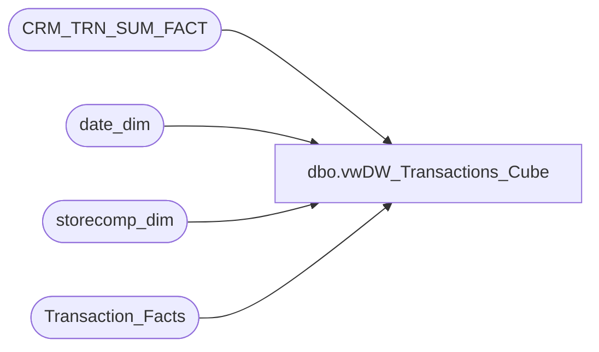

# dbo.vwDW_Transactions_Cube

**Database:** dw  
**Server:** papamart  

## Architecture Diagram



## Table Dependencies

| Referenced Table |
|---|
| CRM_TRN_SUM_FACT |
| date_dim |
| storecomp_dim |
| Transaction_Facts |

## View Code

```sql
CREATE VIEW [dbo].[vwDW_Transactions_Cube]
AS -- =============================================================================================================
-- Name: [dbo].[vwDW_Transactions_Cube]
--
-- Description: View underlying the SSAS Papa Mart Cube used on the dashboard.   
-- Aggregates POS transactions sales and product group metrics by store and date
--
--	NOTE: IF YOU CHANGE THIS, YOU WILL PROBABLY HAVE TO ALSO CHANGE spDW_Build_Transaction_Facts
--
-- Dependencies: 
--
-- Revision History
--		Name:				Date:			Comments:
--		Gary Murrish		2/14/2012		Complete remodel
-- =============================================================================================================

SELECT transaction_id
	 , tf.store_key
	 , tf.date_key
	 , time_key
	 , transaction_type_key
	 , currency_key
	 , party_flag
	 , GAAP_transaction_flag
	 , CASE
		   WHEN tycmp.recID IS NULL THEN
			   0
		   ELSE
			   1
	   END AS isComp
	 , CASE
		   WHEN nyCmp.recID IS NULL THEN
			   0
		   ELSE
			   1
	   END AS isCompNextYear
	 , line_count
	 , unit_net_amount
	 , unit_gross_amount
	 , unit_discount_amount
	 , animal_UGA
	 , animal_units
	 , non_animal_UGA
	 , non_animal_units
	 , footwear_UGA
	 , footwear_units
	 , accessories_UGA
	 , accessories_units
	 , sounds_UGA
	 , sounds_units
	 , clothing_UGA
	 , clothing_units
	 , other_UGA
	 , other_units
	 , GAAP_sales_amount
	 , net_sales_amount
	 , giftcard_discount_amount
	 , giftcard_UGA
	 , merchandise_UGA
	 , merchandise_units
	 , donations_UGA
	 , donations_units
	 , stuffing_supplies_UGA
	 , shipping_UGA
	 , shipping_units
	 , other_fees_UGA
	 , other_fees_units
	 , cub_cash_UGA
	 , party_deposit_UGA
	 , party_deposit_units
	 , reward_certificate_amount
	 , buy_stuff_amount
	 , tax_amount
	 , redemption_amount
	 , coupon_discount_amount
	 , total_discount_amount * -1 AS total_discount_amount
	 , sports_UGA
	 , sports_units
	 , prestuffed_UGA
	 , prestuffed_units
	 , ctsf.SFS_TRN_TYP_CD
	 , ctsf.MNTH_01_12_VST_CNT
	 , ctsf.MNTH_01_24_VST_CNT
	 , ctsf.MNTH_01_36_VST_CNT
	 , 1 AS calc
	 , CASE when tf.sounds_units > 0 THEN 1 ELSE 0 END as isSoundTrans
	 , tf.giftcard_units
	 , cast (0 AS DECIMAL(10,2)) AS giftcards_redeemed
	 , cast(0 AS DECIMAL(15,8)) AS franchisee_exchange_rate
	 , cast (0 AS DECIMAL(15,8)) AS franchisee_withholding_tax_rate
	 , cast (0 AS DECIMAL(10,2)) AS returns_UGA
--,*
FROM
	Transaction_Facts tf WITH (NOLOCK)
	INNER JOIN date_dim tday WITH (NOLOCK)
		ON tday.date_key = tf.date_key
	INNER JOIN date_dim nYR WITH (NOLOCK)
		ON tday.fiscal_year + 1 = nYR.fiscal_year AND tday.fiscal_week = nYR.fiscal_week AND tday.day_of_week = nYR.day_of_week
	LEFT JOIN storecomp_dim tyCmp WITH (NOLOCK)
		ON tyCmp.store_key = tf.store_key AND tf.date_key BETWEEN tyCmp.date_key_from AND tyCmp.date_key_thru
	LEFT JOIN storecomp_dim nyCmp WITH (NOLOCK)
		ON nyCmp.store_key = tf.store_key AND nYR.date_key BETWEEN nyCmp.date_key_from AND nyCmp.date_key_thru
	LEFT JOIN CRM_TRN_SUM_FACT ctsf WITH (NOLOCK)
		ON ctsf.TDF_TRN_ID = tf.transaction_id
```

