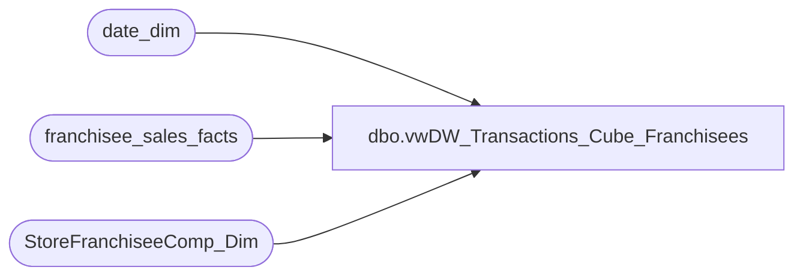

# dbo.vwDW_Transactions_Cube_Franchisees

**Database:** dw  
**Server:** papamart  

## Architecture Diagram



## Table Dependencies

| Referenced Table |
|---|
| date_dim |
| franchisee_sales_facts |
| StoreFranchiseeComp_Dim |

## View Code

```sql
CREATE VIEW [dbo].[vwDW_Transactions_Cube_Franchisees]
AS -- =============================================================================================================
-- Name: [dbo].[vwDW_Transactions_Cube_Franchisees]
--
-- Description: View underlying the SSAS Papa Mart Cube used on the dashboard for Franchisee Sales.   
-- Aggregates POS transactions sales and product group metrics by store and date
--
--	NOTE: IF YOU CHANGE THIS, YOU WILL PROBABLY HAVE TO ALSO CHANGE vwDW_Transactions_Cube
--
-- Dependencies: 
--
-- Revision History
--		Name:				Date:			Comments:
--		Gary Murrish		2/14/2012		Complete remodel
-- =============================================================================================================

SELECT  0 as transaction_id
			  , tf.franchisee_store_key as store_key
			  , tf.week_ending_date_key as date_key
			  , 0 as time_key
			  , 5 as transaction_type_key
			  , currency_key
			  , 0 as party_flag
			  , 1 as GAAP_transaction_flag
			  , CASE
					WHEN tycmp.recID IS NULL THEN
						0
					ELSE
						1
				END AS isComp
			  , CASE
					WHEN nyCmp.recID IS NULL THEN
						0
					ELSE
						1
				END AS isCompNextYear
			  , 1 as line_count
			  , 0 as unit_net_amount
			  , 0 as unit_gross_amount
			  , 0 as unit_discount_amount
			  , tf.unstuffed_sales as animal_UGA
			  , tf.unstuffed_units as animal_units
			  , 0 as non_animal_UGA
			  , 0 as non_animal_units
			  , tf.footware_sales as footwear_UGA
			  , tf.footware_units as footwear_units
			  , tf.accessories_sales as accessories_UGA
			  , tf.accessories_units as accessories_units
			  , tf.sound_sales as sounds_UGA
			  , tf.sound_units as sounds_units
			  , tf.clothes_sales as clothing_UGA
			  , tf.clothes_units as clothing_units
			  , 0 as other_UGA
			  , 0 as other_units
			  , tf.total_sales as GAAP_sales_amount
			  , tf.total_sales as net_sales_amount
			  , 0 as giftcard_discount_amount
			  , tf.gift_card_sales as giftcard_UGA
			  , tf.unstuffed_sales + tf.clothes_sales + tf.accessories_sales + tf.footware_sales + tf.sports_sales + tf.sound_sales + tf.prestuffed_sales as merchandise_UGA
			  , tf.unstuffed_units + tf.clothes_units + tf.accessories_units + tf.footware_units + tf.sports_units + tf.sound_units + tf.prestuffed_units as merchandise_units
			  , 0 as donations_UGA
			  , 0 as donations_units
			  , 0 as stuffing_supplies_UGA
			  , 0 as shipping_UGA
			  , 0 as shipping_units
			  , 0 as other_fees_UGA
			  , 0 as other_fees_units
			  , tf.giftcards_redeemed as cub_cash_UGA
			  , 0 as party_deposit_UGA
			  , 0 as party_deposit_units
			  , 0 as reward_certificate_amount
			  , 0 as buy_stuff_amount
			  , 0 as tax_amount
			  , 0 as redemption_amount
			  , 0 as coupon_discount_amount
			  , 0  AS total_discount_amount
			  , tf.sports_sales as sports_UGA
			  , tf.sports_units as sports_units
			  , tf.prestuffed_sales as prestuffed_UGA
			  , tf.prestuffed_units as prestuffed_units
			  , cast('0' as varchar(5)) as SFS_TRN_TYP_CD
			  , 0 as MNTH_01_12_VST_CNT
			  , 0 as MNTH_01_24_VST_CNT
			  , 0 as MNTH_01_36_VST_CNT
			  , 1 as calc
			  , CASE when tf.sound_units > 0 THEN 1 ELSE 0 END as isSoundTrans
			  , tf.gift_card_units AS giftcard_units
			  , tf.giftcards_redeemed
			  , tf.exchange_rate AS franchisee_exchange_rate
			  , tf.withholding_tax_rate AS franchisee_withholding_tax_rate
			  , tf.returns AS returns_UGA
--,*
FROM
	franchisee_sales_facts  tf WITH (NOLOCK)
	INNER JOIN date_dim tday WITH (NOLOCK)
		ON tday.date_key = tf.week_ending_date_key
	INNER JOIN date_dim nYR WITH (NOLOCK)
		ON tday.fiscal_year + 1 = nYR.fiscal_year AND tday.fiscal_week = nYR.fiscal_week AND tday.day_of_week = nYR.day_of_week
	LEFT JOIN StoreFranchiseeComp_Dim tyCmp WITH (NOLOCK)
		ON tyCmp.store_key = tf.franchisee_store_key AND tf.week_ending_date_key BETWEEN tyCmp.date_key_from AND tyCmp.date_key_thru
	LEFT JOIN StoreFranchiseeComp_Dim nyCmp WITH (NOLOCK)
		ON nyCmp.store_key = tf.franchisee_store_key AND nYR.date_key BETWEEN nyCmp.date_key_from AND nyCmp.date_key_thru
```

