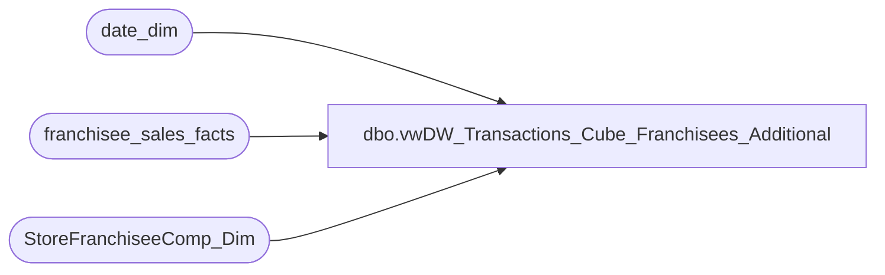

# dbo.vwDW_Transactions_Cube_Franchisees_Additional

**Database:** dw  
**Server:** papamart  

## Architecture Diagram



## Table Dependencies

| Referenced Table |
|---|
| date_dim |
| franchisee_sales_facts |
| StoreFranchiseeComp_Dim |

## View Code

```sql
CREATE VIEW [dbo].[vwDW_Transactions_Cube_Franchisees_Additional]
AS -- =============================================================================================================
-- Name: [dbo].[vwDW_Transactions_Cube_Franchisees_Additional]
--
-- Description: View underlying the SSAS Papa Mart Cube used on the dashboard 
--	for Franchisee Additional information.   
--
--
-- Dependencies: 
--
-- Revision History
--		Name:				Date:			Comments:
--		Kevin Shyr			1/8/2015		Change LY calculation to 52 weeks
--		Gary Murrish		2/14/2012		Complete remodel
-- =============================================================================================================

SELECT  0 as transaction_id
	, tf.franchisee_store_key as store_key
	, tf.week_ending_date_key as date_key
	, 0 as time_key
	, currency_key
	, CASE
		WHEN tycmp.recID IS NULL THEN 0
		ELSE 1
	END AS isComp
	, CASE
		WHEN nyCmp.recID IS NULL THEN 0
		ELSE 1
	END AS isCompNextYear
	, 1 as calc
	, tf.party_count AS Party_Count
	, tf.party_sales AS Party_Sales
	, tf.transaction_count - 1 AS Transaction_Count	-- There is already one for the record in Transactions
	, tf.coupons_and_discounts AS Coupons_And_Discounts
	, tf.returns AS Returns	
FROM
	franchisee_sales_facts  tf WITH (NOLOCK)
	INNER JOIN date_dim tday WITH (NOLOCK)
		ON tday.date_key = tf.week_ending_date_key
	INNER JOIN date_dim nYR WITH (NOLOCK)
		ON tday.week_id + 52 = nYR.week_id
			AND tday.day_of_week = nYR.day_of_week
	LEFT JOIN StoreFranchiseeComp_Dim tyCmp WITH (NOLOCK)
		ON tyCmp.store_key = tf.franchisee_store_key 
			AND tf.week_ending_date_key BETWEEN tyCmp.date_key_from AND tyCmp.date_key_thru
	LEFT JOIN StoreFranchiseeComp_Dim nyCmp WITH (NOLOCK)
		ON nyCmp.store_key = tf.franchisee_store_key 
			AND nYR.date_key BETWEEN nyCmp.date_key_from AND nyCmp.date_key_thru
```

