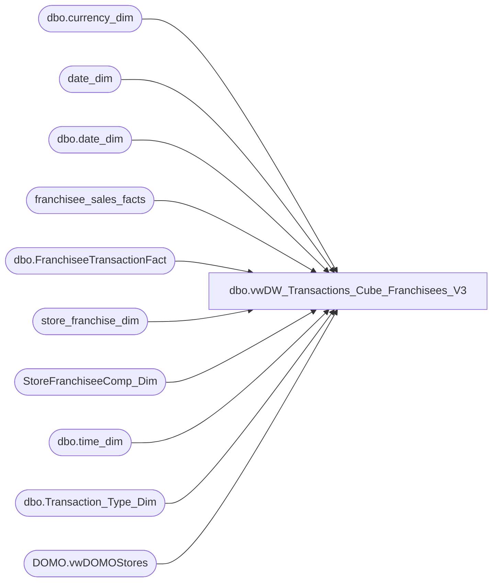

# dbo.vwDW_Transactions_Cube_Franchisees_V3

**Database:** dw  
**Server:** papamart  

## Architecture Diagram



## Table Dependencies

| Referenced Table |
|---|
| dbo.currency_dim |
| date_dim |
| dbo.date_dim |
| franchisee_sales_facts |
| dbo.FranchiseeTransactionFact |
| store_franchise_dim |
| StoreFranchiseeComp_Dim |
| dbo.time_dim |
| dbo.Transaction_Type_Dim |
| DOMO.vwDOMOStores |

## View Code

```sql
CREATE VIEW [dbo].[vwDW_Transactions_Cube_Franchisees_V3]
AS -- =============================================================================================================
-- Name: [dbo].[vwDW_Transactions_Cube_Franchisees_V3]
--
-- Description: View underlying the SSAS Papa Mart Cube used on the dashboard for Franchisee Sales.   
-- Aggregates POS transactions sales and product group metrics by store and date
--
--	NOTE: IF YOU CHANGE THIS, YOU WILL PROBABLY HAVE TO ALSO CHANGE vwDW_Transactions_Cube
--
-- Dependencies: 
--
-- Revision History
--		Name:				Date:			Comments:
--		Kevin Shyr			2/9/2015		Added Scent
--		Kevin Shyr			1/8/2015		Change LY calcuation to 52 weeks
--		Gary Murrish		5/8/2014		Added Cost fields for Corporate
--		Gary Murrish		7/9/2013		Added fields that are used for Corporate Sales.
--		Gary Murrish		6/5/2012		Added Counter for num of Transactions with Discounts (Always 0)
--		Gary Murrish		5/24/2012		Added ShopperTrak Flag (Always 0)
--		Gary Murrish		2/14/2012		Complete remodel
--		Dan Tweedie			06/09/2016		Added new columns related to new Enterprise Selling transactions handling (these don't affect Franchisees, but we need the columns in the view)
--												Store_transaction_flag,
--												Store_Sales_Amount,
--												Store_units,
--												numStoreTransWithDiscount,
--												Financial_Store_Sales_Amount
--		Dan Tweedie			06/22/2016		Added hasTraffic
--		Dan Tweedie			08/10/2016		Added ES columns (franchisees don't use, but we need for the cube)
--		Dan Tweedie			10/04/2016		Added [TransactionEligibleForLoyaltyCapture]
--		Tim Bytnar			12/14/2017		Appending the DOMO data for franchiees after specific dates - China is the first
--      John Eck            1/19/2018       Added DM Transactions column
--		Kelly Farrar		4/24/2019		Added Has Phone Number Flag to view
--		Dan Tweedie			2019-05-29		Added 'Tablez and Toys Pvt Ltd' (India) to be pulled from FranchiseeTransactionFact
--		Dan Tweedie		2020-1-11			Added PickupFromStore,ShipFromStore,Curbside,SameDayShipt measures
-- =============================================================================================================


SELECT
	CAST(0 as varchar(32)) AS transaction_id,
	tf.franchisee_store_key AS store_key,
	tf.week_ending_date_key AS date_key,
	0 AS time_key,
	5 AS transaction_type_key,
	currency_key,
	0 AS party_flag,
	1 AS GAAP_transaction_flag,
	CASE
		WHEN tyCmp.recID IS NULL THEN 0
		ELSE 1
	END AS isComp,
	CASE
		WHEN nyCmp.recID IS NULL THEN 0
		ELSE 1
	END AS isCompNextYear,
	1 AS line_count,
	0 AS unit_net_amount,
	0 AS unit_gross_amount,
	0 AS unit_discount_amount,
	tf.unstuffed_sales AS animal_UGA,
	tf.unstuffed_units AS animal_units,
	0 AS non_animal_UGA,
	0 AS non_animal_units,
	tf.footware_sales AS footwear_UGA,
	tf.footware_units AS footwear_units,
	tf.accessories_sales AS accessories_UGA,
	tf.accessories_units AS accessories_units,
	tf.sound_sales AS sounds_UGA,
	tf.sound_units AS sounds_units,
	0 AS Scents_UGA,
	0 AS Scents_units,
	tf.clothes_sales AS clothing_UGA,
	tf.clothes_units AS clothing_units,
	0 AS other_UGA,
	0 AS other_units,
	tf.total_sales AS GAAP_sales_amount,
	tf.total_sales AS net_sales_amount,
	0 AS giftcard_discount_amount,
	tf.gift_card_sales AS giftcard_UGA,
	tf.unstuffed_sales + tf.clothes_sales + tf.accessories_sales + tf.footware_sales + tf.sports_sales + tf.sound_sales + tf.prestuffed_sales AS merchandise_UGA,
	tf.unstuffed_units + tf.clothes_units + tf.accessories_units + tf.footware_units + tf.sports_units + tf.sound_units + tf.prestuffed_units AS merchandise_units,
	0 AS donations_UGA,
	0 AS donations_units,
	0 AS stuffing_supplies_UGA,
	0 AS shipping_UGA,
	0 AS shipping_units,
	0 AS other_fees_UGA,
	0 AS other_fees_units,
	tf.giftcards_redeemed AS cub_cash_UGA,
	0 AS party_deposit_UGA,
	0 AS party_deposit_units,
	0 AS reward_certificate_amount,
	0 AS buy_stuff_amount,
	0 AS tax_amount,
	0 AS redemption_amount,
	0 AS coupon_discount_amount,
	0 AS total_discount_amount,
	tf.sports_sales AS sports_UGA,
	tf.sports_units AS sports_units,
	tf.prestuffed_sales AS prestuffed_UGA,
	tf.prestuffed_units AS prestuffed_units,
	CAST('0' AS varchar(5)) AS SFS_TRN_TYP_CD,
	0 AS MNTH_01_12_VST_CNT,
	0 AS MNTH_01_24_VST_CNT,
	0 AS MNTH_01_36_VST_CNT,
	1 AS calc,
	CASE
		WHEN tf.sound_units > 0 THEN 1
		ELSE 0
	END AS isSoundTrans,
	tf.gift_card_units AS giftcard_units,
	tf.giftcards_redeemed,
	tf.exchange_rate AS franchisee_exchange_rate,
	tf.withholding_tax_rate AS franchisee_withholding_tax_rate,
	tf.returns AS returns_UGA,
	CAST(0 AS smallint) AS isShopperTrak,
	CAST(0 AS smallint) AS numGAAPTransWithDiscount,
	CAST(0 AS integer) AS isSTComp,
	CAST(0 AS integer) AS isSTCompNextYear,
	CAST(tf.total_sales AS money) AS Financial_GAAP_Sales_Amount,
	CAST(0 AS money) AS upsell_discount_amount,
	CAST(0 AS bit) AS isSOTF,
		CAST(0 AS money) as Merchandise_Cost,
	CAST(0 AS money) as Animal_Cost,
	CAST(0 AS money) as Non_Animal_Cost,
	CAST(0 AS money) as Footwear_Cost,
	CAST(0 AS money) AS Accessories_Cost,
	CAST(0 AS money) AS Sounds_Cost,
	CAST(0 AS money) AS Scents_Cost,
	CAST(0 AS money) as Clothing_Cost,
	CAST(0 AS money) as Other_Cost,
	CAST(0 AS money) as Sports_Cost,
	CAST(0 AS money) as Prestuffed_Cost,
	1 AS Store_transaction_flag, --same as gaap_transaction_flag
	tf.total_sales AS Store_Sales_Amount, --same as GAAP_sales_amount
	tf.unstuffed_units + tf.clothes_units + tf.accessories_units + tf.footware_units + tf.sports_units + tf.sound_units + tf.prestuffed_units as Store_units, --same as merchandise_units
	CAST(0 AS smallint) AS numStoreTransWithDiscount, --same as numGAAPTransWithDiscount
	CAST(tf.total_sales AS money) AS Financial_Store_Sales_Amount, -- same as Financial_GAAP_Sales_Amount
	1 as hasTraffic,
	0 as Enterprise_Selling_Amount,
	0 as Enterprise_Selling_Transaction_Count,
	0 as Enterprise_Selling_Units,
	tf.unstuffed_units 
		+ tf.clothes_units 
		+ tf.accessories_units 
		+ tf.footware_units 
		+ tf.sports_units 
		+ tf.sound_units 
		+ tf.prestuffed_units 
		as Gaap_Units,
	
	0 as Enterprise_Selling_Only_Transaction_Count,
	0 as Enterprise_Selling_Only_Amount,
	0 as Enterprise_Selling_Only_Units,
	0 as GiftCard_Only_Flag,
	0 as [TransactionEligibleForLoyaltyCapture],
	0 as party_master,
	0 as DM_Transactions,
	0 as HasPhoneNumber,
	0 as isShipFromStore,
	0 as isPickUpFromStore,
	0 as isCurbside,
	0 as isSameDayShipt,
	0 as ShipFromStoreAmount,
	0 as ShipFromStoreUnits,
	0 as FinancialShipFromStoreAmount,
	0 as PickupFromStoreAmount,
	0 as PickupFromStoreUnits,
	0 as FinancialPickupFromStoreAmount,
	0 as CurbsideAmount,
	0 as CurbsideUnits,
	0 as FinancialCurbsideAmount,
	0 as SameDayShiptAmount,
	0 as SameDayShiptUnits,
	0 as FinancialSameDayShiptAmount,
	0 AS numShipFromStoreTransWithDiscount,
	0 AS numPickupFromStoreTransWithDiscount,
	0 AS numCurbsideTransWithDiscount,
	0 AS numSameDayShiptTransWithDiscount

--,*
FROM
	franchisee_sales_facts tf WITH (NOLOCK)
	INNER JOIN date_dim tday WITH (NOLOCK)
		ON tday.date_key = tf.week_ending_date_key
	INNER JOIN date_dim nYR WITH (NOLOCK)
		ON tday.week_id + 52 = nYR.week_id
		--tday.fiscal_year + 1 = nYR.fiscal_year
		--AND tday.fiscal_week = nYR.fiscal_week
		AND tday.day_of_week = nYR.day_of_week
	LEFT JOIN StoreFranchiseeComp_Dim tyCmp WITH (NOLOCK)
		ON tyCmp.store_key = tf.franchisee_store_key
		AND tf.week_ending_date_key BETWEEN tyCmp.date_key_from AND tyCmp.date_key_thru
	LEFT JOIN StoreFranchiseeComp_Dim nyCmp WITH (NOLOCK)
		ON nyCmp.store_key = tf.franchisee_store_key
		AND nYR.date_key BETWEEN nyCmp.date_key_from AND nyCmp.date_key_thru
WHERE NOT (tf.franchisee_store_key IN (SELECT store_key FROM store_franchise_dim WHERE BearRange = 'Harry''s Kitchen Brand Limited')) -- China never used the scorecard system
	  AND NOT (tf.franchisee_store_key IN (SELECT store_key FROM store_franchise_dim WHERE BearRange = 'INTENCITY ENTERTAINMENT (PTY) LTD') AND tf.week_ending_date_key > 7666) -- South Africas Start date is 12/31/2017
	  AND NOT (tf.franchisee_store_key IN (SELECT store_key FROM store_franchise_dim WHERE BearRange = 'CP Retail Concepts PTE LTD') AND tf.week_ending_date_key > 7666) --Singapores Start Date is 12/31/2017
	  AND NOT (tf.franchisee_store_key IN (SELECT store_key FROM store_franchise_dim WHERE BearRange = 'BABW-AU') AND tf.week_ending_date_key > 7666) --Australias Start Date is 12/31/2017
	  AND NOT (tf.franchisee_store_key IN (SELECT store_key FROM store_franchise_dim WHERE BearRange = 'Tablez and Toys Pvt Ltd'))
UNION ALL 

SELECT ftf.[transaction_id] AS transaction_id
      ,ds.StoreKey AS store_key
	  ,we.date_key as date_key   -- Weekending Date of Saturday
	  ,ftf.time_key
      ,ftf.transaction_type_key
	  ,ftf.currency_key
	  ,ftf.party_flag
	  ,ftf.[GAAP_transaction_flag] AS GAAP_transaction_flag
	  ,CASE
			WHEN tyCmp.recID IS NULL THEN 0
			ELSE 1
		END AS isComp,
		CASE
			WHEN nyCmp.recID IS NULL THEN 0
			ELSE 1
		END AS isCompNextYear
	  ,ftf.line_count
	  ,ftf.[unit_net_amount]
	  ,ftf.[unit_gross_amount]
	  ,ftf.[unit_discount_amount] AS unit_discount_amount
	  ,ftf.animal_UGA
	  ,ftf.animal_units
	  ,ftf.non_animal_UGA
	  ,ftf.non_animal_units
	  ,ftf.footwear_UGA
	  ,ftf.footwear_units
	  ,ftf.accessories_UGA
	  ,ftf.accessories_units
	  ,ftf.sounds_UGA
	  ,ftf.sounds_units
	  ,ftf.Scents_UGA
	  ,ftf.Scents_units
	  ,ftf.clothing_UGA
	  ,ftf.clothing_units
	  ,ftf.other_UGA
	  ,ftf.other_units
	  ,ftf.GAAP_sales_amount
	  ,ftf.net_sales_amount
	  ,ftf.giftcard_discount_amount
	  ,ftf.giftcard_UGA
	  ,ftf.merchandise_UGA
	  ,ftf.merchandise_units
	  ,ftf.donations_UGA
	  ,ftf.donations_units
	  ,ftf.stuffing_supplies_UGA
	  ,ftf.shipping_UGA
	  ,ftf.shipping_units
	  ,ftf.other_fees_UGA
	  ,ftf.other_fees_units
	  ,ftf.cub_cash_UGA
	  ,ftf.party_deposit_UGA
	  ,ftf.party_deposit_units
	  ,ftf.reward_certificate_amount
	  ,ftf.buy_stuff_amount
	  ,ftf.tax_amount
	  ,ftf.redemption_amount
	  ,ftf.coupon_discount_amount
	  ,ftf.total_discount_amount
	  ,ftf.sports_UGA
	  ,ftf.sports_units
	  ,ftf.prestuffed_UGA
	  ,ftf.prestuffed_units
	  ,CAST('0' AS varchar(5)) AS SFS_TRN_TYP_CD
	  ,0 AS MNTH_01_12_VST_CNT
	  ,0 AS MNTH_01_24_VST_CNT
	  ,0 AS MNTH_01_36_VST_CNT
	  ,1 AS calc
      ,CASE
		   WHEN ftf.sounds_units > 0 THEN 1
		   ELSE 0
	   END AS isSoundTrans
	  ,ftf.giftcard_units
	  ,ftf.giftcard_UGA as giftcards_redeemed
	  ,0 AS franchisee_exchange_rate 						 ---- Is in the cube view but not in the domo view
	  ,0 AS franchisee_withholding_tax_rate 					 ---- Is in the cube view but not in the domo view
	  ,0 AS returns_UGA 										 ---- Is in the cube view but not in the domo view
	  ,CAST(0 AS smallint) AS isShopperTrak
	  ,CAST(0 AS smallint) AS numGAAPTransWithDiscount
	  ,CAST(0 AS integer) AS isSTComp
	  ,CAST(0 AS integer) AS isSTCompNextYear
	  ,CAST(ftf.Store_Sales_Amount AS money) AS Financial_GAAP_Sales_Amount
	  ,ftf.upsell_discount_amount
	  ,CAST(0 AS bit) AS isSOTF
      ,ftf.merchandise_cost as Merchandise_Cost
	  ,ftf.animal_cost as Animal_Cost
	  ,ftf.non_animal_cost as Non_Animal_Cost
	  ,ftf.footwear_cost as Footwear_Cost
	  ,ftf.accessories_cost as Accessories_Cost
	  ,ftf.sounds_cost as Sounds_Cost
	  ,ftf.scents_cost as Scents_Cost
	  ,ftf.clothing_cost as Clothing_Cost
	  ,ftf.other_cost as Other_Cost
	  ,ftf.sports_cost as Sports_Cost
	  ,ftf.prestuffed_cost as Prestuffed_Cost
	  ,ftf.Store_transaction_flag as Store_transaction_flag
	  ,ftf.Store_Sales_Amount
	  ,ftf.Store_units
	  ,CAST(0 AS smallint) AS numStoreTransWithDiscount --same as numGAAPTransWithDiscount
	  ,CAST(ftf.Store_Sales_Amount AS money) AS Financial_Store_Sales_Amount -- same as Financial_GAAP_Sales_Amount
	  ,1 as hasTraffic
	  ,ftf.Enterprise_Selling_Amount
	  ,0 as Enterprise_Selling_Transaction_Count
	  ,ftf.Enterprise_Selling_Units
	  ,ftf.Gaap_Units
	  ,0 as Enterprise_Selling_Only_Transaction_Count
	  ,0 as Enterprise_Selling_Only_Amount
	  ,0 as Enterprise_Selling_Only_Units
	  ,ftf.GiftCard_Only_Flag
	  ,0 as [TransactionEligibleForLoyaltyCapture]
	  ,0 as party_master
	  ,0 as DM_Transactions
	  ,0 as HasPhoneNumber,
	  0 as isShipFromStore,
	0 as isPickUpFromStore,
	0 as isCurbside,
	0 as isSameDayShipt,
	0 as ShipFromStoreAmount,
	0 as ShipFromStoreUnits,
	0 as FinancialShipFromStoreAmount,
	0 as PickupFromStoreAmount,
	0 as PickupFromStoreUnits,
	0 as FinancialPickupFromStoreAmount,
	0 as CurbsideAmount,
	0 as CurbsideUnits,
	0 as FinancialCurbsideAmount,
	0 as SameDayShiptAmount,
	0 as SameDayShiptUnits,
	0 as FinancialSameDayShiptAmount,
	0 AS numShipFromStoreTransWithDiscount,
	0 AS numPickupFromStoreTransWithDiscount,
	0 AS numCurbsideTransWithDiscount,
	0 AS numSameDayShiptTransWithDiscount

  FROM [dw].[dbo].[FranchiseeTransactionFact] ftf WITH(NOLOCK) INNER JOIN
	    [dw].[DOMO].[vwDOMOStores] ds WITH(NOLOCK)
			ON ds.StoreKey=CONVERT(VARCHAR,ftf.store_key) INNER JOIN
		[dw].[dbo].[date_dim] dd WITH(NOLOCK)
			ON ftf.date_key = dd.date_key  
		LEFT JOIN [dw].[dbo].[date_dim] we
			ON DATEADD(day, (6 + 8 - DATEPART(dw, dd.actual_date) - @@DATEFIRST ) % 7, dd.actual_date) = we.actual_date
		INNER JOIN [dw].[dbo].[time_dim] td WITH(NOLOCK)
			ON td.time_key = ftf.time_key INNER JOIN
		[dw].[dbo].[Transaction_Type_Dim] ttd WITH(NOLOCK)
			ON ttd.transaction_key = ftf.transaction_type_key INNER JOIN
		[dw].[dbo].[currency_dim] cd WITH(NOLOCK)
			ON cd.currency_key=ftf.currency_key
		LEFT JOIN StoreFranchiseeComp_Dim tyCmp WITH (NOLOCK)
			ON tyCmp.store_key = ftf.store_key
			AND ftf.date_key BETWEEN tyCmp.date_key_from AND tyCmp.date_key_thru
		INNER JOIN date_dim tday WITH (NOLOCK)
			ON tday.date_key = ftf.date_key
		INNER JOIN date_dim nYR WITH (NOLOCK)
			ON tday.week_id + 52 = nYR.week_id
			--tday.fiscal_year + 1 = nYR.fiscal_year
			--AND tday.fiscal_week = nYR.fiscal_week
			AND tday.day_of_week = nYR.day_of_week
		LEFT JOIN StoreFranchiseeComp_Dim nyCmp WITH (NOLOCK)
			ON nyCmp.store_key = ftf.store_key
			AND nYR.date_key BETWEEN nyCmp.date_key_from AND nyCmp.date_key_thru

WHERE 1=1
AND dd.actual_date>=DATEADD(year, -2, DATEADD(yy, DATEDIFF(yy, 0, GETDATE()), 0))
AND dd.actual_date<CONVERT(DATE,GETDATE())
AND (
		   (ftf.store_key IN (SELECT store_key FROM store_franchise_dim WHERE BearRange = 'Harry''s Kitchen Brand Limited')) -- China never used the scorecard system
		OR (ftf.store_key IN (SELECT store_key FROM store_franchise_dim WHERE BearRange = 'INTENCITY ENTERTAINMENT (PTY) LTD') AND we.date_key >= 7666)  --South Africa's start date is: 
		OR (ftf.store_key IN (SELECT store_key FROM store_franchise_dim WHERE BearRange = 'CP Retail Concepts PTE LTD') AND we.date_key >= 7666) 
		OR (ftf.store_key IN (SELECT store_key FROM store_franchise_dim WHERE BearRange = 'BABW-AU') AND we.date_key >= 7666) 
		OR (ftf.store_key IN (select store_key from store_franchise_dim where BearRange = 'Tablez and Toys Pvt Ltd')) --India
		OR (ftf.store_key in (select store_key from store_franchise_dim where BearRange = 'Ansaldo S.A.')) --Chile
		OR (ftf.store_key in (select store_key from store_franchise_dim where BearRange = 'BAB GULF FZE')) --Gulf States
	)
```

