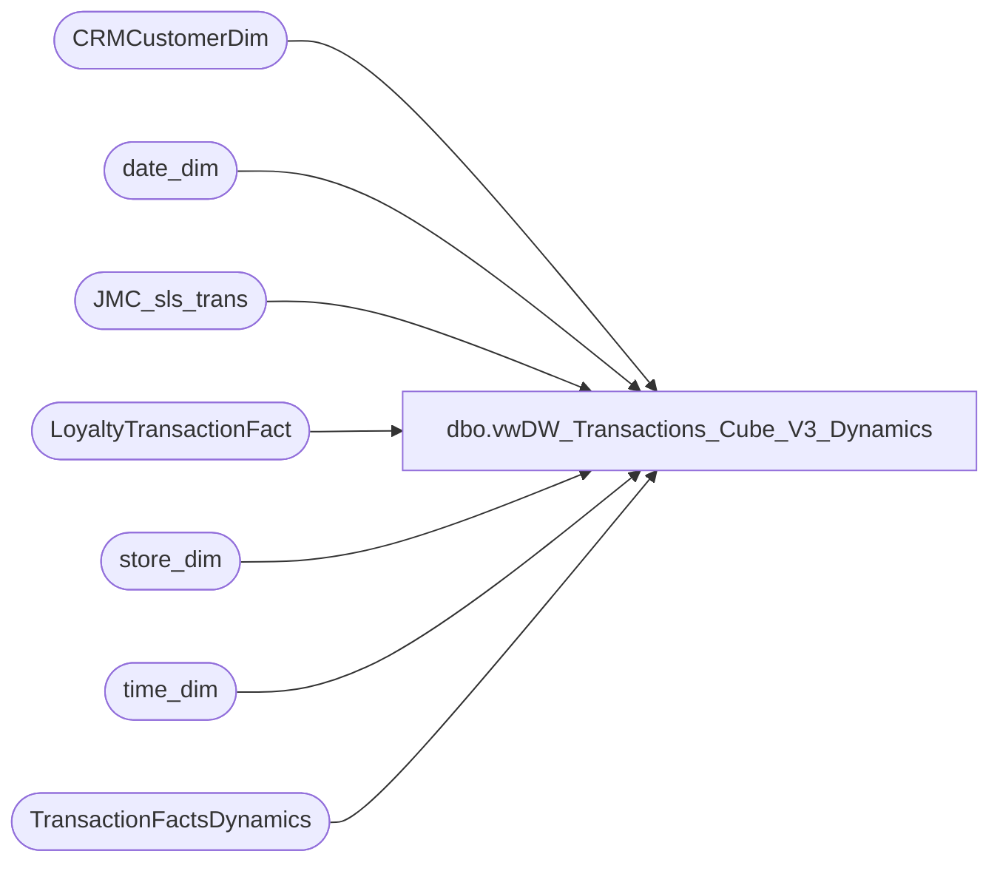

# dbo.vwDW_Transactions_Cube_V3_Dynamics

**Database:** dw  
**Server:** papamart  

## Architecture Diagram



## Table Dependencies

| Referenced Table |
|---|
| CRMCustomerDim |
| date_dim |
| JMC_sls_trans |
| LoyaltyTransactionFact |
| store_dim |
| time_dim |
| TransactionFactsDynamics |

## View Code

```sql
create VIEW [dbo].[vwDW_Transactions_Cube_V3_Dynamics]

---
--used for subHourly sales push to storeforce, using new transaction fact tables used for data push to Dynamics, which are running every 15 min -- and sales are pushed from store to sa every 15 min
--
AS

with
JumpMindStores as
	(
		select 
			case 
					when left(business_unit_id,1)='2 '
						then business_unit_id
					else cast(right((cast('0000' as varchar) + cast(right(business_unit_id,3) as varchar)),4) as int)
			end as StoreID
		from dw..JMC_sls_trans with (nolock)
		group by 
			case 
					when left(business_unit_id,1)='2 '
						then business_unit_id
					else cast(right((cast('0000' as varchar) + cast(right(business_unit_id,3) as varchar)),4) as int)
			end
		having max(cast(business_date as date)) >'2023-04-15'--- first jump mind store went live around 4/10
	)
SELECT 
	transaction_id,
	tf.store_key,
	tf.date_key,
	tf.TIME_KEY,
	transaction_type_key,
	currency_key,
	Party_Flag,
	GAAP_transaction_flag,
	--CAST(ISNULL(cmp.isCompTY, 0) AS integer) AS isComp,
	--CAST(ISNULL(cmp.isCompNY, 0) AS integer) AS isCompNextYear,
	line_count,
	unit_net_amount,
	unit_gross_amount,
	unit_discount_amount,
	animal_UGA,
	animal_units,
	non_animal_UGA,
	non_animal_units,
	Footwear_UGA,
	footwear_units,
	accessories_UGA,
	accessories_units,
	sounds_UGA,
	sounds_units,
	Scents_UGA,
	Scents_units,
	Clothing_UGA,
	clothing_units,
	Other_UGA,
	other_units,
	GAAP_sales_amount,
	net_sales_amount,
	giftcard_discount_amount,
	giftcard_UGA,
	Merchandise_UGA,
	merchandise_units,
	Donations_UGA,
	donations_units,
	stuffing_supplies_UGA,
	Shipping_UGA,
	shipping_units,
	Other_Fees_UGA,
	other_fees_units,
	Cub_Cash_UGA,
	Party_Deposit_UGA,
	party_deposit_units,
	reward_certificate_amount * -1 as reward_certificate_amount,
	buy_stuff_amount,
	tax_amount,
	redemption_amount,
	coupon_discount_amount * -1 AS coupon_discount_amount,
	total_discount_amount * -1 AS total_discount_amount,
	sports_UGA,
	sports_units,
	Prestuffed_UGA,
	prestuffed_units,
	--ctsf.SFS_TRN_TYP_CD,
	cast(case 
		when v.LoyaltyTransactionType = 'NEW' then 1
		when v.LoyaltyTransactionType = 'Repeat' then 2
		when v.LoyaltyTransactionType is NULL then 0
		else 0
	end as int) as SFS_TRN_TYP_CD,

	--v.MNTH_01_12_VST_CNT,
	--v.MNTH_01_24_VST_CNT,
	--v.MNTH_01_36_VST_CNT,
	1 AS calc,
	CASE
		WHEN tf.sounds_units > 0 THEN 1
		ELSE 0
	END AS isSoundTrans,
	tf.giftcard_units,
	CAST(0 AS decimal(10, 2)) AS giftcards_redeemed,
	CAST(0 AS decimal(15, 8)) AS franchisee_exchange_rate,
	CAST(0 AS decimal(15, 8)) AS franchisee_withholding_tax_rate,
	CAST(0 AS decimal(10, 2)) AS returns_UGA,
	--CAST(CASE
	--	WHEN cmp.isShopperTrak IS NULL THEN 0
	--	WHEN cmp.isShopperTrak = 1 
	--	--AND td.hour BETWEEN cmp.ShopperTrakStartHour AND cmp.ShopperTrakEndHour 
	--		THEN 1
	--	ELSE 0
	--END AS smallint) AS isShopperTrak,
	CAST(CASE
		WHEN tf.unit_discount_amount <> 0 THEN tf.GAAP_transaction_flag
		ELSE 0
	END AS smallint) AS numGAAPTransWithDiscount,
	--CAST(CASE
	--	WHEN cmp.isShopperTrakCompTY IS NULL THEN 0
	--	WHEN cmp.isShopperTrakCompTY = 1 
	--	--AND td.hour BETWEEN cmp.ShopperTrakStartHour AND cmp.ShopperTrakEndHour 
	--		THEN 1
	--	ELSE 0
	--END AS integer) AS isSTComp,
	--CAST(CASE
	--	WHEN cmp.isShopperTrakCompNY IS NULL THEN 0
	--	WHEN cmp.isShopperTrakCompNY = 1 
	--	--AND td.hour BETWEEN cmp.ShopperTrakStartHour AND cmp.ShopperTrakEndHour 
	--		THEN 1
	--	ELSE 0
	--END AS integer) AS isSTCompNextYear,
	--CAST(ISNULL(cmp.isSOTF, 0) AS integer) AS isSOTF,
	tf.fin_GAAP_sales_amount AS Financial_GAAP_Sales_Amount,
	tf.Upsell_Discount_Amount * -1 AS Upsell_Discount_Amount,
	tf.merchandise_cost as Merchandise_Cost,
	tf.animal_cost as Animal_Cost,
	tf.non_animal_cost as Non_Animal_Cost,
	tf.footwear_cost as Footwear_Cost,
	tf.accessories_cost AS Accessories_Cost,
	tf.sounds_cost AS Sounds_Cost,
	tf.Scents_cost AS Scents_Cost,
	tf.clothing_cost as Clothing_Cost,
	tf.other_cost as Other_Cost,
	tf.sports_cost as Sports_Cost,
	tf.prestuffed_cost as Prestuffed_Cost,
	Store_transaction_flag,
	Store_Sales_Amount,
	Store_units,
	CAST(CASE
		WHEN tf.unit_discount_amount <> 0 THEN tf.Store_transaction_flag
		ELSE 0
	END AS smallint) AS numStoreTransWithDiscount,
	tf.fin_Store_sales_amount as Financial_Store_Sales_Amount,
	--isnull(ht.hasTraffic, 0) as hasTraffic,
	
	tf.Enterprise_Selling_Amount,

	CAST(CASE
		WHEN
			tf.Enterprise_selling_units <> 0
				then 1
				else 0
		end as smallint) as Enterprise_Selling_Transaction_Count,
	
	tf.Enterprise_Selling_Units,
	tf.Gaap_Units,
	
	tf.Enterprise_Selling_only_flag as Enterprise_Selling_Only_Transaction_Count,

	CASE
		WHEN tf.enterprise_selling_only_flag = 1
			then tf.Enterprise_selling_amount
			else 0
		end as Enterprise_Selling_Only_Amount,
		
	CAST(CASE
		WHEN tf.enterprise_selling_only_flag = 1
			then tf.Enterprise_selling_units
			else 0
		end as smallint) as Enterprise_Selling_Only_Units,
	isnull(tf.giftcard_only_flag, 0) as GiftCard_Only_Flag,
	case when isnull(tf.giftcard_only_flag, 0) = 1 or tf.Store_transaction_flag =1 
		then 1
		else 0
	end as [TransactionEligibleForLoyaltyCapture],
	ISNULL(tf.party_master,0) as party_master,
	--Case ISNULL(Mail_stat_cd,'None') when 'OPT-IN' then 1 else 0 end as DM_Transactions
	isnull(cd.DirectMailOptIn,0) as DM_Transactions,
	isnull(cd.HasPhoneNumber, 0) as HasPhoneNumber,
	isnull(tf.isShipFromStore,0) as isShipFromStore,
	isnull(tf.isPickupFromStore,0) as isPickUpFromStore,
	isnull(tf.isCurbside,0) as isCurbside,
	isnull(tf.isSameDayShipt,0) as isSameDayShipt,
	case 
		when isnull(tf.isShipFromStore,0) = 1 
		then Store_Sales_Amount
		else 0
	end as ShipFromStoreAmount,
	case 
		when isnull(tf.isShipFromStore,0) = 1 
		then tf.Store_units 
		else 0 
	end as ShipFromStoreUnits,
	
	case 
		when isnull(tf.isShipFromStore,0) = 1 
		then tf.fin_Store_sales_amount 
		else 0
	end as FinancialShipFromStoreAmount,
	case 
		when isnull(tf.isPickupFromStore,0) = 1 
		then Store_Sales_Amount
		else 0
	end as PickupFromStoreAmount,
	case 
		when isnull(tf.isPickupFromStore,0) = 1 
		then tf.Store_units 
		else 0 
	end as PickupFromStoreUnits,
	case 
		when isnull(tf.isPickupFromStore,0) = 1 
		then tf.fin_Store_sales_amount 
		else 0
	end as FinancialPickupFromStoreAmount,

	case 
		when isnull(tf.isCurbside,0) = 1 
		then Store_Sales_Amount
		else 0
	end as CurbsideAmount,
	case 
		when isnull(tf.isCurbside,0) = 1 
		then tf.Store_units 
		else 0 
	end as CurbsideUnits,
	case 
		when isnull(tf.isCurbside,0) = 1 
		then tf.fin_Store_sales_amount 
		else 0
	end as FinancialCurbsideAmount,
	case 
		when isnull(tf.isSameDayShipt,0) = 1 
		then Store_Sales_Amount
		else 0
	end as SameDayShiptAmount,
	case 
		when isnull(tf.isSameDayShipt,0) = 1 
		then tf.Store_units 
		else 0 
	end as SameDayShiptUnits,
	case 
		when isnull(tf.isSameDayShipt,0) = 1 
		then tf.fin_Store_sales_amount 
		else 0
	end as FinancialSameDayShiptAmount,

	CAST(CASE
		WHEN tf.unit_discount_amount <> 0 THEN tf.isShipFromStore
		ELSE 0
	END AS smallint) AS numShipFromStoreTransWithDiscount,
	CAST(CASE
		WHEN tf.unit_discount_amount <> 0 THEN tf.isPickupFromStore
		ELSE 0
	END AS smallint) AS numPickupFromStoreTransWithDiscount,

	CAST(CASE
		WHEN tf.unit_discount_amount <> 0 THEN tf.isCurbside
		ELSE 0
	END AS smallint) AS numCurbsideTransWithDiscount,
	CAST(CASE
		WHEN tf.unit_discount_amount <> 0 THEN tf.isSameDayShipt
		ELSE 0
	END AS smallint) AS numSameDayShiptTransWithDiscount
FROM
	TransactionFactsDynamics tf WITH (NOLOCK)
	join date_dim dd on tf.date_key=dd.date_key and dd.date_key>=9597 --'2023-04-15' --first week of jump mind for first store
	join store_dim sd on tf.store_key=sd.store_key
	join JumpMindStores jms on sd.store_id=jms.StoreID
	--LEFT JOIN StoreCompDetail_Dim cmp WITH (NOLOCK)
	--	ON cmp.store_key = tf.store_key
	--	AND cmp.date_key = tf.date_key
	INNER JOIN time_dim td WITH (NOLOCK)
		ON tf.TIME_KEY = td.TIME_KEY
	--LEFT OUTER JOIN has_traffic ht 
	--	ON tf.store_key = ht.store_key
	--	AND tf.date_key = ht.date_key
	LEFT JOIN LoyaltyTransactionFact v with (nolock) on tf.transaction_id = v.TransactionID
	left join CRMCustomerDim cd with (nolock) on v.CustomerNumber = cd.CustomerNumber
```

