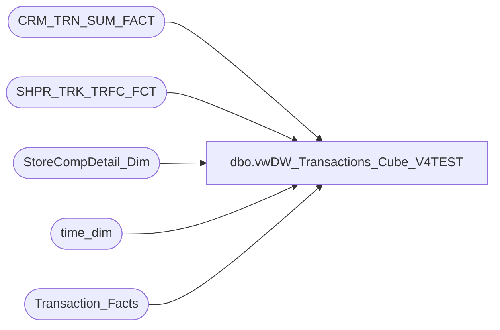

# dbo.vwDW_Transactions_Cube_V4TEST

**Database:** dw  
**Server:** papamart  

## Architecture Diagram



## Table Dependencies

| Referenced Table |
|---|
| CRM_TRN_SUM_FACT |
| SHPR_TRK_TRFC_FCT |
| StoreCompDetail_Dim |
| time_dim |
| Transaction_Facts |

## View Code

```sql
create VIEW [dbo].[vwDW_Transactions_Cube_V4TEST]
AS
-- =============================================================================================================
-- Name: [dbo].[vwDW_Transactions_Cube_V3]
--
-- Description: View underlying the SSAS Papa Mart Cube used on the dashboard.   
-- Aggregates POS transactions sales and product group metrics by store and date
--
--	NOTE: IF YOU CHANGE THIS, YOU WILL PROBABLY HAVE TO ALSO CHANGE spDW_Build_Transaction_Facts
--
-- Dependencies: 
--
-- Revision History
--		Name:				Date:			Comments:
--		Kevin Shyr			2/7/2015		Added Scents data
--		Kevin Shyr			10/2/2014		Change age calculation
--		Gary Murrish		5/7/2014		Added Cost Measures
--		Gary Murrish		7/9/2013		Added Fiscal GAAP Sales
--		Gary Murrish		9/12/2012		Changed the ShopperTrak Source
--		Gary Murrish		6/5/2012		Added Count of number of transactions with a discount
--		Gary Murrish		5/24/2012		Added Shopper Trak Flag for those days where we have shopper trak info
--		Gary Murrish		5/10/2012		Changed Comp Store Selection
--		Gary Murrish		2/14/2012		Complete remodel
--		Dan Tweedie			06/09/2016		Added new columns related to new Enterprise Selling transactions handling
--												Store_transaction_flag,
--												Store_Sales_Amount,
--												Store_units,
--												numStoreTransWithDiscount,
--												Financial_Store_Sales_Amount
--		Dan Tweedie			06/22/2016		Added hasTraffic flag
--		Dan Tweedie			06/29/2016		Removed 'AND td.hour BETWEEN cmp.ShopperTrakStartHour AND cmp.ShopperTrakEndHour'  so no longer filtering by this
--		Dan Tweedie			07/19/2016		Added Guest and CRM CTE's to allow the view to only join to one CRM transaction record (the min guest), to ensure the join doesn't cause incorrect aggregates in the cube
-- =============================================================================================================


WITH hasTraf as
	(
		select 
			STR_KEY AS store_key,
			DT_KEY AS date_key,
			case when sum(EXITS) = 0 
					then 0
				else 1
			end as hasTraffic
		FROM
			SHPR_TRK_TRFC_FCT STTF WITH (NOLOCK)
		group by 
			STR_KEY,
			DT_KEY
	),
Guest as
	(
		select 
			tdf_trn_id,
			min(CLNSD_GST_ID) as CLNSD_GST_ID
		from CRM_TRN_SUM_FACT with (nolock)
		group by tdf_trn_id
	),
CRM as
	(
		select 
			g.tdf_trn_id,
			min(gg.SFS_TRN_TYP_CD) as SFS_TRN_TYP_CD,
			min(gg.MNTH_01_12_VST_CNT) as MNTH_01_12_VST_CNT,
			min(gg.MNTH_01_24_VST_CNT) as MNTH_01_24_VST_CNT,
			min(gg.MNTH_01_36_VST_CNT) as MNTH_01_36_VST_CNT
		from CRM_TRN_SUM_FACT gg with (nolock)
		join Guest g on gg.tdf_trn_id = g.tdf_trn_id and gg.clnsd_gst_id = g.clnsd_gst_id
		group by g.tdf_trn_id
	)
SELECT
	transaction_id,
	tf.store_key,
	tf.date_key,
	tf.TIME_KEY,
	transaction_type_key,
	currency_key,
	Party_Flag,
	GAAP_transaction_flag,
	CAST(ISNULL(cmp.isCompTY, 0) AS integer) AS isComp,
	CAST(ISNULL(cmp.isCompNY, 0) AS integer) AS isCompNextYear,
	line_count,
	unit_net_amount,
	unit_gross_amount,
	unit_discount_amount,
	animal_UGA,
	animal_units,
	non_animal_UGA,
	non_animal_units,
	Footwear_UGA,
	footwear_units,
	accessories_UGA,
	accessories_units,
	sounds_UGA,
	sounds_units,
	Scents_UGA,
	Scents_units,
	Clothing_UGA,
	clothing_units,
	Other_UGA,
	other_units,
	GAAP_sales_amount,
	net_sales_amount,
	giftcard_discount_amount,
	giftcard_UGA,
	Merchandise_UGA,
	merchandise_units,
	Donations_UGA,
	donations_units,
	stuffing_supplies_UGA,
	Shipping_UGA,
	shipping_units,
	Other_Fees_UGA,
	other_fees_units,
	Cub_Cash_UGA,
	Party_Deposit_UGA,
	party_deposit_units,
	reward_certificate_amount * -1 as reward_certificate_amount,
	buy_stuff_amount,
	tax_amount,
	redemption_amount,
	coupon_discount_amount * -1 AS coupon_discount_amount,
	total_discount_amount * -1 AS total_discount_amount,
	sports_UGA,
	sports_units,
	Prestuffed_UGA,
	prestuffed_units,
	ctsf.SFS_TRN_TYP_CD,
	ctsf.MNTH_01_12_VST_CNT,
	ctsf.MNTH_01_24_VST_CNT,
	ctsf.MNTH_01_36_VST_CNT,
	1 AS calc,
	CASE
		WHEN tf.sounds_units > 0 THEN 1
		ELSE 0
	END AS isSoundTrans,
	tf.giftcard_units,
	CAST(0 AS decimal(10, 2)) AS giftcards_redeemed,
	CAST(0 AS decimal(15, 8)) AS franchisee_exchange_rate,
	CAST(0 AS decimal(15, 8)) AS franchisee_withholding_tax_rate,
	CAST(0 AS decimal(10, 2)) AS returns_UGA,
	CAST(CASE
		WHEN cmp.isShopperTrak IS NULL THEN 0
		WHEN cmp.isShopperTrak = 1 
		--AND td.hour BETWEEN cmp.ShopperTrakStartHour AND cmp.ShopperTrakEndHour 
			THEN 1
		ELSE 0
	END AS smallint) AS isShopperTrak,
	CAST(CASE
		WHEN tf.unit_discount_amount <> 0 THEN tf.GAAP_transaction_flag
		ELSE 0
	END AS smallint) AS numGAAPTransWithDiscount,
	CAST(CASE
		WHEN cmp.isShopperTrakCompTY IS NULL THEN 0
		WHEN cmp.isShopperTrakCompTY = 1 
		--AND td.hour BETWEEN cmp.ShopperTrakStartHour AND cmp.ShopperTrakEndHour 
			THEN 1
		ELSE 0
	END AS integer) AS isSTComp,
	CAST(CASE
		WHEN cmp.isShopperTrakCompNY IS NULL THEN 0
		WHEN cmp.isShopperTrakCompNY = 1 
		--AND td.hour BETWEEN cmp.ShopperTrakStartHour AND cmp.ShopperTrakEndHour 
			THEN 1
		ELSE 0
	END AS integer) AS isSTCompNextYear,
	CAST(ISNULL(cmp.isSOTF, 0) AS integer) AS isSOTF,
	tf.fin_GAAP_sales_amount AS Financial_GAAP_Sales_Amount,
	tf.Upsell_Discount_Amount * -1 AS Upsell_Discount_Amount,
	tf.merchandise_cost as Merchandise_Cost,
	tf.animal_cost as Animal_Cost,
	tf.non_animal_cost as Non_Animal_Cost,
	tf.footwear_cost as Footwear_Cost,
	tf.accessories_cost AS Accessories_Cost,
	tf.sounds_cost AS Sounds_Cost,
	tf.Scents_cost AS Scents_Cost,
	tf.clothing_cost as Clothing_Cost,
	tf.other_cost as Other_Cost,
	tf.sports_cost as Sports_Cost,
	tf.prestuffed_cost as Prestuffed_Cost,
	Store_transaction_flag,
	Store_Sales_Amount,
	Store_units,
	CAST(CASE
		WHEN tf.unit_discount_amount <> 0 THEN tf.Store_transaction_flag
		ELSE 0
	END AS smallint) AS numStoreTransWithDiscount,
	tf.fin_Store_sales_amount as Financial_Store_Sales_Amount,
	isnull(ht.hasTraffic, 0) as hasTraffic
--,*
FROM
	Transaction_Facts tf WITH (NOLOCK)
	--LEFT JOIN CRM_TRN_SUM_FACT ctsf WITH (NOLOCK)
	--	ON ctsf.TDF_TRN_ID = tf.transaction_id
	LEFT JOIN CRM ctsf 
		ON ctsf.TDF_TRN_ID = tf.transaction_id
	LEFT JOIN StoreCompDetail_Dim cmp WITH (NOLOCK)
		ON cmp.store_key = tf.store_key
		AND cmp.date_key = tf.date_key
	INNER JOIN time_dim td WITH (NOLOCK)
		ON tf.TIME_KEY = td.TIME_KEY
	LEFT OUTER JOIN hasTraf ht 
		ON tf.store_key = ht.store_key
		AND tf.date_key = ht.date_key
```

