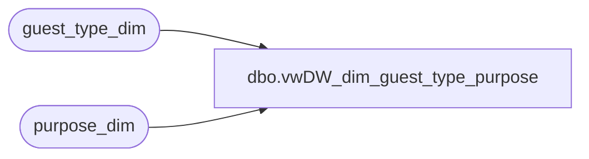

# dbo.vwDW_dim_guest_type_purpose

**Database:** dw  
**Server:** papamart  

## Architecture Diagram



## Table Dependencies

| Referenced Table |
|---|
| guest_type_dim |
| purpose_dim |

## View Code

```sql
CREATE view [dbo].[vwDW_dim_guest_type_purpose]
as

	SELECT 
		Purpose_Key
		,Guest_Type_Key
		,Purpose_Code
		,Guest_Type_Code
		,Purpose
		,Guest AS Guest_Type
		,CASE WHEN Purpose_Key = 0 THEN 'No Purpose' ELSE Purpose END + ' - ' +
			CASE WHEN Guest_Type_Key = 0 THEN 'No Guest Type' ELSE Guest END AS FullDescription
		,CASE WHEN guest_type_code='02' OR (guest_type_code ='01' AND purpose_code = '1') THEN 'Purchaser' ELSE 'N/A' END AS Purchaser
		,CASE WHEN guest_type_code='01' OR (guest_type_code ='02' AND purpose_code = '1') THEN 'Owner' ELSE 'N/A' END AS Owner
	FROM 
		(
			SELECT *
			FROM purpose_dim
			CROSS JOIN guest_type_dim 
--			WHERE guest_type_code <> '00'
--				AND purpose_code <> '0'
		) a
```

