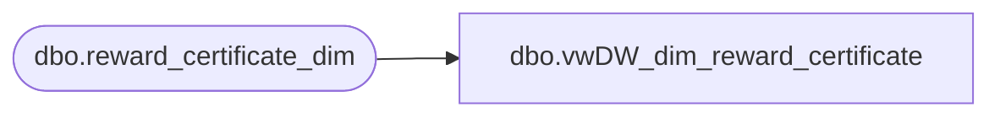

# dbo.vwDW_dim_reward_certificate

**Database:** dw  
**Server:** papamart  

## Architecture Diagram



## Table Dependencies

| Referenced Table |
|---|
| dbo.reward_certificate_dim |

## View Code

```sql
CREATE VIEW [dbo].[vwDW_dim_reward_certificate]
AS

	SELECT
		[reward_certificate_key]
		,[reward_certificate_code]
		,[first_earned_date_key]
		,[cert_value]
	FROM [dw].[dbo].[reward_certificate_dim]
```

