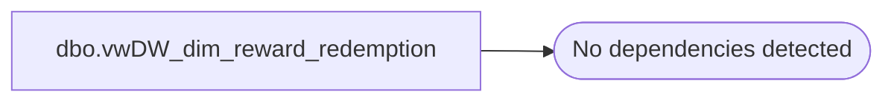

# dbo.vwDW_dim_reward_redemption

**Database:** dw  
**Server:** papamart  

## Architecture Diagram



## Table Dependencies

_No table dependencies detected._

## View Code

```sql
CREATE VIEW [dbo].[vwDW_dim_reward_redemption]
AS

	SELECT 0 AS reward_redemption_key, 'No Reward Redeemed' AS reward_redemption_description
	UNION
	SELECT 1 AS reward_redemption_key, 'Reward Redeemed' AS reward_redemption_description
```

