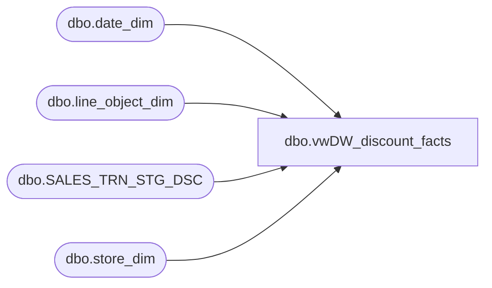

# dbo.vwDW_discount_facts

**Database:** dw  
**Server:** papamart  

## Architecture Diagram



## Table Dependencies

| Referenced Table |
|---|
| dbo.date_dim |
| dbo.line_object_dim |
| dbo.SALES_TRN_STG_DSC |
| dbo.store_dim |

## View Code

```sql
CREATE VIEW [dbo].[vwDW_discount_facts]
AS

/**********************************************************
View: vwDW_discount_facts
Purpose: Used as source for Discount_Facts.dtsx

History: 
02/07/2013	Gary Murrish		Significant rewrite for Discount Manager changes
03/31/2012  Gary Murrish		Changed Conversion of Reference number
03/21/2012	Gary Murrish		Fixed the conversion of Reference number
09/09/2011	Trista Parmentier	Created view using logic from Informatica mapping, m_History_Fact_Load+Tax_v6. 
								This replaces the logic that inserts into discount_facts. 
								The discount_product_facts insert has not been created in SSIS as it was determined to be unused. Those records are excluded from this query.
09/28/2011	Trista Parmentier	Added stg.Coupon_Flag logic to account for another path in Informatica mapping where data was inserted into discount_facts

**********************************************************/

SELECT
	STSD.Transaction_ID,
	sd.store_key,
	dd.date_key,
	STSD.coupon_key,
	lod.line_object_key,
	CASE
			WHEN STSD.Line_Action IN (20, 38) AND STSD.Line_Object <> 1199 THEN -1
			WHEN STSD.Line_Object IN (290, 295, 1103) THEN 1 ELSE -1
		END
	AS units,

	CASE
			WHEN STSD.Line_Action IN (20, 38) AND STSD.Line_Object <> 1199 THEN (STSD.Gross_Line_Amount * -1)
			WHEN STSD.Line_Object IN (290, 295, 1103) THEN STSD.Gross_Line_Amount ELSE (STSD.Gross_Line_Amount * -1)
		END
	AS unit_gross_amount,
	CAST(STSD.origReference_no AS varchar(50)) AS Reference_No,
	'NewDisc' AS process_name,
	GETDATE() AS process_date,
	STSD.transaction_no AS transaction_no,
	STSD.categoryTypeID AS categoryTypeID,
	STSD.isExpired AS isExpired
FROM
	dwstaging.dbo.SALES_TRN_STG_DSC STSD WITH (NOLOCK)
	INNER JOIN dw.dbo.store_dim sd WITH (NOLOCK)
		ON STSD.Store_No = sd.store_id
	INNER JOIN dw.dbo.date_dim dd WITH (NOLOCK)
		ON dd.actual_date = STSD.Transaction_Date
	INNER JOIN dw.dbo.line_object_dim lod WITH (NOLOCK)
		ON STSD.Line_Object = lod.Line_Object
WHERE
	NOT (stsd.Line_Object BETWEEN 1636 AND 1669
	OR stsd.Line_Object BETWEEN 1740 AND 1749) --previously inserted into product_discount_facts, now excluded
```

