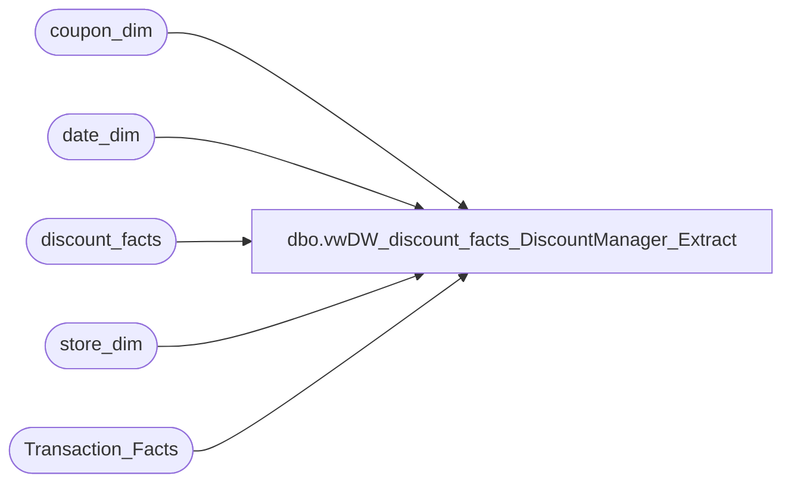

# dbo.vwDW_discount_facts_DiscountManager_Extract

**Database:** dw  
**Server:** papamart  

## Architecture Diagram



## Table Dependencies

| Referenced Table |
|---|
| coupon_dim |
| date_dim |
| discount_facts |
| store_dim |
| Transaction_Facts |

## View Code

```sql
CREATE VIEW [dbo].[vwDW_discount_facts_DiscountManager_Extract]
AS

/**********************************************************
View: vwDW_discount_facts_DiscountManager_Extract
Purpose: Used as source for Loading DiscountResults in Discount Manager

History: 
02/07/2013	Gary Murrish		New

**********************************************************/

SELECT
	base.fiscal_year,
	base.fiscal_period,
	base.dmDiscountID,
	base.categoryTypeID,
	base.isExpired,
	base.Country,
	CAST(SUM(base.unit_gross_amount * -1) AS money) AS RedeemedAmt,
	SUM(base.numRedeemed) AS numRedeemed,
	SUM(tf.GAAP_transaction_flag) AS GAAP_Transactions,
	CAST(SUM(tf.GAAP_Sales_Amount) AS money) AS GAAP_Sales_Amount
FROM
	(SELECT
			dd.fiscal_year,
			dd.fiscal_period,
			cd.dmDiscountID,
			df.categoryTypeID,
			df.isExpired,
			df.transaction_id,
			sd.Country,
			SUM(df.unit_Gross_Amount) AS unit_Gross_Amount,
			SUM(df.Units) AS numRedeemed
		FROM
			discount_facts df WITH (NOLOCK)
			INNER JOIN coupon_dim cd WITH (NOLOCK)
				ON df.coupon_key = cd.coupon_key
			INNER JOIN date_dim dd WITH (NOLOCK)
				ON df.date_key = dd.date_key
			INNER JOIN store_dim sd WITH (NOLOCK)
				ON df.store_key = sd.store_key
		WHERE
			df.categoryTypeID >= -1
		GROUP BY	dd.fiscal_year,
					dd.fiscal_period,
					cd.dmDiscountID,
					df.categoryTypeID,
					df.isExpired,
					df.transaction_id,
					sd.Country)
	base
	INNER JOIN Transaction_Facts tf WITH (NOLOCK)
		ON base.transaction_id = tf.transaction_id
GROUP BY	base.fiscal_year,
			base.fiscal_period,
			base.dmDiscountID,
			base.categoryTypeID,
			base.isExpired,
			base.Country
```

